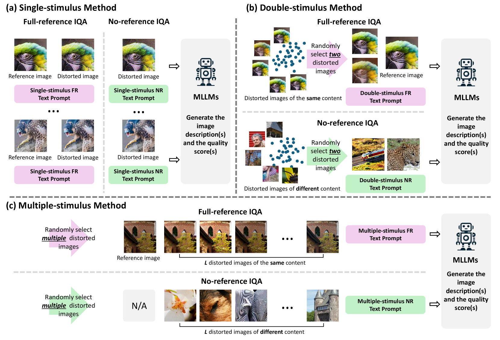
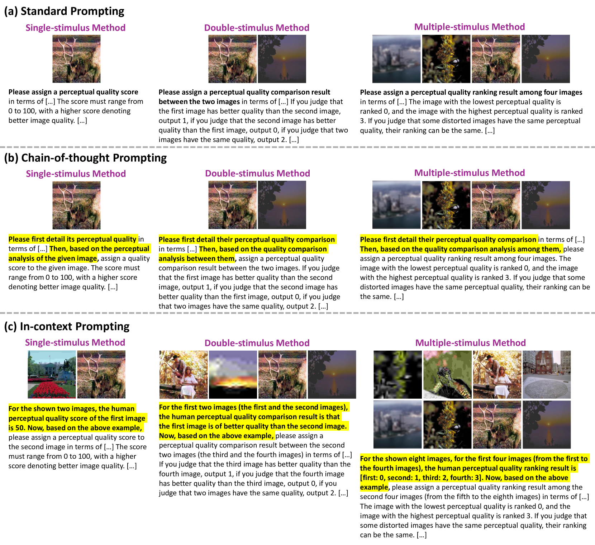
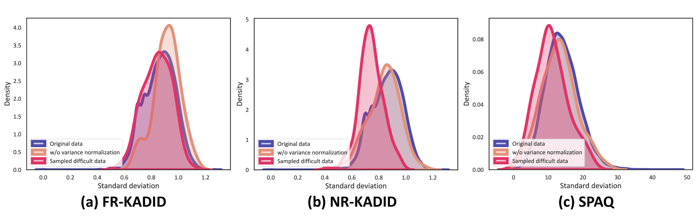
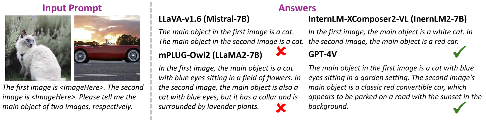
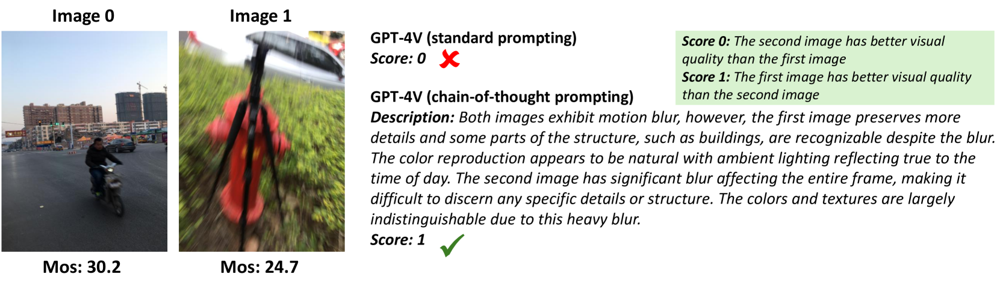

# 本研究全方位探究了应用于图像质量评估任务的多模态大型语言模型，旨在深入理解此类模型在该领域的性能与潜力。

发布时间：2024年03月16日

`LLM应用` `图像质量评估`

> A Comprehensive Study of Multimodal Large Language Models for Image Quality Assessment

> 尽管 MLLMs 在视觉理解及推理能力上取得重大突破，其作为强大、灵活且易解读的文本驱动图像质量评估(IQA)模型的可能性仍大有未掘之处。本研究深入探讨了如何通过提示方式来调动 MLLMs 进行 IQA 的潜能。我们首先创新性地结合心理物理学中的三种标准化测试流程（单一刺激、双重刺激和多重刺激法）与 NLP 中热门的三种提示策略（标准提示、上下文提示及链式思维提示），设计出九套适用于 MLLMs 的提示体系。随后，为了进一步考验各最佳提示系统下的 MLLMs，我们提出了兼顾样本多样性和不确定性的复杂样本挑选方案。在全参考和无参考条件下，我们选用四个 MLLMs（其中三个开源，一个闭源）对包括结构与纹理失真、色彩差异、几何变换在内的多项图像质量指标进行了详尽评估。实验证明，仅有闭源的 GPT-4V 对人类图像质量感知具有一定的解释力，但在识别微小质量差异（例如色彩差异）以及对比多幅图像视觉质量这类人类本能的任务上，其表现相对较弱。

> While Multimodal Large Language Models (MLLMs) have experienced significant advancement on visual understanding and reasoning, their potentials to serve as powerful, flexible, interpretable, and text-driven models for Image Quality Assessment (IQA) remains largely unexplored. In this paper, we conduct a comprehensive and systematic study of prompting MLLMs for IQA. Specifically, we first investigate nine prompting systems for MLLMs as the combinations of three standardized testing procedures in psychophysics (i.e., the single-stimulus, double-stimulus, and multiple-stimulus methods) and three popular prompting strategies in natural language processing (i.e., the standard, in-context, and chain-of-thought prompting). We then present a difficult sample selection procedure, taking into account sample diversity and uncertainty, to further challenge MLLMs equipped with the respective optimal prompting systems. We assess three open-source and one close-source MLLMs on several visual attributes of image quality (e.g., structural and textural distortions, color differences, and geometric transformations) in both full-reference and no-reference scenarios. Experimental results show that only the close-source GPT-4V provides a reasonable account for human perception of image quality, but is weak at discriminating fine-grained quality variations (e.g., color differences) and at comparing visual quality of multiple images, tasks humans can perform effortlessly.

[Arxiv](https://arxiv.org/abs/2403.10854)