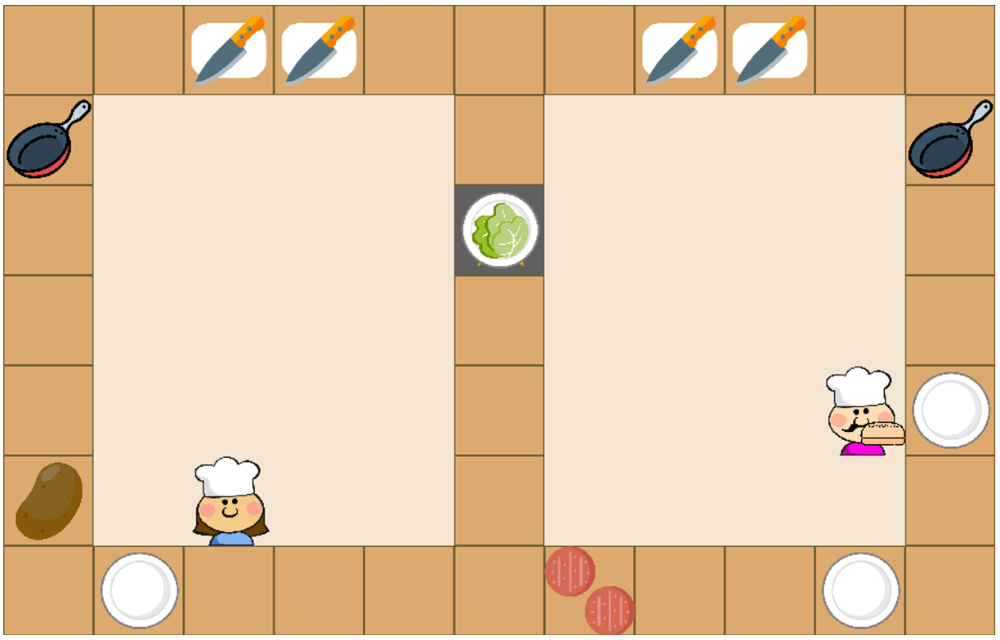
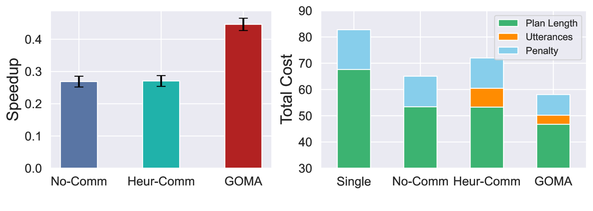
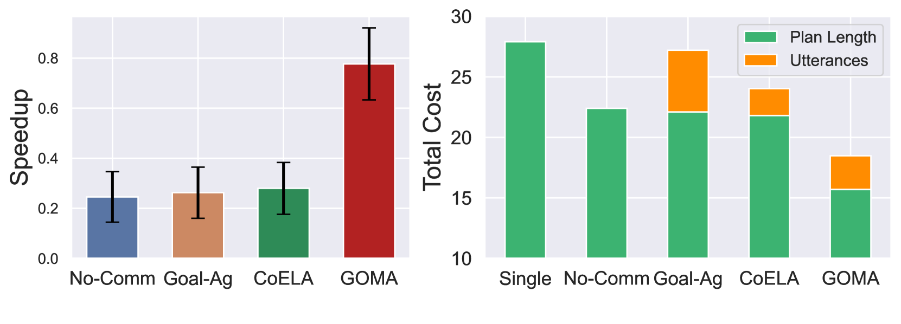
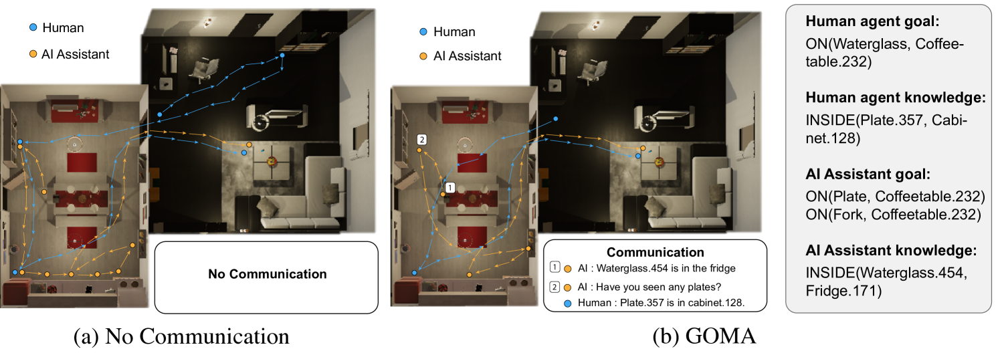

# GOMA 是一种创新方法，通过目标导向的心理对齐机制实现积极主动的具身化合作沟通。

发布时间：2024年03月16日

`Agent` `人工智能` `人机交互`

> GOMA: Proactive Embodied Cooperative Communication via Goal-Oriented Mental Alignment

> 在面对任务不清、环境不明、心理状态互不了解的合作场景时，口头沟通扮演着关键角色。本文创新性地提出了“目标导向心智协调”框架（GOMA），它将口头交流视为一种规划过程，旨在减少各方与目标相关的思维状态间的分歧。借助这一方案，具身助手能够智能判断何时以及如何运用自然语言主动开启与人类的对话，从而助力提升合作效果。我们在Overcooked和VirtualHome这两款颇具挑战性的应用中，对本方法进行了严格的基准测试。实验结果表明，尽管大型语言模型在生成紧密联系社交与物理情境的有效沟通上尚显吃力，但GOMA却能够成功生成简明扼要的口头指令，显著提高合作效能并改善人类用户对助手的感知。

> Verbal communication plays a crucial role in human cooperation, particularly when the partners only have incomplete information about the task, environment, and each other's mental state. In this paper, we propose a novel cooperative communication framework, Goal-Oriented Mental Alignment (GOMA). GOMA formulates verbal communication as a planning problem that minimizes the misalignment between the parts of agents' mental states that are relevant to the goals. This approach enables an embodied assistant to reason about when and how to proactively initialize communication with humans verbally using natural language to help achieve better cooperation. We evaluate our approach against strong baselines in two challenging environments, Overcooked (a multiplayer game) and VirtualHome (a household simulator). Our experimental results demonstrate that large language models struggle with generating meaningful communication that is grounded in the social and physical context. In contrast, our approach can successfully generate concise verbal communication for the embodied assistant to effectively boost the performance of the cooperation as well as human users' perception of the assistant.

[Arxiv](https://arxiv.org/abs/2403.11075)