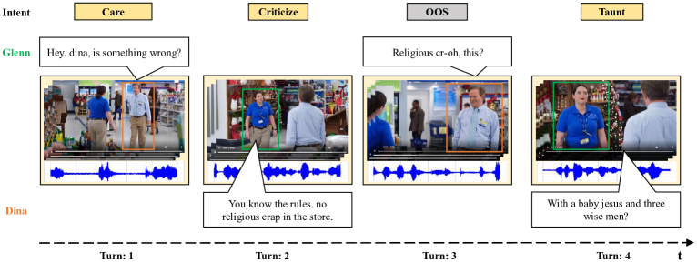
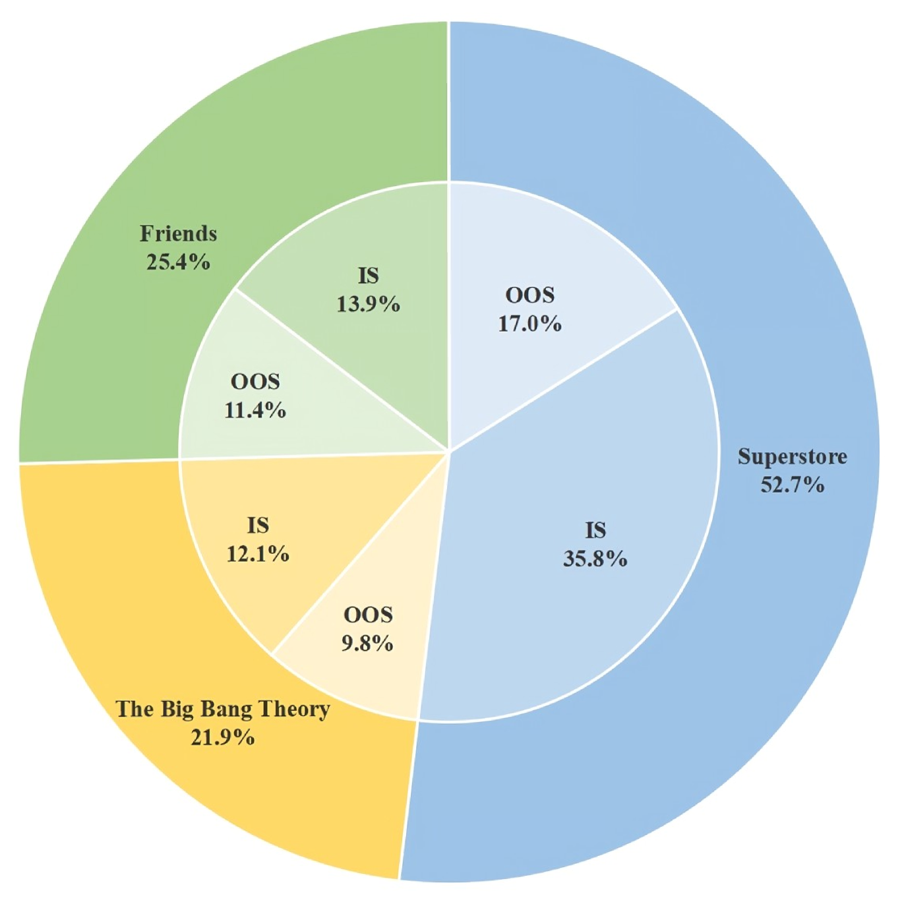
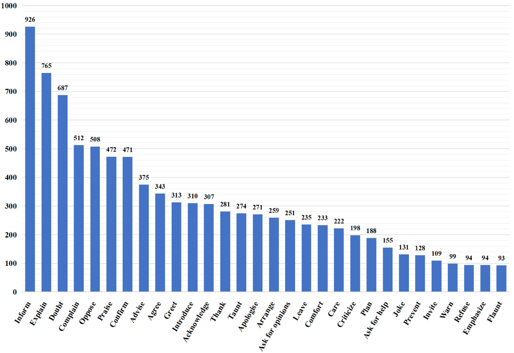
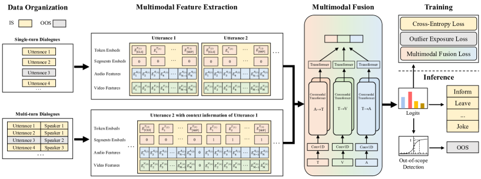
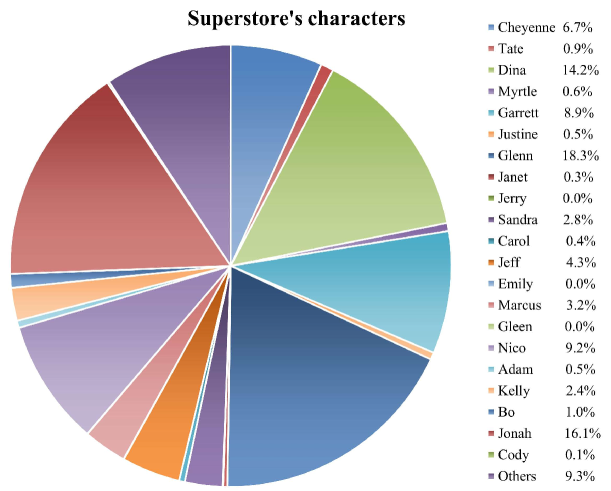
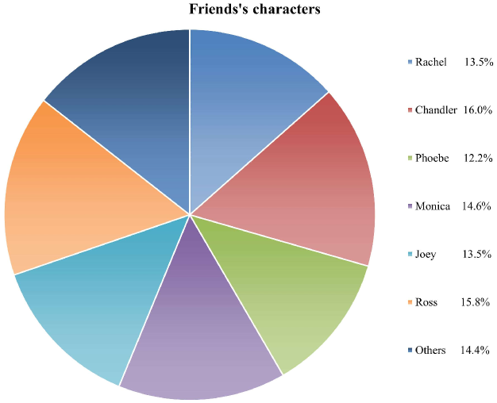
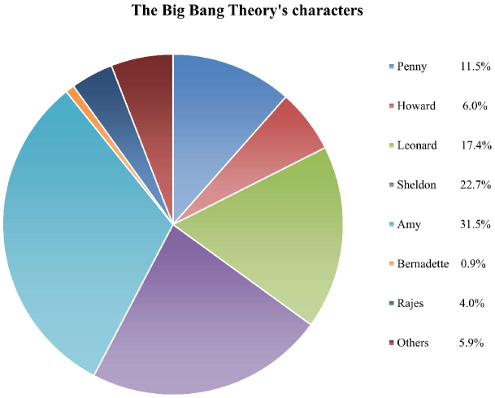
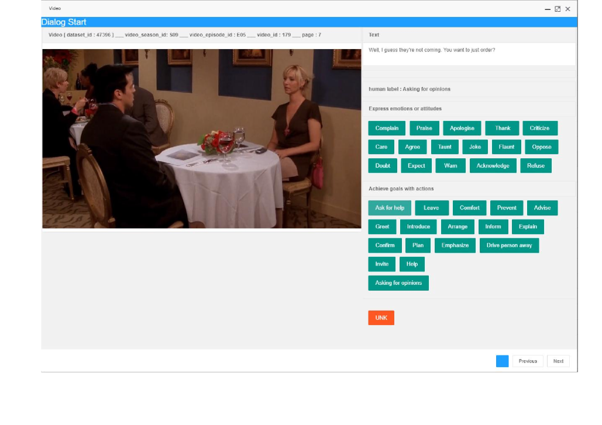

# MIntRec2.0 是专为对话场景打造的大规模基准数据集，它聚焦于多模态意图识别及范围外检测两大挑战性任务。

发布时间：2024年03月16日

`Agent` `对话系统` `多模态意图识别`

> MIntRec2.0: A Large-scale Benchmark Dataset for Multimodal Intent Recognition and Out-of-scope Detection in Conversations

# 摘要

> 面对多模态意图识别这一难题，我们需要将真实场景中的非言语信息融入进来，以便更好地理解人类的意图。当前的基准数据集不仅规模受限，还难以应对多轮对话交流中出现的超范围样本问题。因此，我们推出了MIntRec2.0——一个大规模的适用于多参与者对话的多模态意图识别基准数据集。该数据集包含1,245段对话和15,040个样本，按照全新的30类精细意图分类体系进行标注，其中有9,304个覆盖内样本和5,736个在实际对话情境中自然产生的覆盖外样本。同时，每一条话语都附带详尽的说话人信息，增强了其在多参与者对话研究领域的应用价值。我们搭建了一套综合架构，支持单轮或多轮对话数据整理、模态特征提取、多模态融合技术，以及覆盖内类别分类与覆盖外样本识别。我们采用经典多模态融合方法、ChatGPT模型及人工评估标准设立评估基准线，虽然已有方法在整合非言语信息上取得进步，但如何高效利用对话上下文信息并准确识别覆盖外样本仍是一大挑战。尤其值得注意的是，大型语言模型在此类认知意图理解任务上的表现明显落后于人类，暴露了机器学习方法的局限所在。我们坚信，MIntRec2.0将成为推动人机对话交互研究的重要基石，有力地推进相关应用领域的发展。目前，完整数据集及代码已公开在https://github.com/thuiar/MIntRec2.0供下载查阅。

> Multimodal intent recognition poses significant challenges, requiring the incorporation of non-verbal modalities from real-world contexts to enhance the comprehension of human intentions. Existing benchmark datasets are limited in scale and suffer from difficulties in handling out-of-scope samples that arise in multi-turn conversational interactions. We introduce MIntRec2.0, a large-scale benchmark dataset for multimodal intent recognition in multi-party conversations. It contains 1,245 dialogues with 15,040 samples, each annotated within a new intent taxonomy of 30 fine-grained classes. Besides 9,304 in-scope samples, it also includes 5,736 out-of-scope samples appearing in multi-turn contexts, which naturally occur in real-world scenarios. Furthermore, we provide comprehensive information on the speakers in each utterance, enriching its utility for multi-party conversational research. We establish a general framework supporting the organization of single-turn and multi-turn dialogue data, modality feature extraction, multimodal fusion, as well as in-scope classification and out-of-scope detection. Evaluation benchmarks are built using classic multimodal fusion methods, ChatGPT, and human evaluators. While existing methods incorporating nonverbal information yield improvements, effectively leveraging context information and detecting out-of-scope samples remains a substantial challenge. Notably, large language models exhibit a significant performance gap compared to humans, highlighting the limitations of machine learning methods in the cognitive intent understanding task. We believe that MIntRec2.0 will serve as a valuable resource, providing a pioneering foundation for research in human-machine conversational interactions, and significantly facilitating related applications. The full dataset and codes are available at https://github.com/thuiar/MIntRec2.0.

[Arxiv](https://arxiv.org/abs/2403.10943)