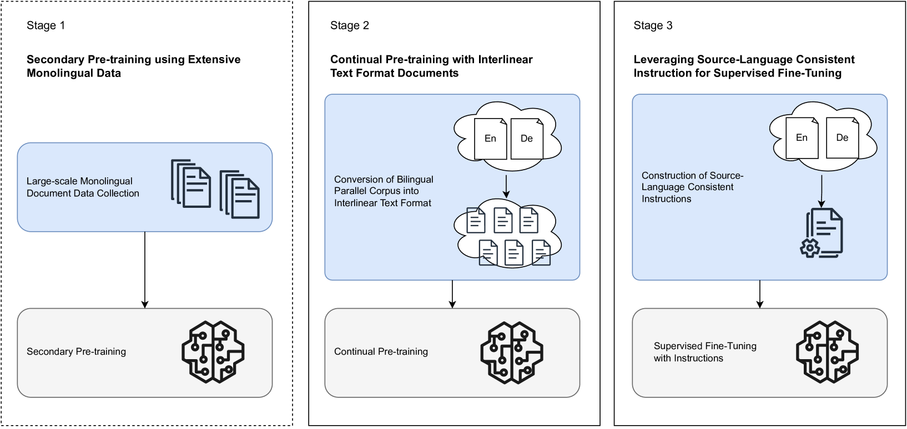
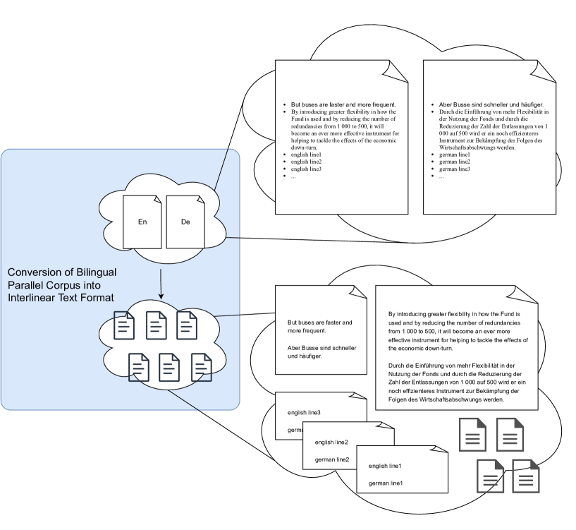
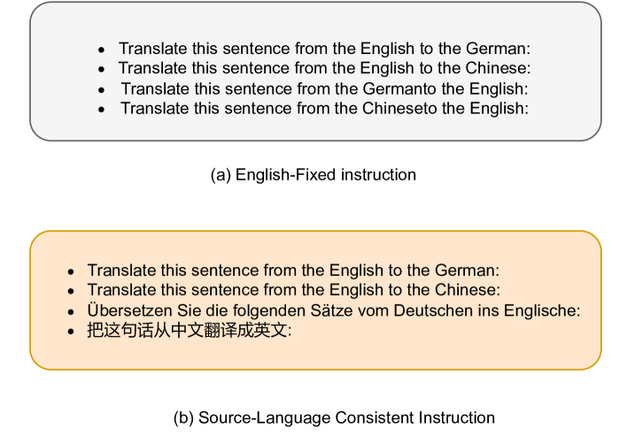
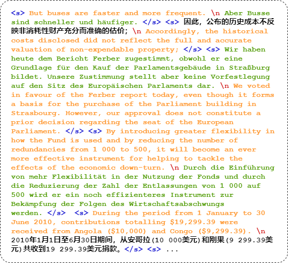

# 一种创新范式助力大型语言模型提升翻译效能

发布时间：2024年03月17日

`LLM应用` `机器翻译`

> A Novel Paradigm Boosting Translation Capabilities of Large Language Models

> 本篇论文探讨了一项针对机器翻译（MT）任务中大型语言模型（LLMs）翻译性能优化的全新策略，设计了一套包含三个环节的方法论：广泛单语数据辅助下的二次预训练、基于线性文本格式文档的持续预训练，以及运用与源语言保持一致的指导信息进行精细监督微调。过去对于LLMs的研究虽聚焦于多种监督微调（SFT）手段，但其成效有限。不同于依赖海量平行双语数据的传统机器翻译方式，我们的方案突出使用少量高品质双语数据的价值。我们主张，在预训练阶段更应注重提升LLMs跨语言对齐的能力，而不只是单纯依赖SFT时的庞大双语数据量。实验采用Llama2模型，特别是在完成单语增强后的中文-Llama2场景下，有力证明了LLMs翻译性能的显著改善。本研究的关键突破体现在第二阶段——以不到10亿规模的训练数据，运用线性文本格式文档进行连续预训练，彰显出高效率特性。而在第三阶段，我们注意到设置与源语言相协调的指令有助于提高监督微调的效果。实验证明，尽管我们的模型参数量仅为70亿或130亿，远低于诸如NLLB-54B和GPT3.5-text-davinci-003等模型，但其性能已超越这些前辈，并展现出卓越表现，确立了我们在机器翻译领域的一种开创性策略地位。

> This paper presents a study on strategies to enhance the translation capabilities of large language models (LLMs) in the context of machine translation (MT) tasks. The paper proposes a novel paradigm consisting of three stages: Secondary Pre-training using Extensive Monolingual Data, Continual Pre-training with Interlinear Text Format Documents, and Leveraging Source-Language Consistent Instruction for Supervised Fine-Tuning. Previous research on LLMs focused on various strategies for supervised fine-tuning (SFT), but their effectiveness has been limited. While traditional machine translation approaches rely on vast amounts of parallel bilingual data, our paradigm highlights the importance of using smaller sets of high-quality bilingual data. We argue that the focus should be on augmenting LLMs' cross-lingual alignment abilities during pre-training rather than solely relying on extensive bilingual data during SFT. Experimental results conducted using the Llama2 model, particularly on Chinese-Llama2 after monolingual augmentation, demonstrate the improved translation capabilities of LLMs. A significant contribution of our approach lies in Stage2: Continual Pre-training with Interlinear Text Format Documents, which requires less than 1B training data, making our method highly efficient. Additionally, in Stage3, we observed that setting instructions consistent with the source language benefits the supervised fine-tuning process. Experimental results demonstrate that our approach surpasses previous work and achieves superior performance compared to models such as NLLB-54B and GPT3.5-text-davinci-003, despite having a significantly smaller parameter count of only 7B or 13B. This achievement establishes our method as a pioneering strategy in the field of machine translation.

[Arxiv](https://arxiv.org/abs/2403.11430)