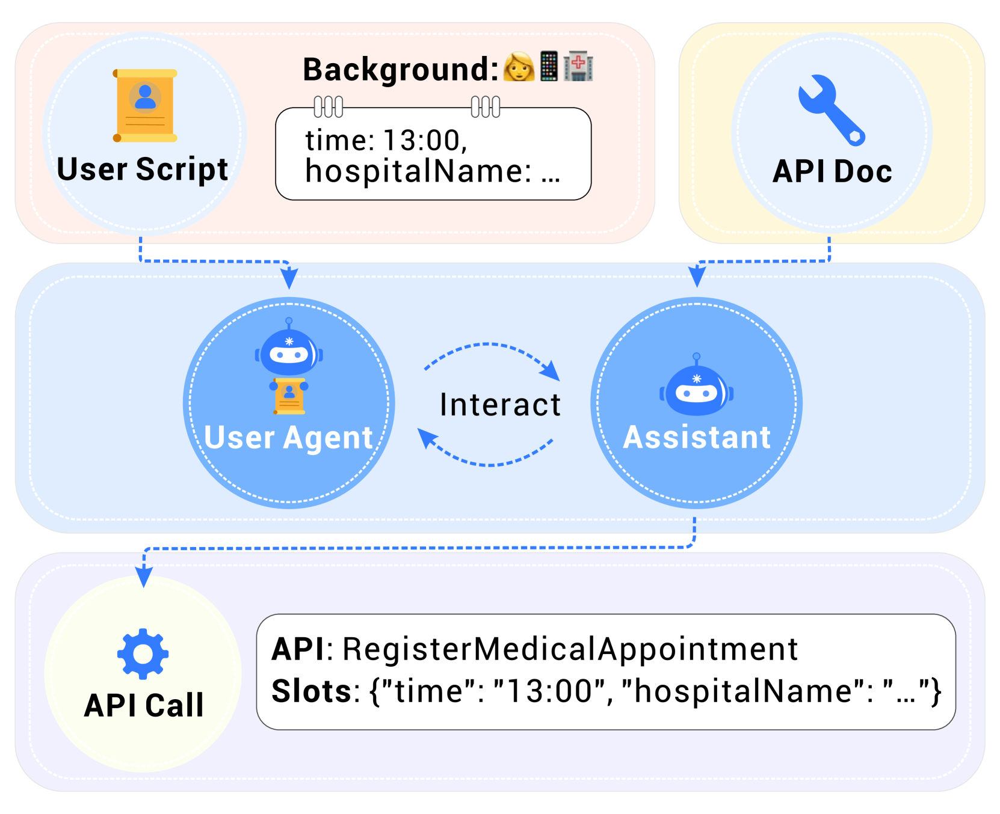
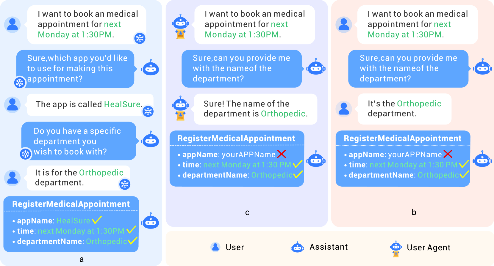
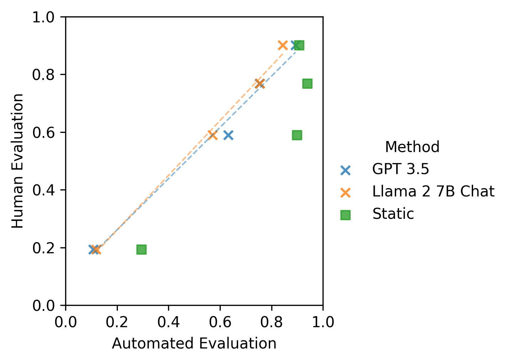

# 不仅限于静态评测，本研究提出了一种新颖的动态方法，用于深入探究和评估 AI 助手调用 API 的能力。

发布时间：2024年03月17日

`Agent` `AI助手` `API调用`

> Beyond Static Evaluation: A Dynamic Approach to Assessing AI Assistants' API Invocation Capabilities

# 摘要

> 随着LLMs的兴起，AI助手运用工具特别是通过API调用的能力有了显著跃升，因此呼唤更准确的评估手段。当前不少研究依赖静态评估，即基于预设对话情境评判AI助手的API调用效果，但这种方法存在局限，因为真实的交互场景下，AI助手可能无法准确应对并生成API调用。为此，我们提出了一种无需人工参与的自动动态评估方案——AutoDE，它能够在无需人机实时互动的情况下评估AI助手的API调用能力。我们在构建的框架中，借助配备用户脚本、确保与人类行为保持一致的LLM为基础的用户代理，尽可能真实地模拟人机对话流程。实验结果表明，AutoDE能够揭示静态评估难以察觉的错误，其评估结果与人工评估高度相关。我们采用定制化的基准测试了四款AI助手，结果显示，我们的方法与人工评估的相关系数达到0.99，相比传统静态评估提升了8%。

> With the rise of Large Language Models (LLMs), AI assistants' ability to utilize tools, especially through API calls, has advanced notably. This progress has necessitated more accurate evaluation methods. Many existing studies adopt static evaluation, where they assess AI assistants' API call based on pre-defined dialogue histories. However, such evaluation method can be misleading, as an AI assistant might fail in generating API calls from preceding human interaction in real cases. Instead of the resource-intensive method of direct human-machine interactions, we propose Automated Dynamic Evaluation (AutoDE) to assess an assistant's API call capability without human involvement. In our framework, we endeavor to closely mirror genuine human conversation patterns in human-machine interactions, using a LLM-based user agent, equipped with a user script to ensure human alignment. Experimental results highlight that AutoDE uncovers errors overlooked by static evaluations, aligning more closely with human assessment. Testing four AI assistants using our crafted benchmark, our method mirrored human evaluation with an correlation of 0.99, marking an 8% enhancement compared to conventional static evaluations.

[Arxiv](https://arxiv.org/abs/2403.11128)