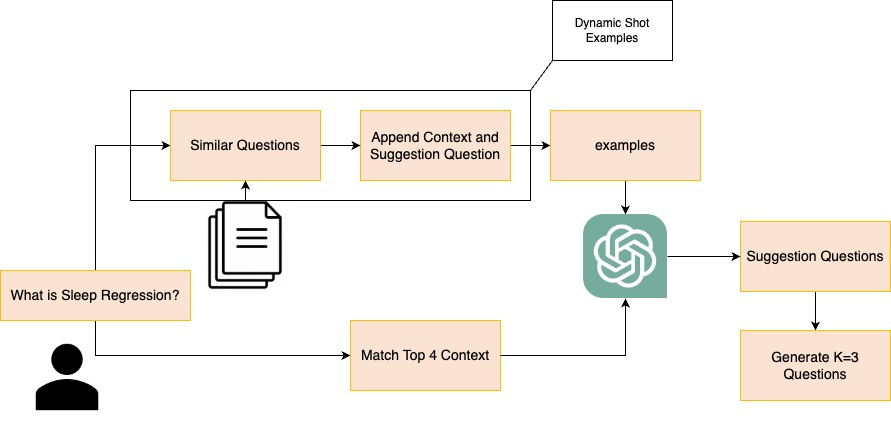

# 本研究探讨了如何在以 RAG 为核心的对话系统中利用动态上下文来生成更具启发性的建议性问题，以提升交互体验和信息检索效率。

发布时间：2024年03月17日

`RAG` `聊天机器人`

> Dynamic Contexts for Generating Suggestion Questions in RAG Based Conversational Systems

> 在与 RAG 为技术支持的聊天机器人交流时，用户需巧妙构思问题才能确保被准确理解。但用户理解机器人的能力边界颇具难度，这常导致提出模糊不清、需要进一步解释的问题。为此，本研究致力于搭建一座桥梁——研发一款能提供有效建议问题的生成器。我们采用了一种利用动态上下文策略的方法，该策略整合了动态的一次性示例和实时检索到的语境信息。实验证明，相较于其他提示生成技术，动态上下文方法在生成高质量建议性问题上表现更优。

> When interacting with Retrieval-Augmented Generation (RAG)-based conversational agents, the users must carefully craft their queries to be understood correctly. Yet, understanding the system's capabilities can be challenging for the users, leading to ambiguous questions that necessitate further clarification. This work aims to bridge the gap by developing a suggestion question generator. To generate suggestion questions, our approach involves utilizing dynamic context, which includes both dynamic few-shot examples and dynamically retrieved contexts. Through experiments, we show that the dynamic contexts approach can generate better suggestion questions as compared to other prompting approaches.

[Arxiv](https://arxiv.org/abs/2403.11413)