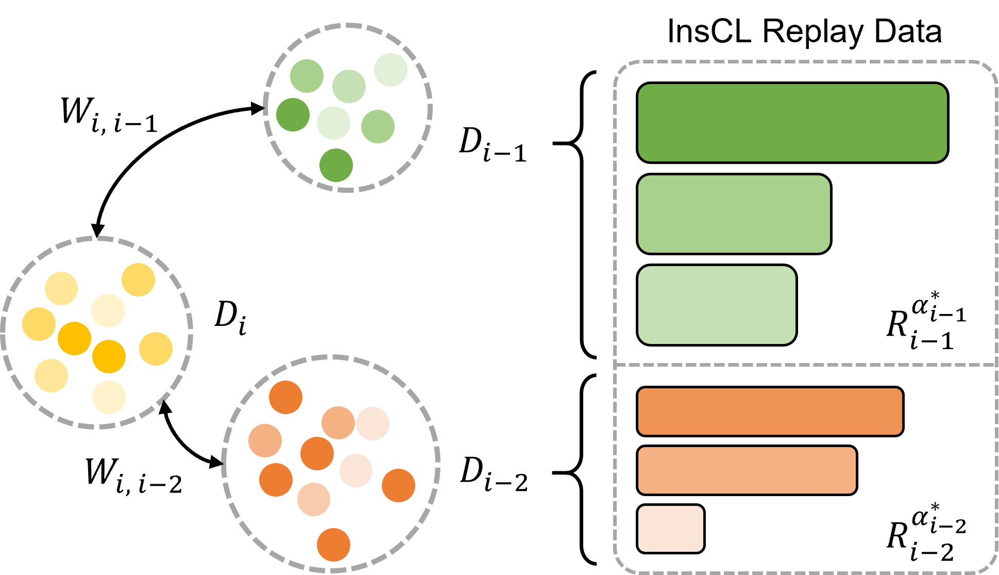
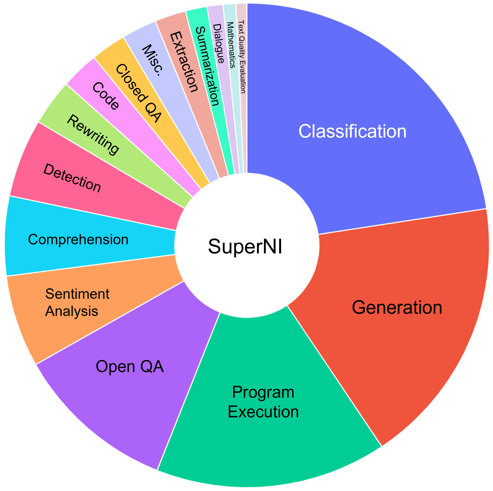
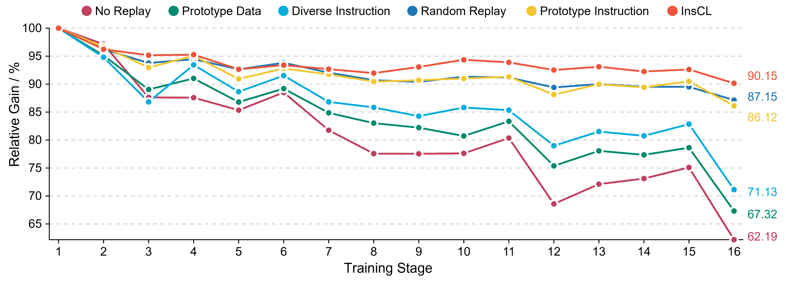
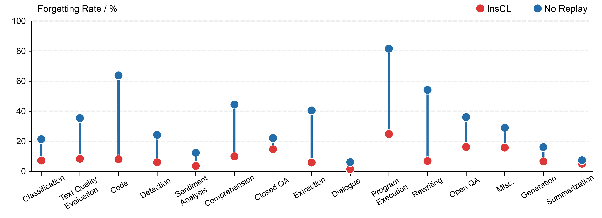
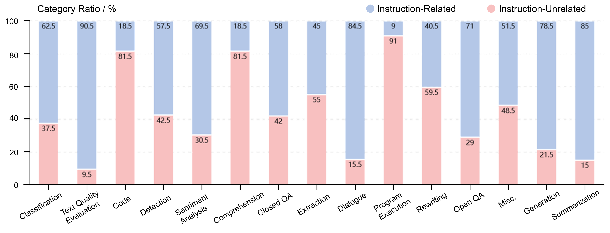

# InsCL 是一种新型的数据高效持续学习方法，专门针对大型语言模型进行指令引导的微调过程。这一范式有助于在节省数据的前提下，提升大型语言模型应对不断变化任务的学习能力。

发布时间：2024年03月17日

`LLM应用` `连续学习`

> InsCL: A Data-efficient Continual Learning Paradigm for Fine-tuning Large Language Models with Instructions

> 指令调整技术能够有效提升大型语言模型（LLMs）处理下游任务的能力，而面对真实应用场景中的环境变化，LLMs 必须在避免灾难性遗忘的前提下不断适应特定任务。鉴于计算资源的限制，基于回放的连续学习（CL）方法因其简洁高效而成为针对 LLMs 遗忘问题的主流解决方案。不过，传统基于回放的方法未能充分利用指令来优化回放策略。本研究创新性地提出了“基于指令的连续学习”（InsCL）新模式。InsCL 灵活运用 Wasserstein 距离和指令信息，动态决定回放之前与当前任务相似度高的数据。同时，我们设计了一项称为“指令信息指标”（InsInfo）的工具，用于衡量指令的复杂性和多样性程度。借助 InsInfo，InsCL 更倾向选取高质量数据进行回放。在涵盖16个不同训练顺序任务的广泛实验中，InsCL 表现出稳健的性能提升。待所有任务完成训练时，InsCL 相较于随机回放提升了3.0相对增益，相比于未采用回放方法则实现了高达27.96的相对增益。

> Instruction tuning effectively optimizes Large Language Models (LLMs) for downstream tasks. Due to the changing environment in real-life applications, LLMs necessitate continual task-specific adaptation without catastrophic forgetting. Considering the heavy computational cost, replay-based Continual Learning (CL) methods are the simplest and most widely used for LLMs to address the forgetting issue. However, traditional replay-based methods do not fully utilize instructions to customize the replay strategy. In this work, we propose a novel paradigm called Instruction-based Continual Learning (InsCL). InsCL dynamically replays previous data based on task similarity, calculated by Wasserstein Distance with instructions. Moreover, we further introduce an Instruction Information Metric (InsInfo) to quantify the complexity and diversity of instructions. According to InsInfo, InsCL guides the replay process more inclined to high-quality data. We conduct extensive experiments over 16 tasks with different training orders, observing consistent performance improvements of InsCL. When all tasks have been trained, InsCL achieves performance gains of 3.0 Relative Gain compared with Random Replay, and 27.96 Relative Gain compared with No Replay.

[Arxiv](https://arxiv.org/abs/2403.11435)