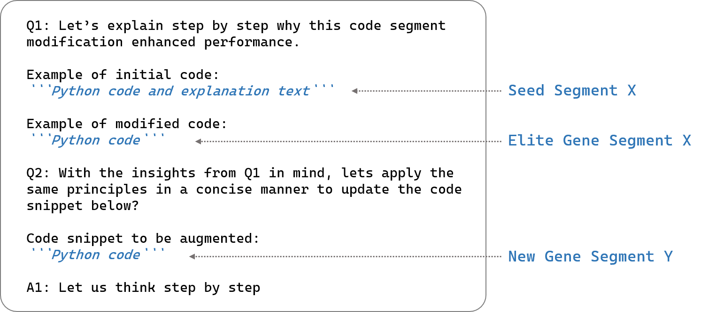
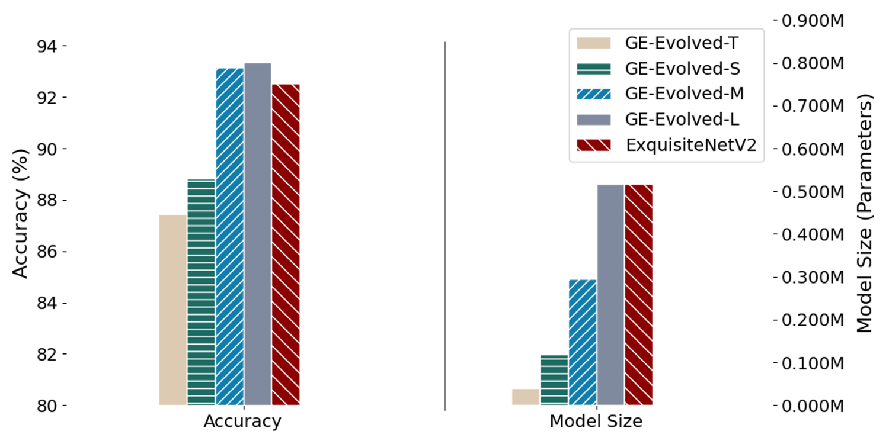
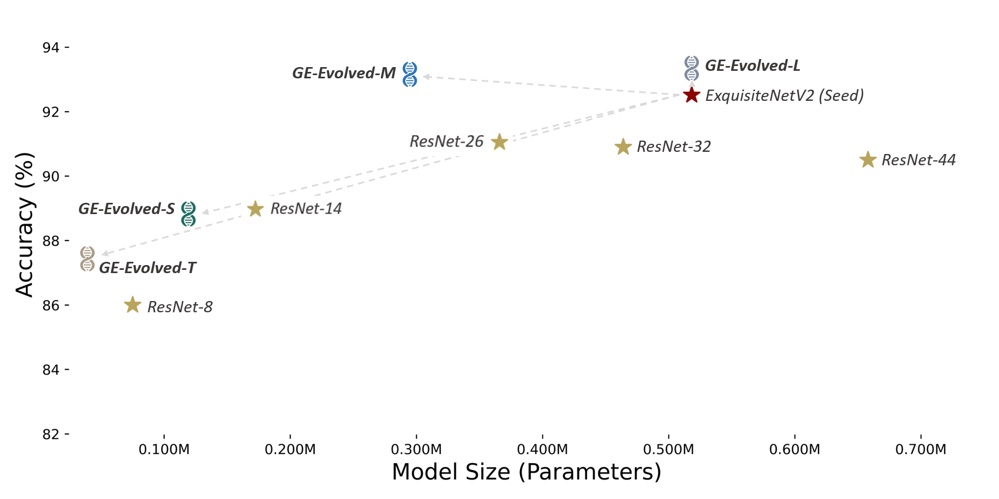
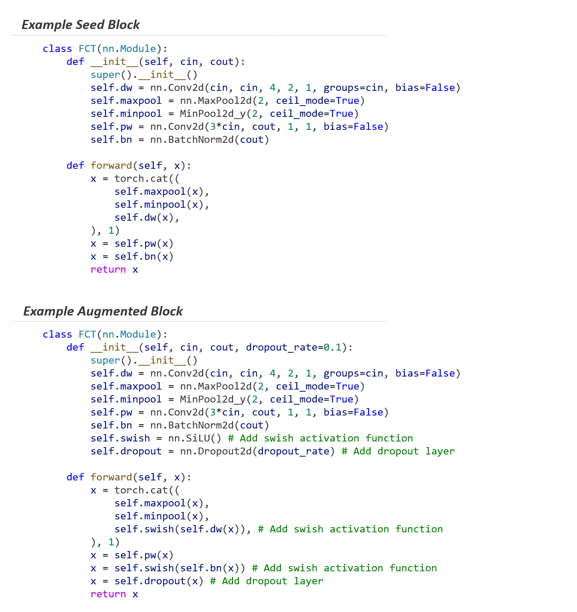
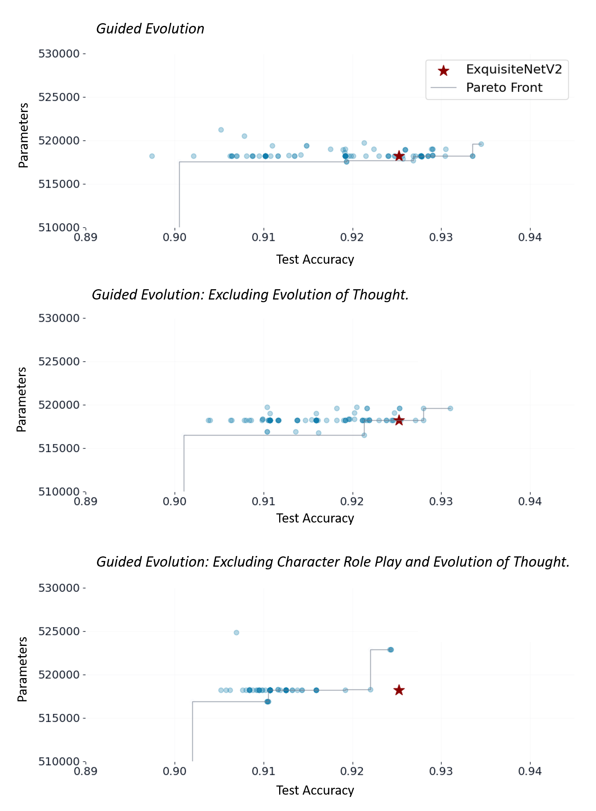
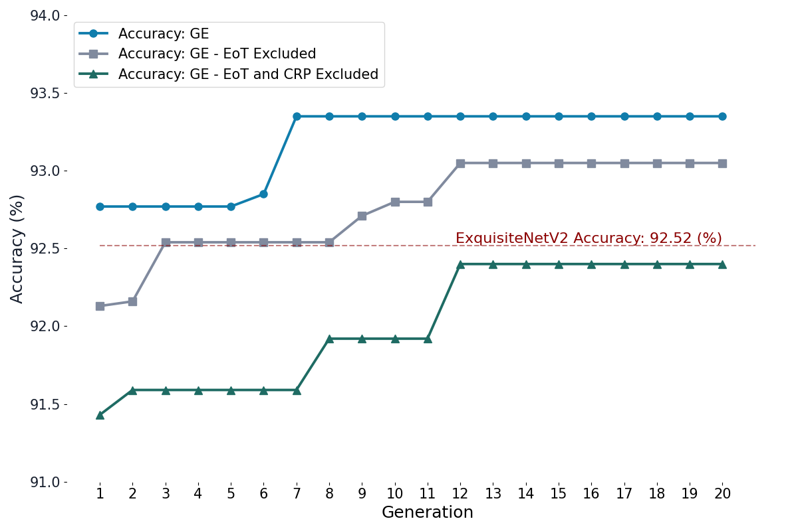

# 在LLM引导下，模型驱动模型自动演进的新范式

发布时间：2024年03月17日

`LLM应用` `机器学习` `自动化模型开发`

> LLM Guided Evolution - The Automation of Models Advancing Models

> 在机器学习世界里，传统的模型开发与AutoML等自动化手段多依赖于层层抽象结构，如基于树或笛卡尔遗传编程的方法。而我们的研究带来一种崭新的“引导式演化”（GE）框架，它独辟蹊径，运用大型语言模型（LLMs）直接调整代码。相较于传统方式，GE借力LLMs实现智能化、监督下的演化过程，巧妙指引变异和交叉操作。我们独创的“思想演化”（EoT）技术更赋予GE强大助力，让LLMs能反思并从前一轮变异结果中吸取经验教训，形成自我强化的反馈闭环，大大提升了模型演化进程中的决策智慧。同时，GE凭借LLMs对专业设计提示生成多样回应及调节模型温度的能力，有效保持了遗传多样性这一进化算法的关键要素。这不仅显著加速了模型的演化步伐，还如同专家一般为演化过程注入创新灵感。在对ExquisiteNetV2模型的应用实践中，LLM驱动的GE成功自动生成了更加精确的变体版本，将精度从92.52%提升至93.34%，并且未牺牲模型的紧凑性。这一成果有力证明了LLMs在革新传统模型设计流水线方面的巨大潜力，使其能够自主进化和完善自身设计方案。

> In the realm of machine learning, traditional model development and automated approaches like AutoML typically rely on layers of abstraction, such as tree-based or Cartesian genetic programming. Our study introduces "Guided Evolution" (GE), a novel framework that diverges from these methods by utilizing Large Language Models (LLMs) to directly modify code. GE leverages LLMs for a more intelligent, supervised evolutionary process, guiding mutations and crossovers. Our unique "Evolution of Thought" (EoT) technique further enhances GE by enabling LLMs to reflect on and learn from the outcomes of previous mutations. This results in a self-sustaining feedback loop that augments decision-making in model evolution. GE maintains genetic diversity, crucial for evolutionary algorithms, by leveraging LLMs' capability to generate diverse responses from expertly crafted prompts and modulate model temperature. This not only accelerates the evolution process but also injects expert like creativity and insight into the process. Our application of GE in evolving the ExquisiteNetV2 model demonstrates its efficacy: the LLM-driven GE autonomously produced variants with improved accuracy, increasing from 92.52% to 93.34%, without compromising model compactness. This underscores the potential of LLMs to accelerate the traditional model design pipeline, enabling models to autonomously evolve and enhance their own designs.

[Arxiv](https://arxiv.org/abs/2403.11446)