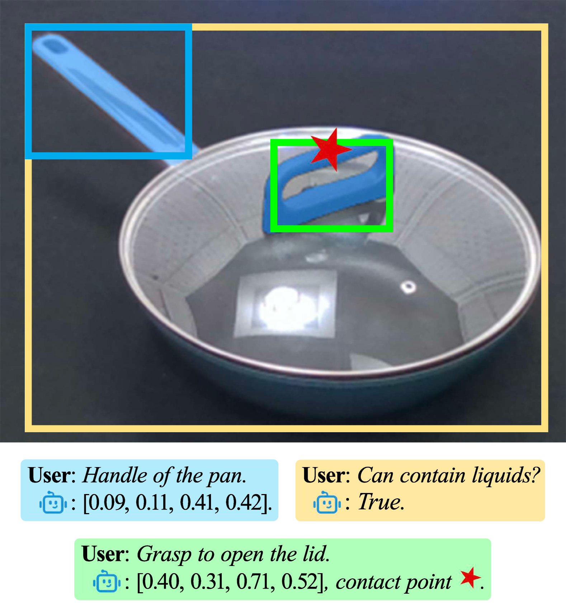
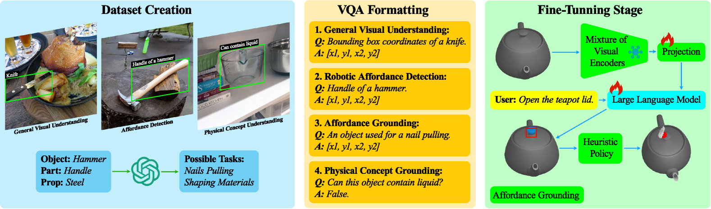
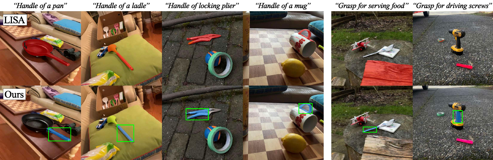
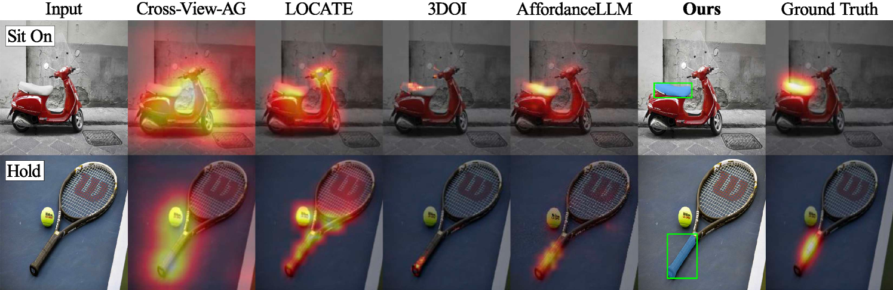
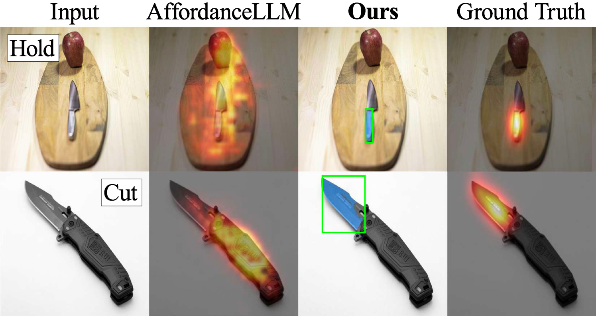
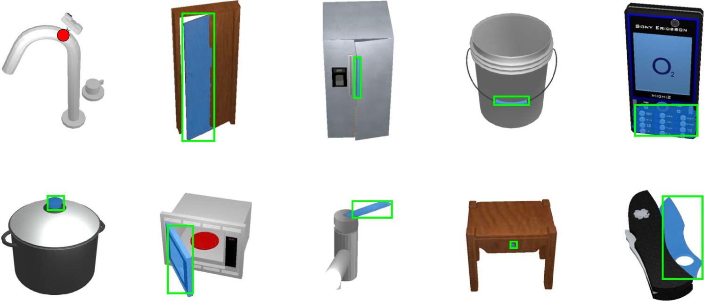

# ManipVQA项目致力于将机器人操作性及物理实证信息巧妙地融入到多模态大型语言模型中，以增强其理解与推理能力。

发布时间：2024年03月17日

`Agent` `机器人`

> ManipVQA: Injecting Robotic Affordance and Physically Grounded Information into Multi-Modal Large Language Models

> 随着 MLMMs 与机器人技术的深度融合，机器人对自然语言指令的理解与执行能力有了大幅提升。然而，常规 MLMMs 在训练过程中，由于仅基于通用图像-文本对，缺失了如工具功能性和物理知识等核心机器人学内容，从而影响其在操作任务上的表现力。为弥补这一不足，我们创新性地提出ManipVQA框架，它借助视觉问答的方式向 MLMMs 注入以操作为核心的知识体系，覆盖了从工具识别、功能认知直至全面掌握物理原理的广阔领域。研究伊始，我们采集了一系列包含互动物体的丰富多样图像样本，这些样本对于工具检测、功能属性判断及物理概念预测都构成了多元化的挑战。为了能将这些特定于机器人的知识无缝融合至 MLMMs 内置的视觉推理能力中，我们采用了统一的VQA格式，并精心设计了一套微调策略，在保持原有视觉推理能力的同时，有效吸收新获得的机器人学洞见。经过在机器人模拟器和各类视觉任务基准测试中的严格检验，ManipVQA展现出强大的实用性。相关代码和数据集即将在https://github.com/SiyuanHuang95/ManipVQA公开发布。

> The integration of Multimodal Large Language Models (MLLMs) with robotic systems has significantly enhanced the ability of robots to interpret and act upon natural language instructions. Despite these advancements, conventional MLLMs are typically trained on generic image-text pairs, lacking essential robotics knowledge such as affordances and physical knowledge, which hampers their efficacy in manipulation tasks. To bridge this gap, we introduce ManipVQA, a novel framework designed to endow MLLMs with Manipulation-centric knowledge through a Visual Question-Answering format. This approach not only encompasses tool detection and affordance recognition but also extends to a comprehensive understanding of physical concepts. Our approach starts with collecting a varied set of images displaying interactive objects, which presents a broad range of challenges in tool object detection, affordance, and physical concept predictions. To seamlessly integrate this robotic-specific knowledge with the inherent vision-reasoning capabilities of MLLMs, we adopt a unified VQA format and devise a fine-tuning strategy that preserves the original vision-reasoning abilities while incorporating the new robotic insights. Empirical evaluations conducted in robotic simulators and across various vision task benchmarks demonstrate the robust performance of ManipVQA. Code and dataset will be made publicly available at https://github.com/SiyuanHuang95/ManipVQA.

[Arxiv](https://arxiv.org/abs/2403.11289)