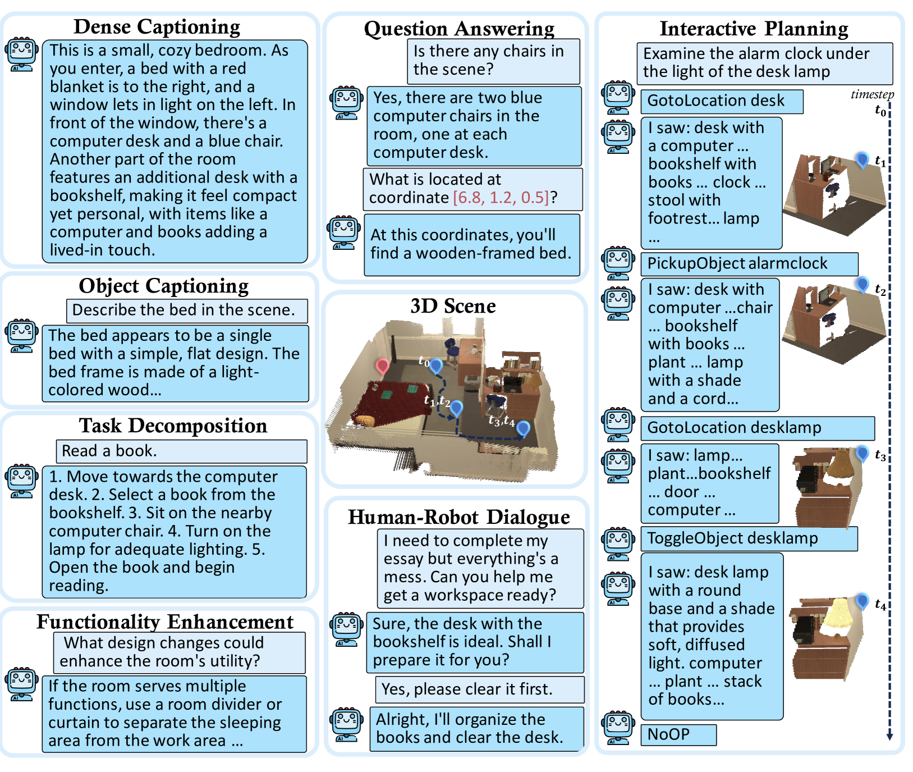
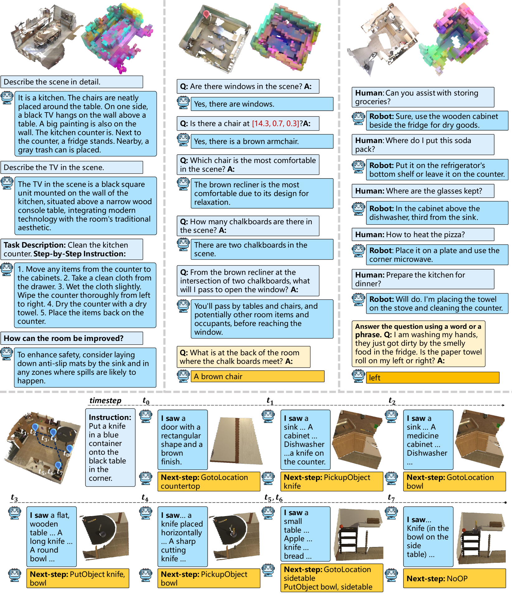

# Scene-LLM：致力于增强语言模型能力，使其能够理解和推理三维视觉场景，从而开启全新的三维视觉智能应用领域。

发布时间：2024年03月17日

`Agent` `3D视觉` `人工智能`

> Scene-LLM: Extending Language Model for 3D Visual Understanding and Reasoning

# 摘要

> 本研究推出Scene-LLM——一种融合LLMs强大推理力的3D视觉-语言模型，它能够显著提升具身智能体在交互式3D室内环境中的表现。Scene-LLM创新地采用了一种混合型3D视觉特征表示法，既包含丰富的空间信息，又支持场景状态实时更新。通过一个高效投影层，该模型能将这些特征巧妙地映射至预训练好的文本嵌入空间，使得3D视觉信息得以精准解读。尤为独特的是，Scene-LLM成功整合了场景级别和自我中心视角的3D信息，这对全局规划和精确定位都至关重要的交互式规划任务起到了关键作用。值得一提的是，我们运用自我中心3D帧特征实现了特征对齐技术，有效提升了模型识别并匹配场景中小物件特征的能力。实验证明，Scene-LLM在密集场景描述生成、问题解答以及交互式规划等方面展现出卓越性能。我们坚信，Scene-LLM将在3D视觉理解和推理领域开创新篇，为室内的复杂智能体交互开启更多可能。

> This paper introduces Scene-LLM, a 3D-visual-language model that enhances embodied agents' abilities in interactive 3D indoor environments by integrating the reasoning strengths of Large Language Models (LLMs). Scene-LLM adopts a hybrid 3D visual feature representation, that incorporates dense spatial information and supports scene state updates. The model employs a projection layer to efficiently project these features in the pre-trained textual embedding space, enabling effective interpretation of 3D visual information. Unique to our approach is the integration of both scene-level and ego-centric 3D information. This combination is pivotal for interactive planning, where scene-level data supports global planning and ego-centric data is important for localization. Notably, we use ego-centric 3D frame features for feature alignment, an efficient technique that enhances the model's ability to align features of small objects within the scene. Our experiments with Scene-LLM demonstrate its strong capabilities in dense captioning, question answering, and interactive planning. We believe Scene-LLM advances the field of 3D visual understanding and reasoning, offering new possibilities for sophisticated agent interactions in indoor settings.

[Arxiv](https://arxiv.org/abs/2403.11401)