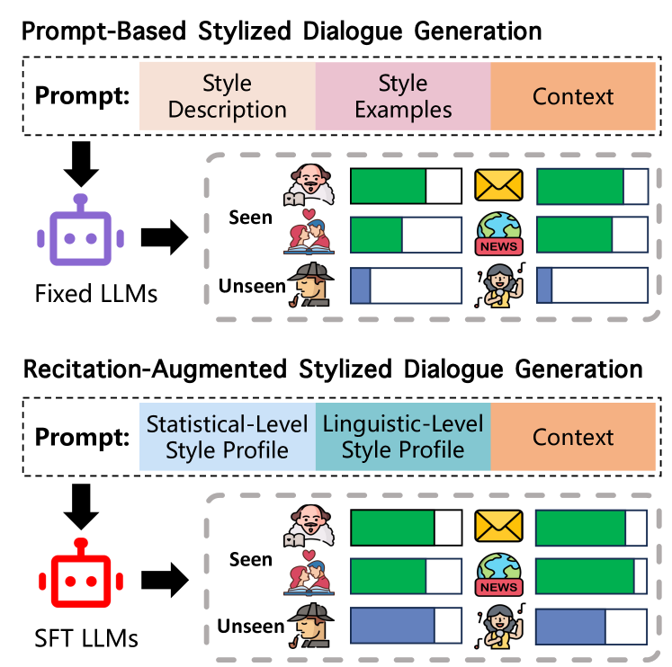
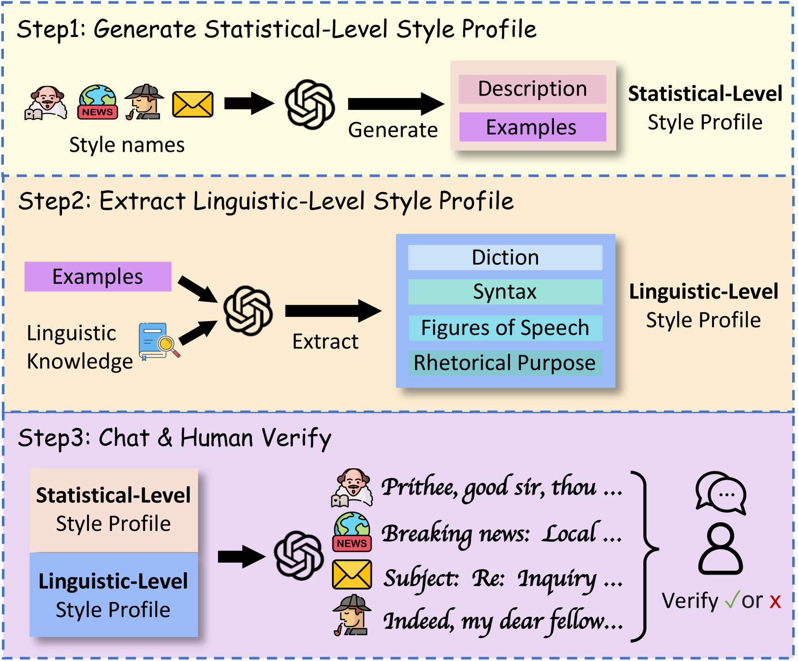
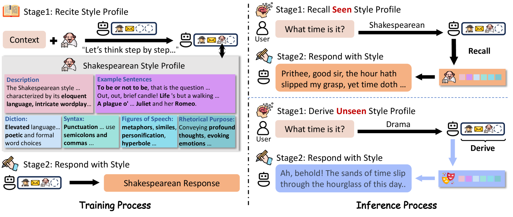
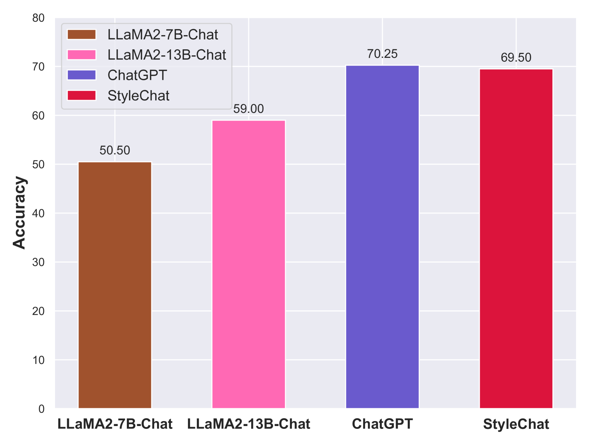
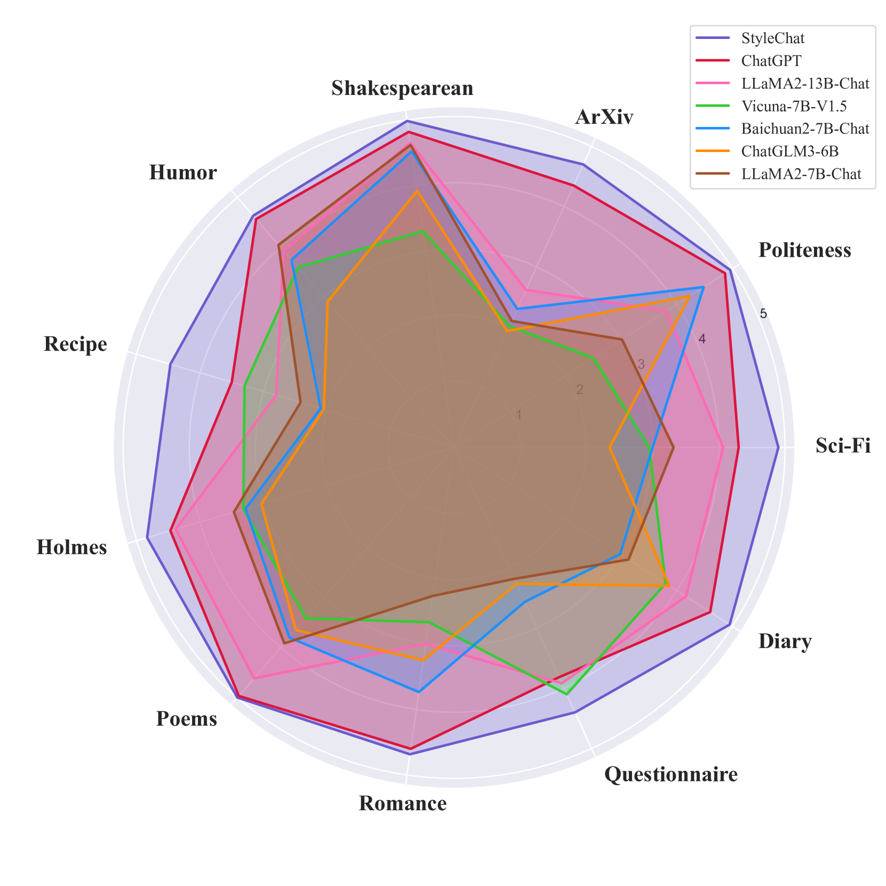

# StyleChat 是一项研究，通过在大型语言模型中融入强化记忆技术，旨在提升模型进行风格化对话生成的能力。

发布时间：2024年03月17日

`LLM应用` `对话系统` `自然语言生成`

> StyleChat: Learning Recitation-Augmented Memory in LLMs for Stylized Dialogue Generation

> 大型语言模型（LLMs）在生成任务上表现出色，备受瞩目，在此背景下，风格化的对话生成是打造智能互动对话助手的关键环节。然而，受限于数据驱动特性和数据偏见，LLMs 在处理特定任务时，尤其是风格化对话生成时，往往表现欠佳，因为这类任务极度缺乏有监督的数据资源。虽然已有多种基于提示的方法尝试解决特定任务，但面对涵盖广泛对话风格的真实世界复杂场景时，这些方法仍有待提升。为此，本研究充分利用 LLMs 强大的生成能力，精心构建并严格人工筛选出一个包含38种风格的风格化对话数据集——StyleEval。基于此数据集，我们创新性地提出StyleChat框架，它采用背诵增强记忆策略与多任务风格学习策略，旨在提高模型的泛化能力。为了验证StyleChat的有效性，我们设立了一个包含生成任务和选择任务在内的综合测试基准，用于全面考察训练后的模型是否真正理解和掌握了不同风格及用户偏好。实验结果表明，StyleChat框架成功超越所有对照组，并助力突破LLMs在风格转换上的局限性。

> Large Language Models (LLMs) demonstrate superior performance in generative scenarios and have attracted widespread attention. Among them, stylized dialogue generation is essential in the context of LLMs for building intelligent and engaging dialogue agent. However the ability of LLMs is data-driven and limited by data bias, leading to poor performance on specific tasks. In particular, stylized dialogue generation suffers from a severe lack of supervised data. Furthermore, although many prompt-based methods have been proposed to accomplish specific tasks, their performance in complex real-world scenarios involving a wide variety of dialog styles further enhancement. In this work, we first introduce a stylized dialogue dataset StyleEval with 38 styles by leveraging the generative power of LLMs comprehensively, which has been carefully constructed with rigorous human-led quality control. Based on this, we propose the stylized dialogue framework StyleChat via recitation-augmented memory strategy and multi-task style learning strategy to promote generalization ability. To evaluate the effectiveness of our approach, we created a test benchmark that included both a generation task and a choice task to comprehensively evaluate trained models and assess whether styles and preferences are remembered and understood. Experimental results show that our proposed framework StyleChat outperforms all the baselines and helps to break the style boundary of LLMs.

[Arxiv](https://arxiv.org/abs/2403.11439)