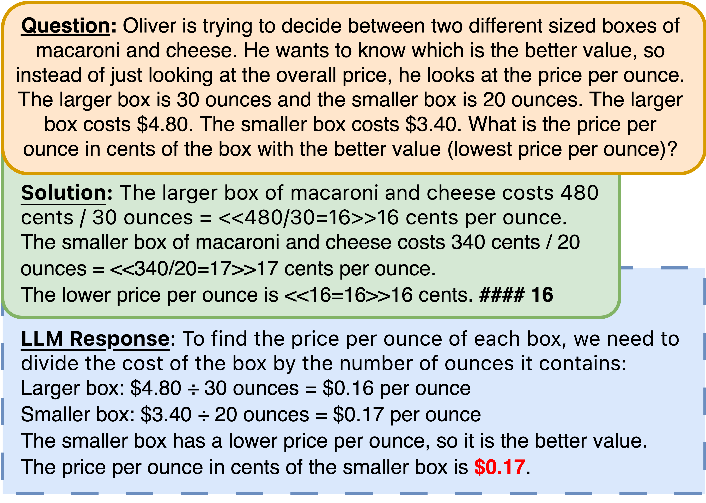
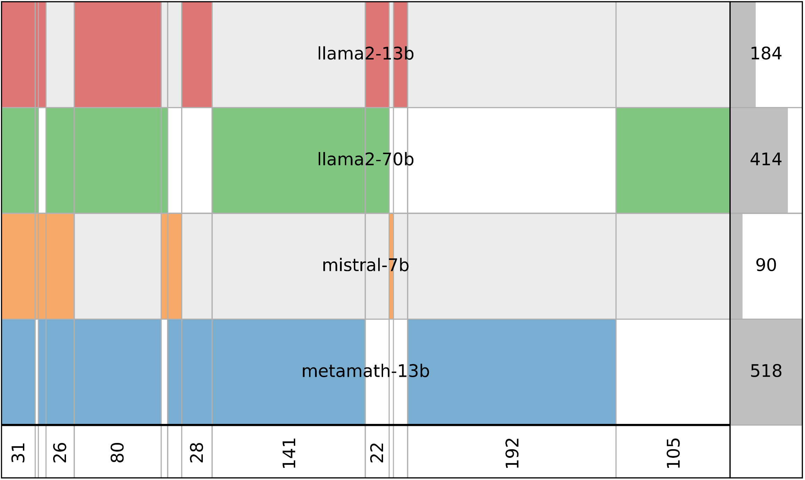
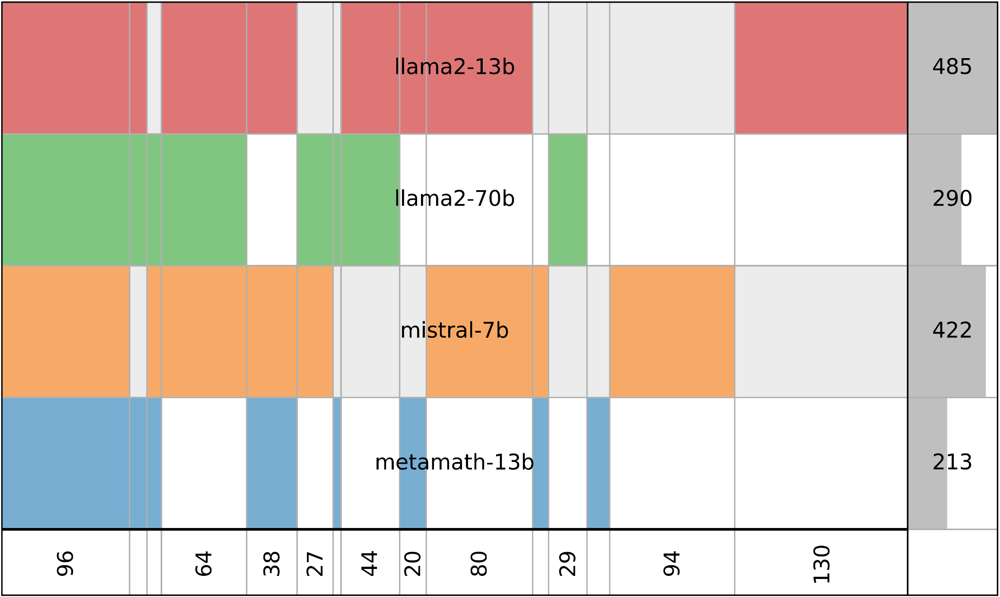
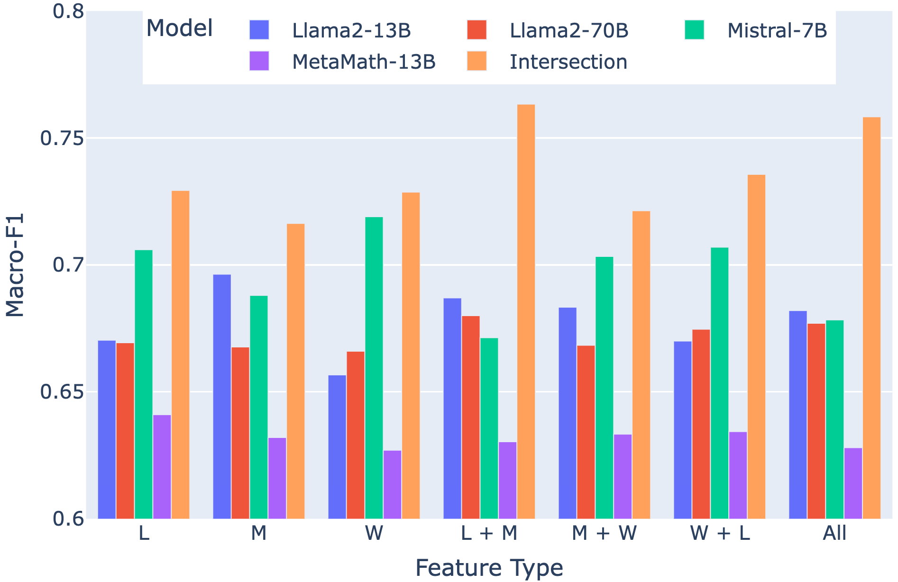
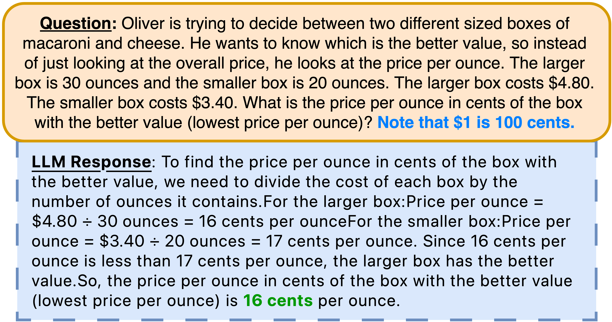

# 究竟为何数学文本题目会对 LLMs 造成困扰呢？

发布时间：2024年03月17日

`LLM应用`

> What Makes Math Word Problems Challenging for LLMs?

# 摘要

> 该研究聚焦于揭示大型语言模型（LLMs）解决数学词问题（MWPs）时所面临的难题所在。我们深入剖析了MWPs的语言及数学核心特征，并通过训练特征导向的分类器来深入了解这些特征如何影响LLMs处理MWPs的整体难度，进而探究这是否能帮助预测LLMs在面对特定类型MWPs时的表现优劣。

> This paper investigates the question of what makes math word problems (MWPs) challenging for large language models (LLMs). We conduct an in-depth analysis of the key linguistic and mathematical characteristics of MWPs. In addition, we train feature-based classifiers to better understand the impact of each feature on the overall difficulty of MWPs for prominent LLMs and investigate whether this helps predict how well LLMs fare against specific categories of MWPs.

[Arxiv](https://arxiv.org/abs/2403.11369)