# X-LLaVA：致力于优化双语环境下大型视觉与语言模型的深度对齐能力

发布时间：2024年03月17日

`LLM应用` `多模态模型` `多语言技术`

> X-LLaVA: Optimizing Bilingual Large Vision-Language Alignment

# 摘要

> 随着 LLM 的迅猛发展，如今已扩展到融合多元数据类型的大型多模态模型（LMMs）领域。然而，多模态模型在训练数据制作上需承担高昂成本，并且因语言的多样性和复杂性，构建适用于 LMM 的多语言数据集困难重重。为此，本研究创新性地提出两种经济实惠的解决方案：一是针对特定语言扩充词汇表并预训练多语言 LLM；二是运用 GPT4-V 技术自动精巧构造多模态数据集。据此，我们成功构建了一个包含 91,000 条记录的英-韩-中三语多模态训练数据集，并进一步研发出一款在韩、英双语上表现卓越、超越现有技术的双语多模态模型。

> The impressive development of large language models (LLMs) is expanding into the realm of large multimodal models (LMMs), which incorporate multiple types of data beyond text. However, the nature of multimodal models leads to significant expenses in the creation of training data. Furthermore, constructing multilingual data for LMMs presents its own set of challenges due to language diversity and complexity. Therefore, in this study, we propose two cost-effective methods to solve this problem: (1) vocabulary expansion and pretraining of multilingual LLM for specific languages, and (2) automatic and elaborate construction of multimodal datasets using GPT4-V. Based on015 these methods, we constructed a 91K English-Korean-Chinese multilingual, multimodal training dataset. Additionally, we developed a bilingual multimodal model that exhibits excellent performance in both Korean and English, surpassing existing approaches.

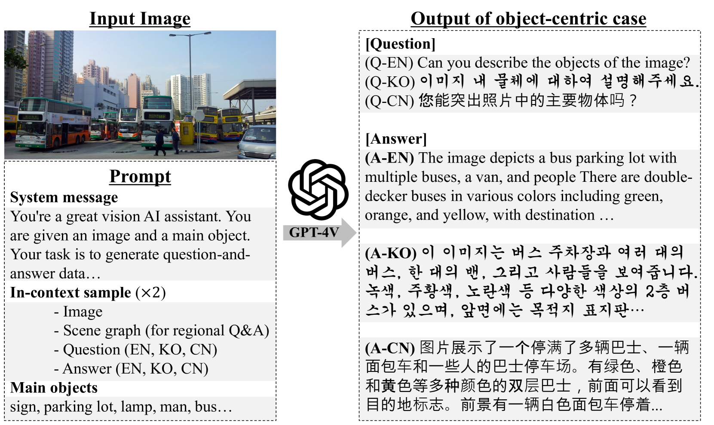

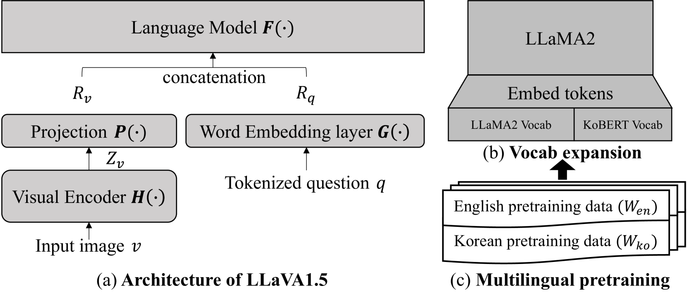

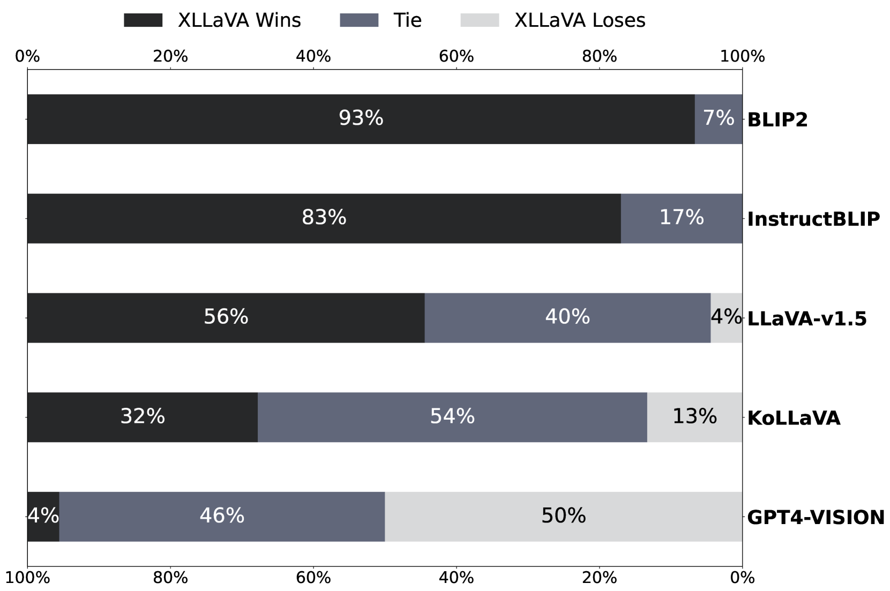

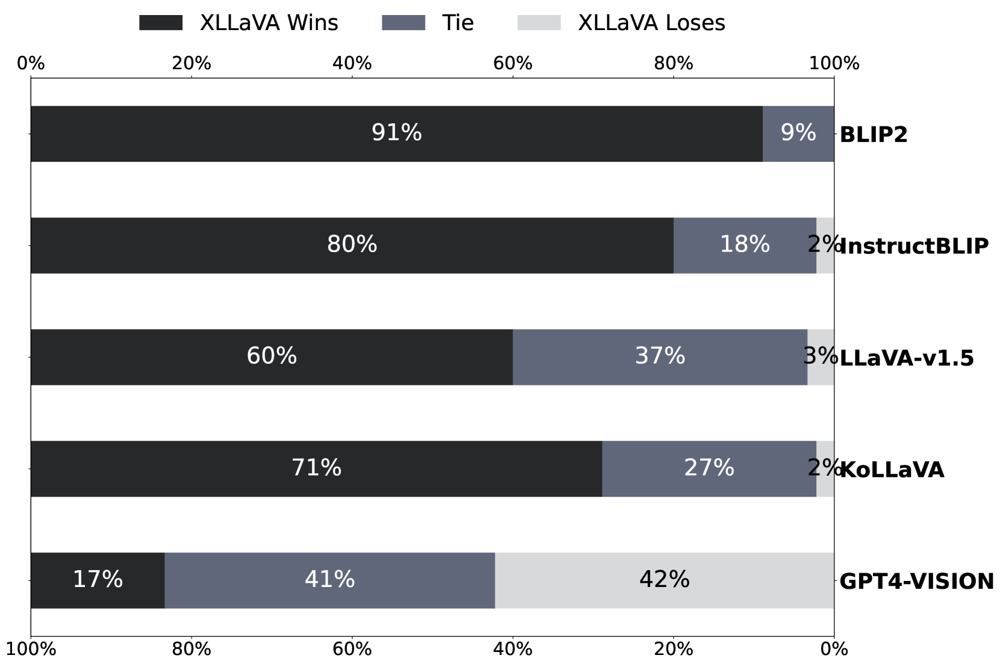

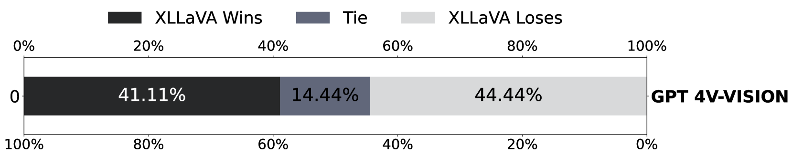

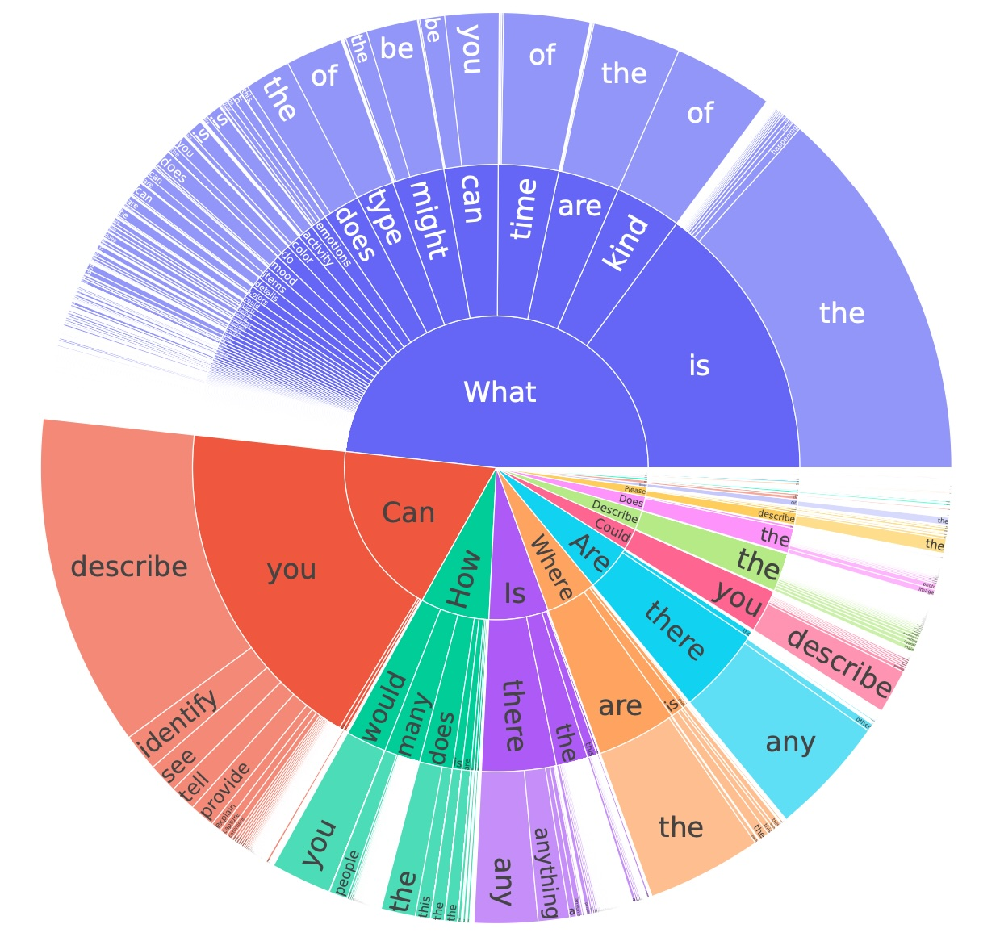

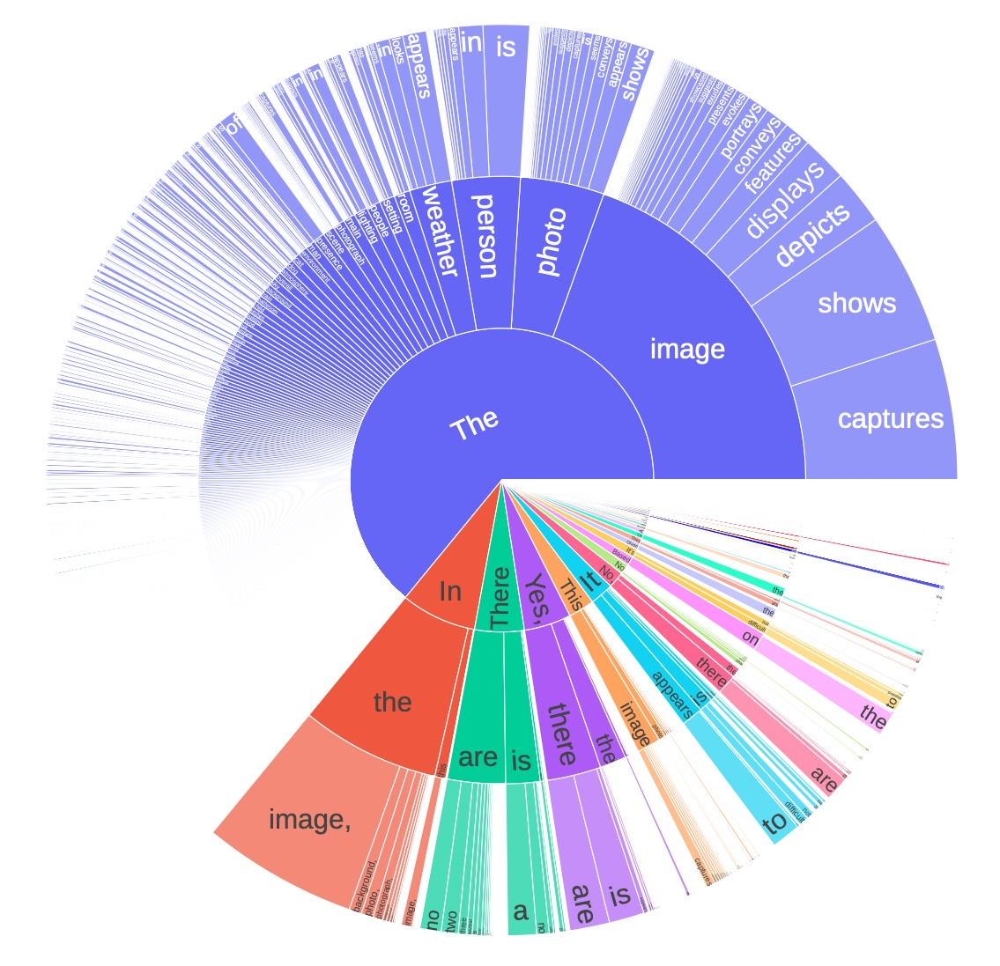

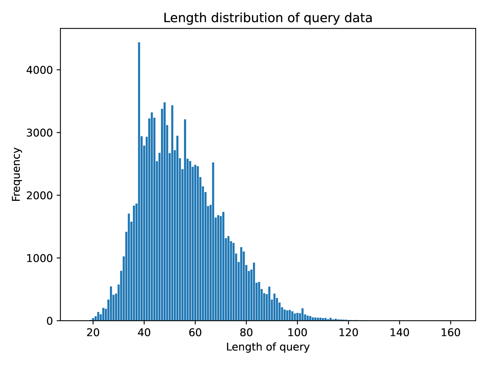

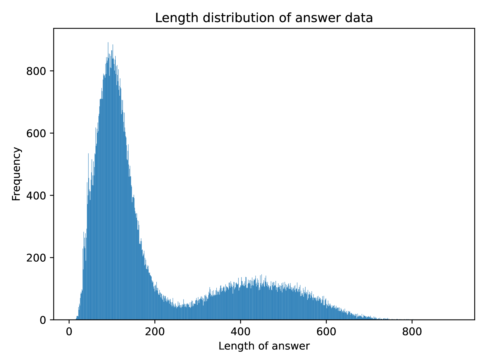

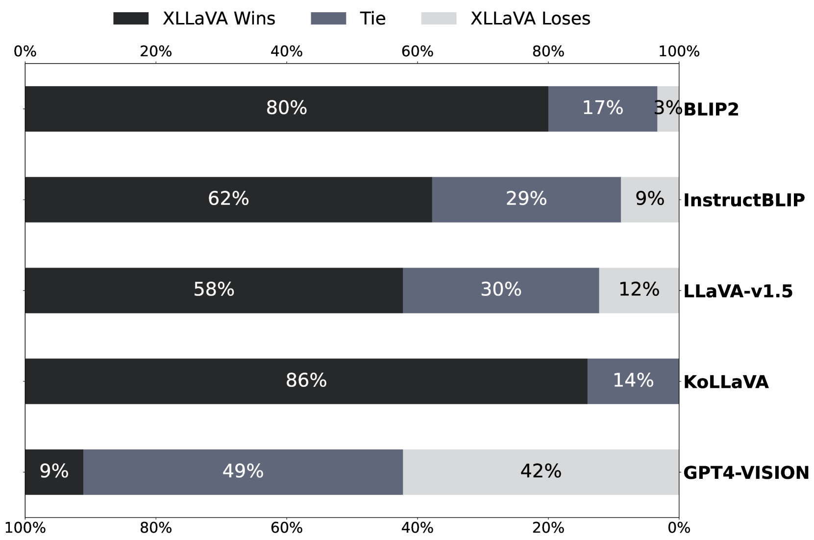

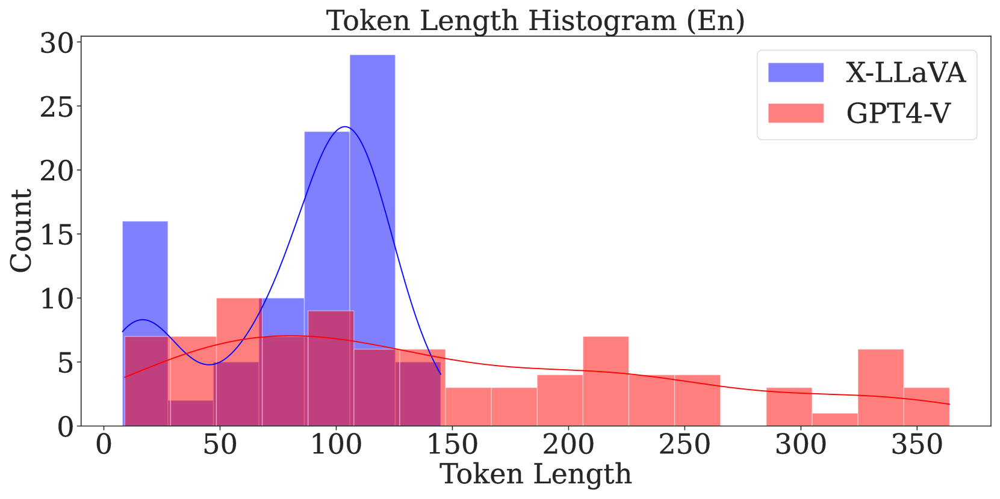

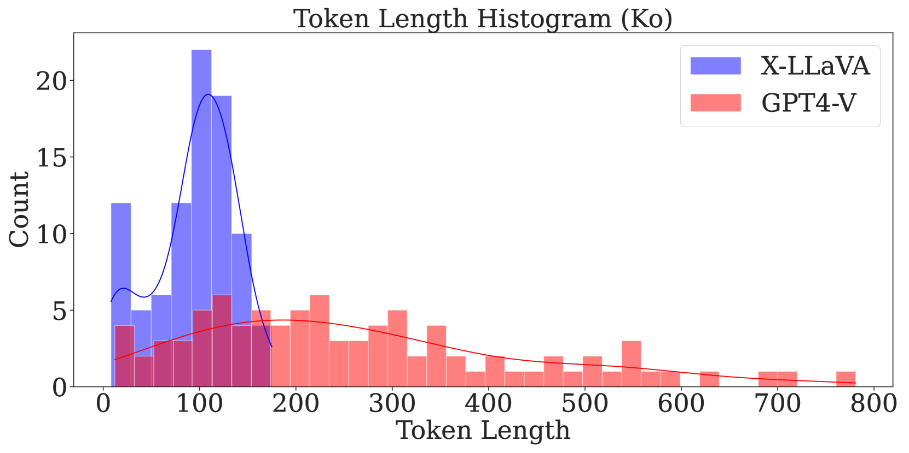

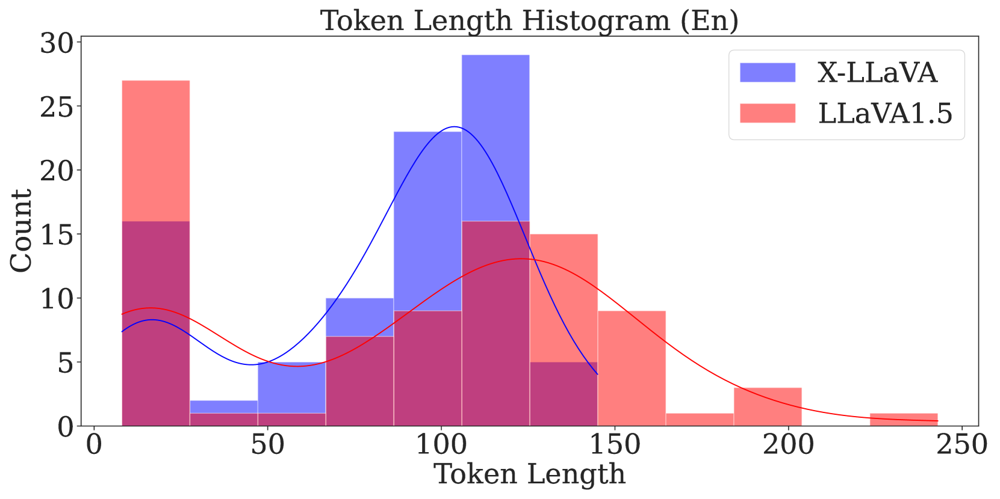

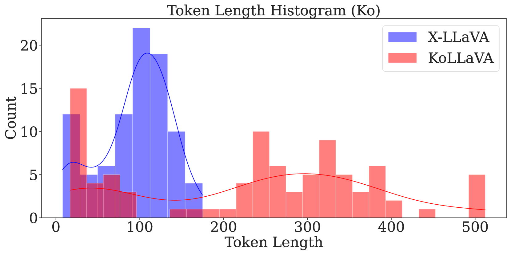

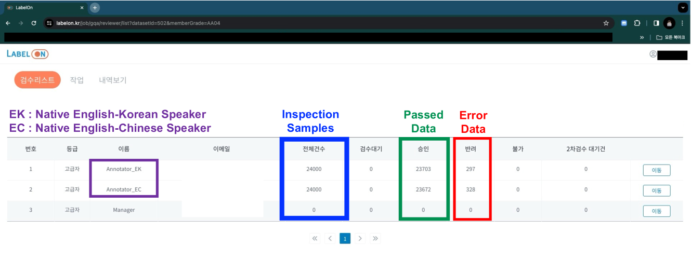

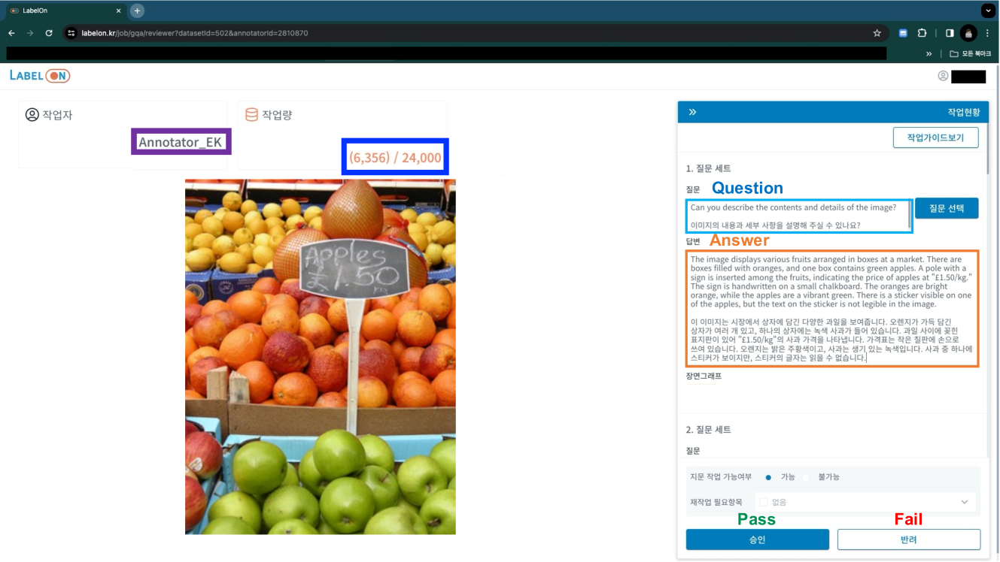

[Arxiv](https://arxiv.org/abs/2403.11399)