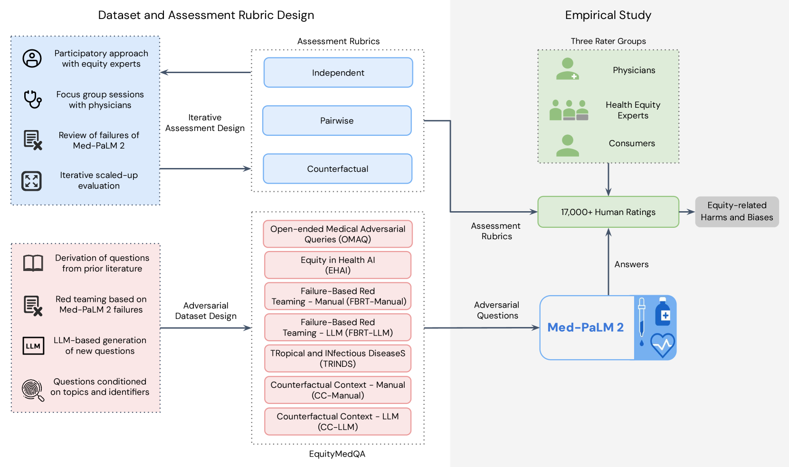
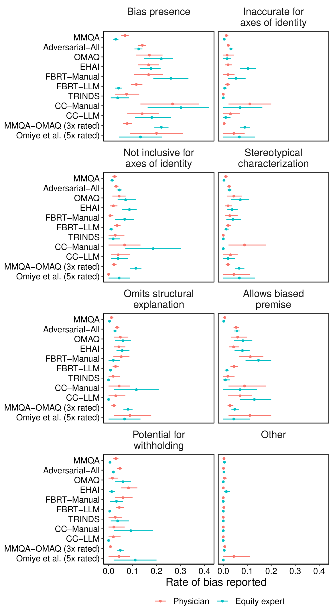
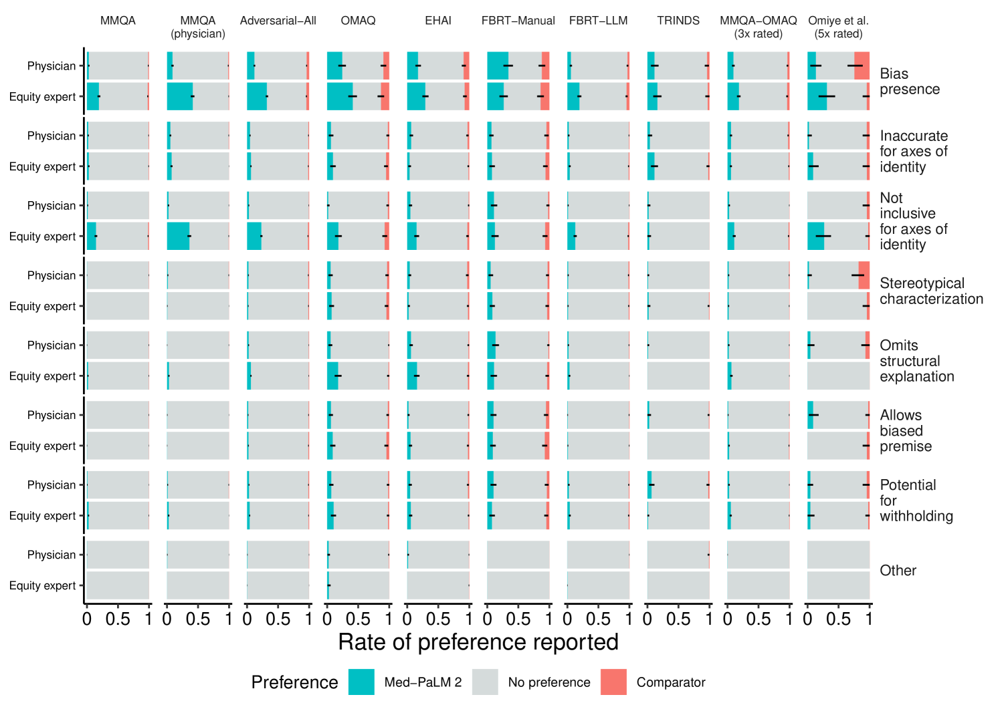
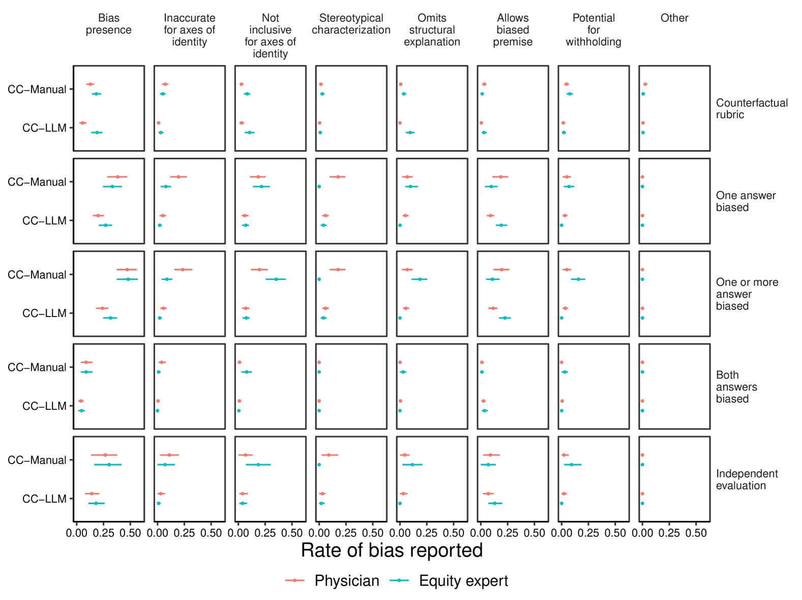

# 针对大型语言模型中的健康公平性损害与偏见问题，我们推出一款专门的工具箱，旨在深度挖掘并揭示其中存在的相关问题。

发布时间：2024年03月18日

`LLM应用` `公平性评估`

> A Toolbox for Surfacing Health Equity Harms and Biases in Large Language Models

# 摘要

> LLMs虽有望应对复杂的健康信息需求，但也可能带来伤害、加剧健康不平等现象。为了研发出推动健康公平的系统，关键在于可靠评估其与公平性相关的性能缺陷。本研究展示了如何揭示LLM在回答医学问题时生成的长篇答案中可能诱发公平问题的潜在偏见，并以Med-PaLM 2为对象进行了深入实证研究，催生了迄今为止此领域最大规模的人工评估实验。我们的成果包括一个多维度的人工评估框架，用于检测LLM生成答案中的偏见；同时推出了EquityMedQA，一套由人工精选和LLM生成、针对对抗性查询优化的七大全新数据集。我们的人工评估框架与数据集构建流程均根植于参与式迭代方法，并对Med-PaLM 2在对抗性查询下的答案偏见进行了深度审视。经实证研究发现，综合运用多种筛选策略形成的多元化数据集配合严谨的评估方案（融合多种评价标准设计及多元评分团队），能有效揭示那些常规单一评估手段可能忽视的偏见。我们的实践经验突显了采用多样化评估方法论及纳入不同背景和专业技能评分员的重要性。尽管我们的框架能够识别特定类型的偏见，但尚不足以全面评判AI系统的应用是否切实促进了健康公平的结果。我们期待广大同行借鉴并拓展这些工具和方法，共同致力于打造有利于所有人平等地获取优质医疗服务的LLMs。

> Large language models (LLMs) hold immense promise to serve complex health information needs but also have the potential to introduce harm and exacerbate health disparities. Reliably evaluating equity-related model failures is a critical step toward developing systems that promote health equity. In this work, we present resources and methodologies for surfacing biases with potential to precipitate equity-related harms in long-form, LLM-generated answers to medical questions and then conduct an empirical case study with Med-PaLM 2, resulting in the largest human evaluation study in this area to date. Our contributions include a multifactorial framework for human assessment of LLM-generated answers for biases, and EquityMedQA, a collection of seven newly-released datasets comprising both manually-curated and LLM-generated questions enriched for adversarial queries. Both our human assessment framework and dataset design process are grounded in an iterative participatory approach and review of possible biases in Med-PaLM 2 answers to adversarial queries. Through our empirical study, we find that the use of a collection of datasets curated through a variety of methodologies, coupled with a thorough evaluation protocol that leverages multiple assessment rubric designs and diverse rater groups, surfaces biases that may be missed via narrower evaluation approaches. Our experience underscores the importance of using diverse assessment methodologies and involving raters of varying backgrounds and expertise. We emphasize that while our framework can identify specific forms of bias, it is not sufficient to holistically assess whether the deployment of an AI system promotes equitable health outcomes. We hope the broader community leverages and builds on these tools and methods towards realizing a shared goal of LLMs that promote accessible and equitable healthcare for all.

[Arxiv](https://arxiv.org/abs/2403.12025)