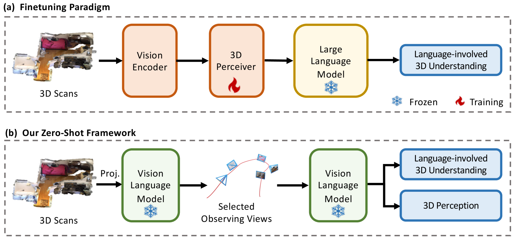
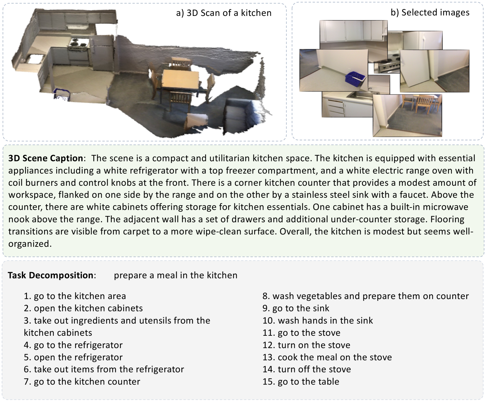

# Agent3D-Zero，一款专为实现零样本三维理解而设计的智能代理

发布时间：2024年03月18日

`Agent` `三维理解` `人工智能`

> Agent3D-Zero: An Agent for Zero-shot 3D Understanding

# 摘要

> 要迈向通用人工智能，理解与推理三维真实世界是一项关键能力。目前主流做法是用三维数据及文本对大型语言模型（LLMs）进行微调以实现三维认知，虽然有效，却受限于现有三维数据的规模与多样性。为此，我们创新性地提出了名为Agent3D-Zero的三维感知智能体框架，它以零样本方式应对三维场景理解难题。该框架的核心思想借鉴人类理解三维场景的方式，将三维场景感知重构为理解和整合多视角图像信息的过程。我们独辟蹊径，提出运用大型视觉语言模型（VLM）的新颖方案——主动选取并解析一系列视点以助力三维理解。具体而言，针对给定的三维场景，Agent3D-Zero首先采用定制视觉提示处理鸟瞰图像，进而迭代选择并总结下一组观察视点。Agent3D-Zero的一大亮点在于其创新引入的视觉提示，极大地激活了VLM识别最具信息量视点的能力，从而有利于观察三维场景。大量实验证明，该框架在理解和处理多样且未见过的三维环境中展现出了卓越效果。

> The ability to understand and reason the 3D real world is a crucial milestone towards artificial general intelligence. The current common practice is to finetune Large Language Models (LLMs) with 3D data and texts to enable 3D understanding. Despite their effectiveness, these approaches are inherently limited by the scale and diversity of the available 3D data. Alternatively, in this work, we introduce Agent3D-Zero, an innovative 3D-aware agent framework addressing the 3D scene understanding in a zero-shot manner. The essence of our approach centers on reconceptualizing the challenge of 3D scene perception as a process of understanding and synthesizing insights from multiple images, inspired by how our human beings attempt to understand 3D scenes. By consolidating this idea, we propose a novel way to make use of a Large Visual Language Model (VLM) via actively selecting and analyzing a series of viewpoints for 3D understanding. Specifically, given an input 3D scene, Agent3D-Zero first processes a bird's-eye view image with custom-designed visual prompts, then iteratively chooses the next viewpoints to observe and summarize the underlying knowledge. A distinctive advantage of Agent3D-Zero is the introduction of novel visual prompts, which significantly unleash the VLMs' ability to identify the most informative viewpoints and thus facilitate observing 3D scenes. Extensive experiments demonstrate the effectiveness of the proposed framework in understanding diverse and previously unseen 3D environments.

[Arxiv](https://arxiv.org/abs/2403.11835)