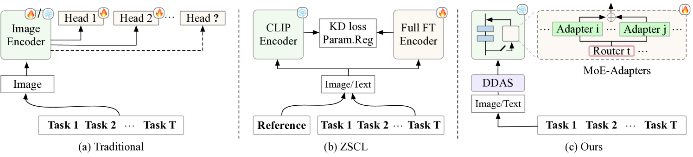
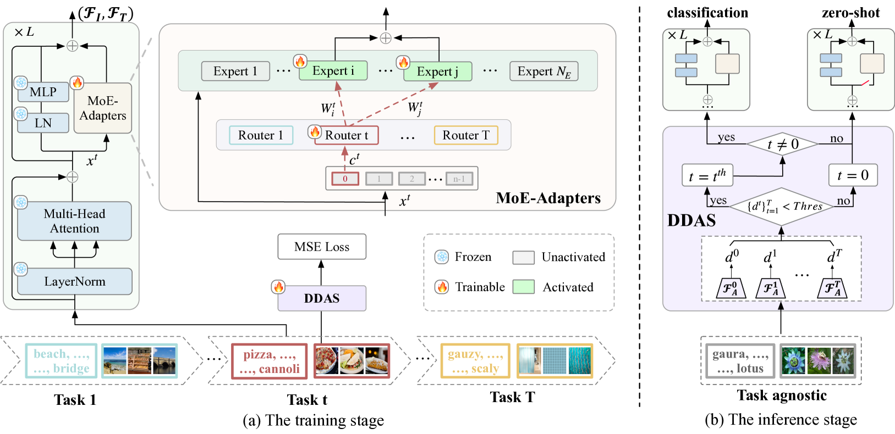
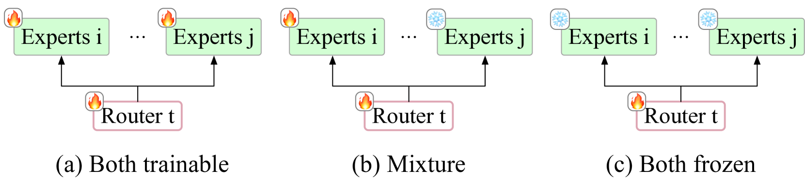
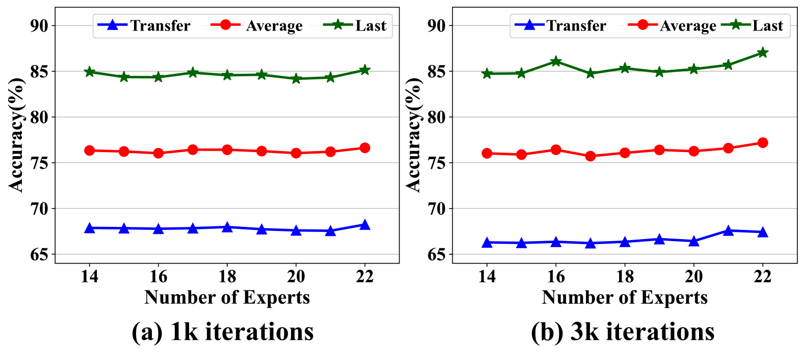
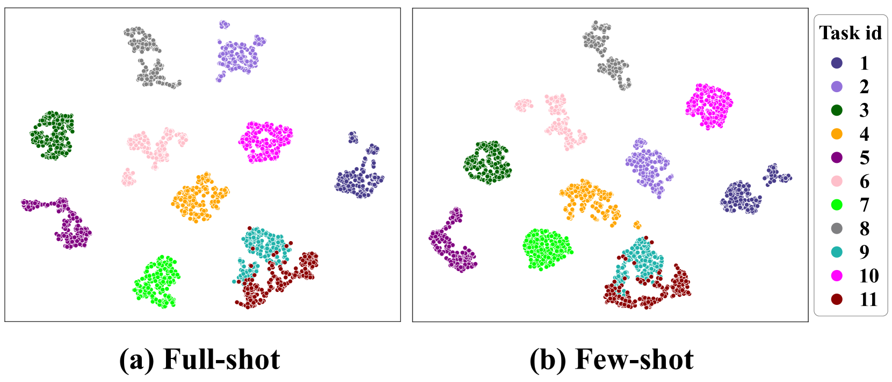
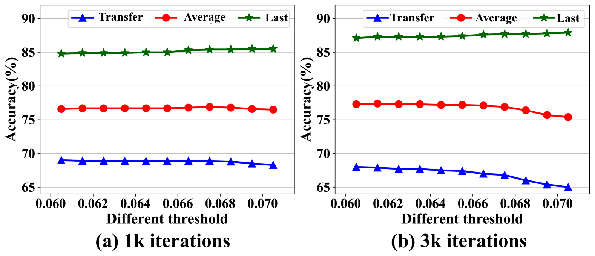

# 利用混合专家适配器技术，我们成功地增强了视觉-语言模型在连续学习任务中的性能。这一方法旨在通过精心设计的适配器结构，有效促进视觉和语言信息融合的模型在不断学习新知识的过程中保持并提升其原有能力。

发布时间：2024年03月18日

`Agent` `持续学习` `视觉-语言模型`

> Boosting Continual Learning of Vision-Language Models via Mixture-of-Experts Adapters

> 为了让视觉-语言模型能够持续吸收新知识而无需依赖完整的历史数据集，持续学习技术大有用武之地。然而，由于终身学习中参数变化及完整模型调优所需的大量计算资源，如何有效减轻大型模型在这一过程中的性能衰退成为一项挑战。在此研究中，我们提出了一种参数高效的持续学习框架，它通过在预训练的CLIP模型中动态融合MoE适配器以应对新增任务，从而减轻增量学习中的长期遗忘现象。为进一步保护视觉-语言模型的零样本识别能力，我们创新性地设计了分布判别式自动选择器（DDAS），它能智能地将分布内外的输入分别导向MoE适配器和原始CLIP模型。经过一系列广泛且深入的实验验证，我们的方法在降低60%参数训练负担的同时，始终超越了以往最先进的方法。我们的源代码已开源，地址为：https://github.com/JiazuoYu/MoE-Adapters4CL。

> Continual learning can empower vision-language models to continuously acquire new knowledge, without the need for access to the entire historical dataset. However, mitigating the performance degradation in large-scale models is non-trivial due to (i) parameter shifts throughout lifelong learning and (ii) significant computational burdens associated with full-model tuning. In this work, we present a parameter-efficient continual learning framework to alleviate long-term forgetting in incremental learning with vision-language models. Our approach involves the dynamic expansion of a pre-trained CLIP model, through the integration of Mixture-of-Experts (MoE) adapters in response to new tasks. To preserve the zero-shot recognition capability of vision-language models, we further introduce a Distribution Discriminative Auto-Selector (DDAS) that automatically routes in-distribution and out-of-distribution inputs to the MoE Adapter and the original CLIP, respectively. Through extensive experiments across various settings, our proposed method consistently outperforms previous state-of-the-art approaches while concurrently reducing parameter training burdens by 60%. Our code locates at https://github.com/JiazuoYu/MoE-Adapters4CL

[Arxiv](https://arxiv.org/abs/2403.11549)