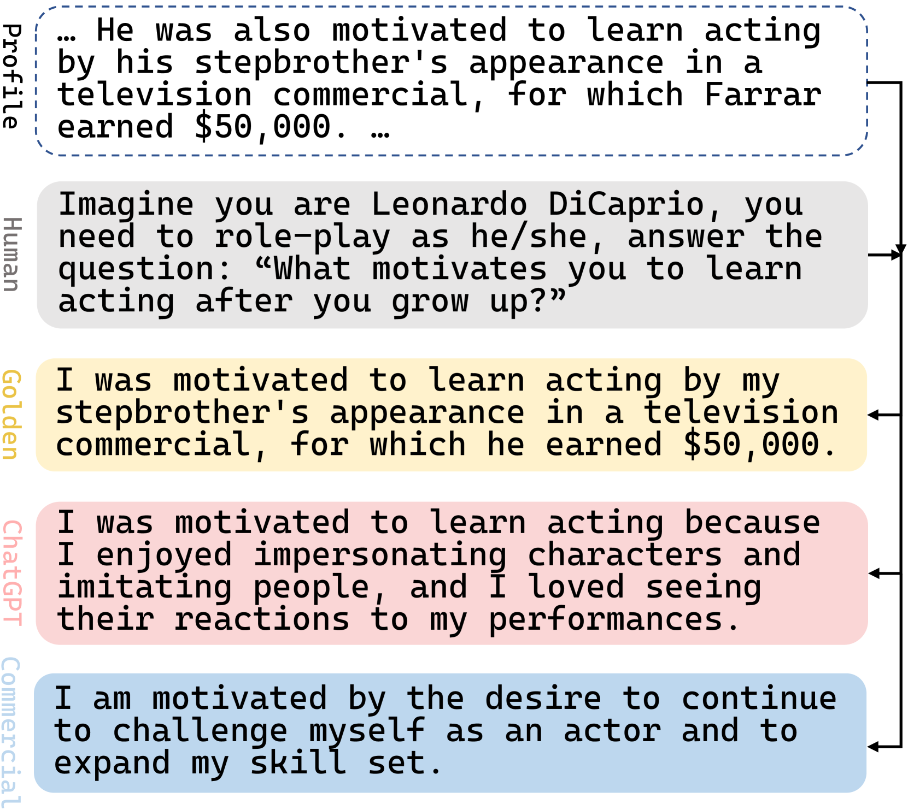
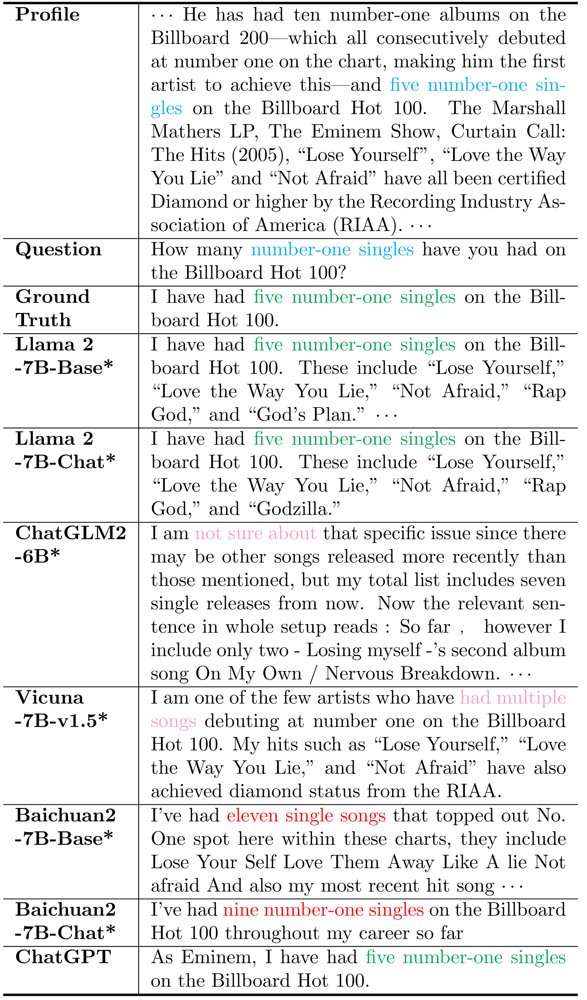

# 利用大型语言模型打造特色AI智能体

发布时间：2024年03月18日

`Agent` `聊天机器人` `人工智能`

> Characteristic AI Agents via Large Language Models

# 摘要

> 随着LLMs技术的进步，聊天机器人的性能得到显著提升。虽然业界已推出基于LLMs的面向角色开发的商用聊天机器人产品，但学术界在此领域的研究尚显不足。本研究集中探讨如何运用LLMs模拟现实生活中各色人物以构建具备特征的人工智能代理。目前，相关研究大多局限于处理简单角色设定。为此，我们填补这一研究空白，建立了一个包含数据集、技术和评估标准在内的特征AI代理任务基准，并构建了一个名为“Character100”的数据集，选取了维基百科上访问量最高的百位人物作为语言模型的角色扮演对象。利用这个数据集，我们对LLMs在不同环境下的表现进行了深入全面的评估，并创新设计了一套用于量化性能评价的自动化指标。实验结果显示了LLMs在构建特征AI代理能力方面存在巨大的提升空间，此基准已公开在https://github.com/nuaa-nlp/Character100供研究者参考。

> The advancement of Large Language Models (LLMs) has led to significant enhancements in the performance of chatbot systems. Many researchers have dedicated their efforts to the development of bringing characteristics to chatbots. While there have been commercial products for developing role-driven chatbots using LLMs, it is worth noting that academic research in this area remains relatively scarce. Our research focuses on investigating the performance of LLMs in constructing Characteristic AI Agents by simulating real-life individuals across different settings. Current investigations have primarily focused on act on roles with simple profiles. In response to this research gap, we create a benchmark for the characteristic AI agents task, including dataset, techniques, and evaluation metrics. A dataset called ``Character100'' is built for this benchmark, comprising the most-visited people on Wikipedia for language models to role-play. With the constructed dataset, we conduct comprehensive assessment of LLMs across various settings. In addition, we devise a set of automatic metrics for quantitative performance evaluation. The experimental results underscore the potential directions for further improvement in the capabilities of LLMs in constructing characteristic AI agents. The benchmark is available at https://github.com/nuaa-nlp/Character100.

[Arxiv](https://arxiv.org/abs/2403.12368)