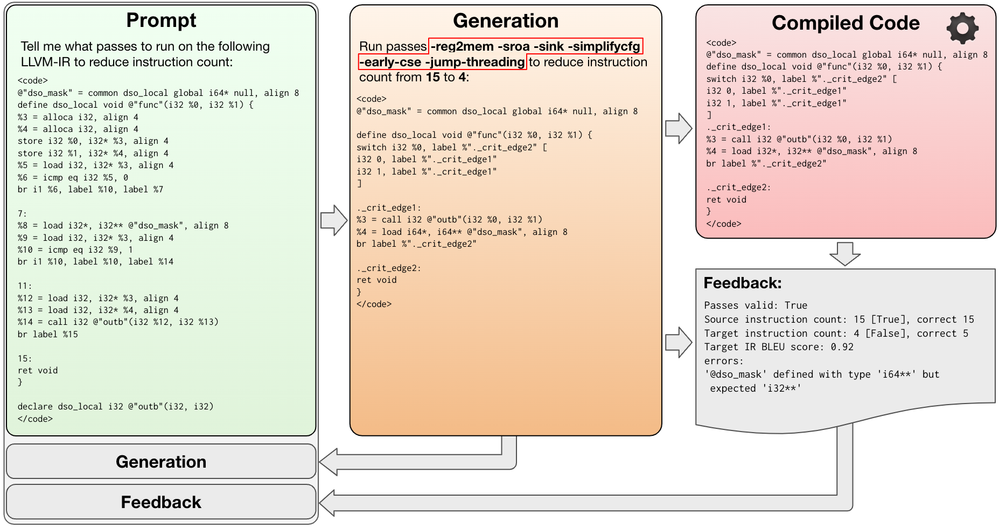
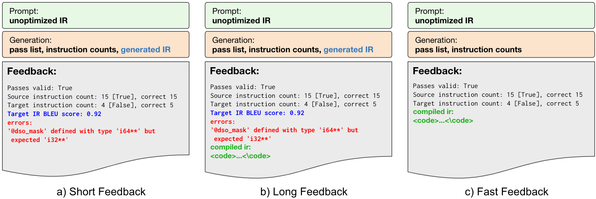
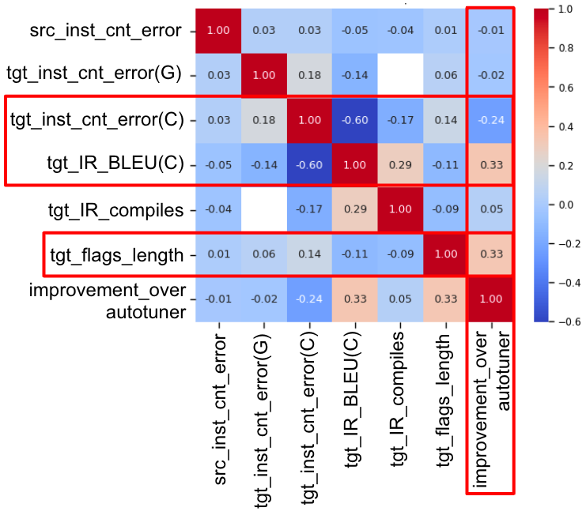
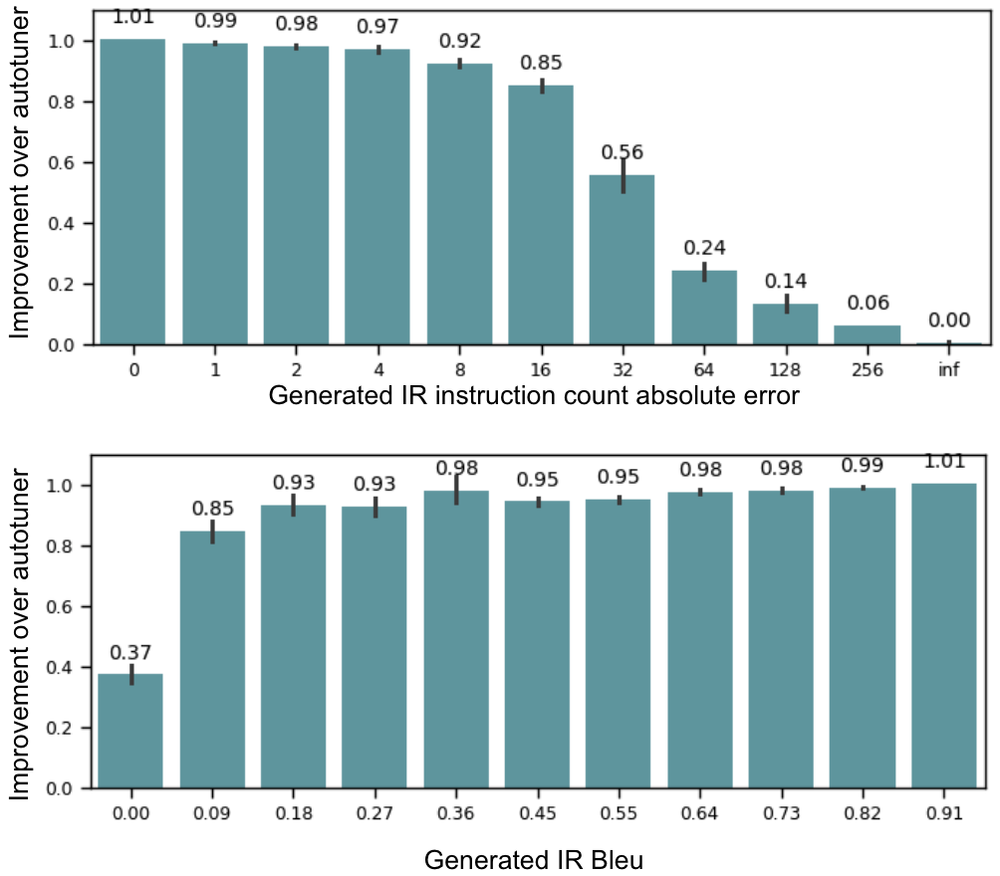
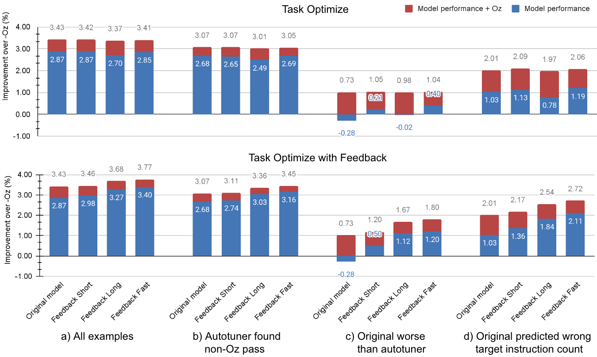
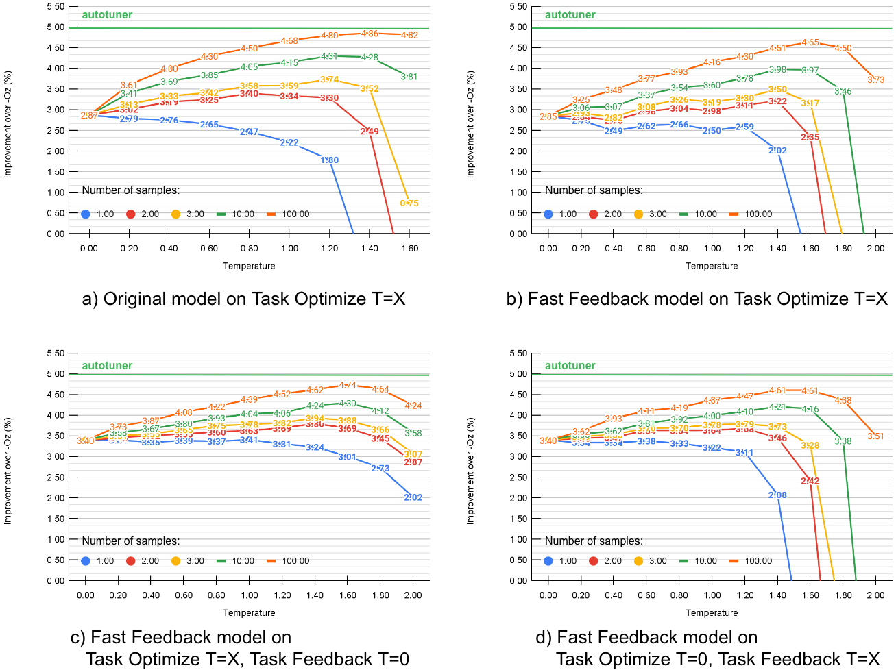
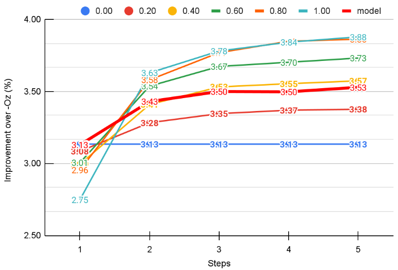

# 为大型语言模型定制的编译器生成反馈技术

发布时间：2024年03月18日

`LLM应用` `软件工程` `编译器优化`

> Compiler generated feedback for Large Language Models

> 我们创新性地提出了一种利用带有编译器反馈的大型语言模型进行编译器优化的新方法，以优化LLVM汇编代码大小。模型接收未经优化的LLVM IR，在输出优化后的IR的同时，还能推荐最佳优化流程，并提供优化前后IR的指令数量统计。接着，我们采用生成的优化流程编译输入，并验证预测的指令数量是否准确、生成的IR能否成功编译，以及其是否与实际编译出的代码相符。我们将这一编译反馈返回给大型语言模型，使其获得再次优化代码的机会。这种策略在原有模型基础上，相较于-Oz优化选项，进一步提升了0.53%的效果。尽管添加更多反馈信息看似直觉合理，但当提供10个或更多样本时，简单采样技术竟能实现显著更高的性能表现。

> We introduce a novel paradigm in compiler optimization powered by Large Language Models with compiler feedback to optimize the code size of LLVM assembly. The model takes unoptimized LLVM IR as input and produces optimized IR, the best optimization passes, and instruction counts of both unoptimized and optimized IRs. Then we compile the input with generated optimization passes and evaluate if the predicted instruction count is correct, generated IR is compilable, and corresponds to compiled code. We provide this feedback back to LLM and give it another chance to optimize code. This approach adds an extra 0.53% improvement over -Oz to the original model. Even though, adding more information with feedback seems intuitive, simple sampling techniques achieve much higher performance given 10 or more samples.

[Arxiv](https://arxiv.org/abs/2403.14714)