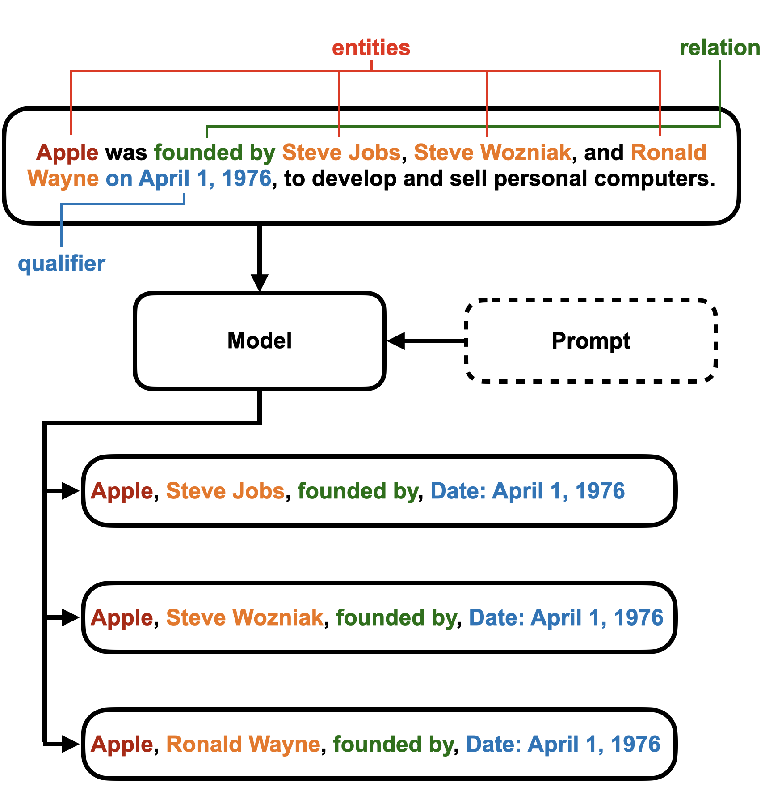
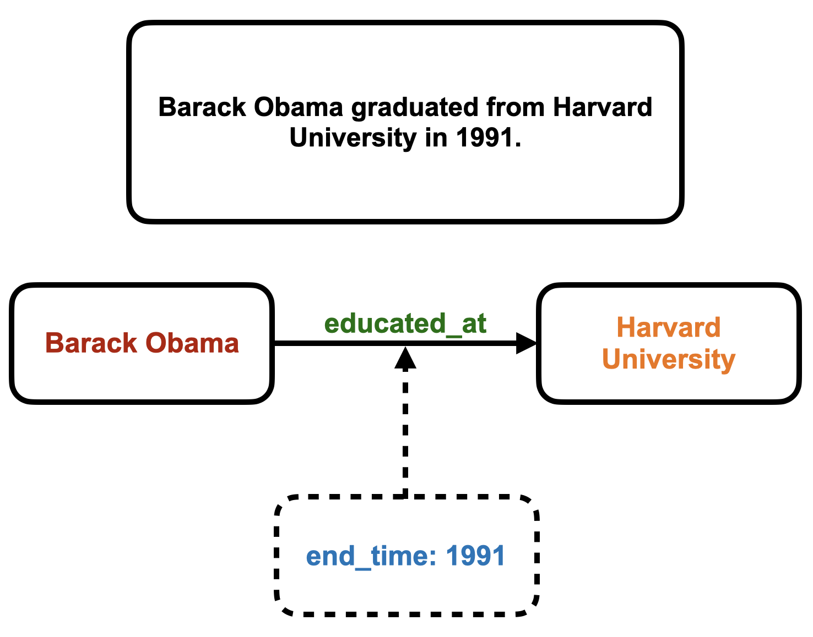
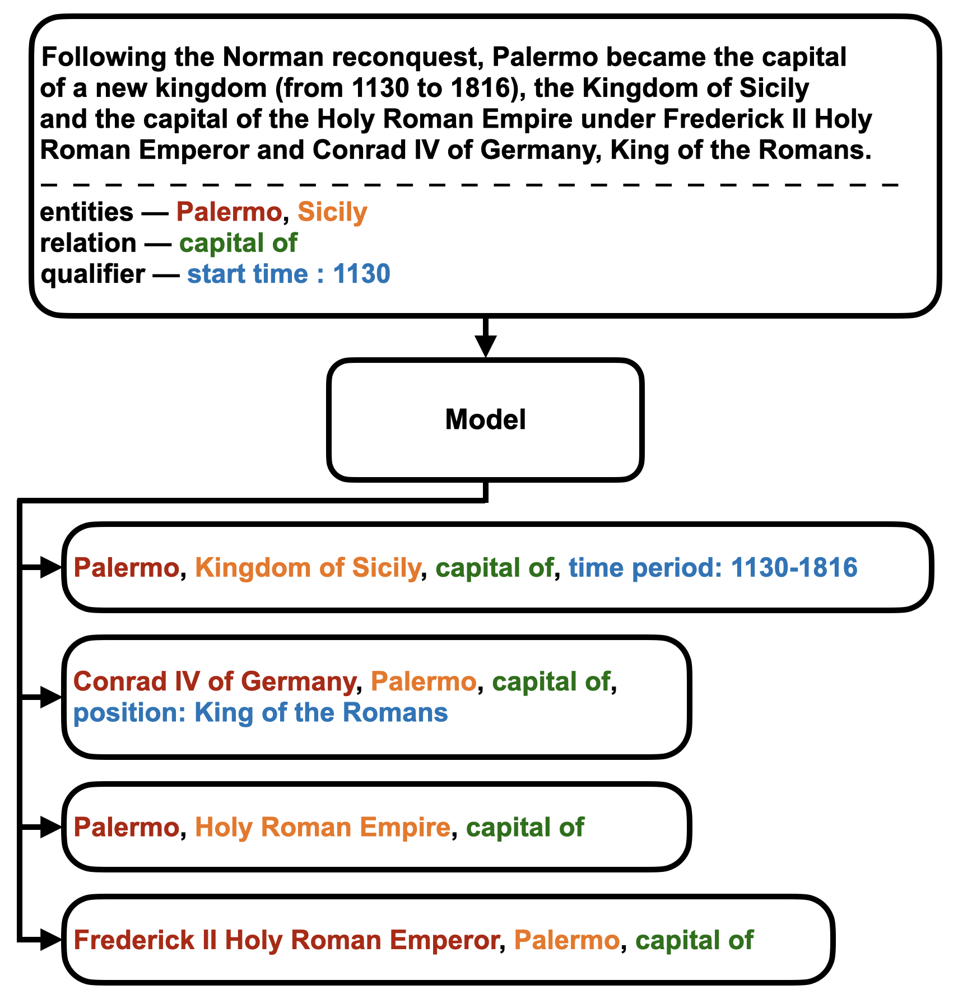

# 本研究探讨如何运用预训练的大型语言模型构建超关系知识图谱，以期在知识表示和推理领域取得新的突破。

发布时间：2024年03月18日

`LLM应用` `知识图谱`

> Construction of Hyper-Relational Knowledge Graphs Using Pre-Trained Large Language Models

# 摘要

> 为了填补构建全面知识图谱时抽取超关系方法不足的问题，我们创新性地运用OpenAI GPT-3.5模型，提出了一种零样本提示法来提取文本中的超关系知识。相较于基准模型，新模型在实验中表现出色，实现了0.77的高召回率，尽管当前精度仍待提升，但我们深入分析模型输出后已发掘出该领域的若干未来研究方向。

> Extracting hyper-relations is crucial for constructing comprehensive knowledge graphs, but there are limited supervised methods available for this task. To address this gap, we introduce a zero-shot prompt-based method using OpenAI's GPT-3.5 model for extracting hyper-relational knowledge from text. Comparing our model with a baseline, we achieved promising results, with a recall of 0.77. Although our precision is currently lower, a detailed analysis of the model outputs has uncovered potential pathways for future research in this area.

[Arxiv](https://arxiv.org/abs/2403.11786)