# Counting-Stars——我们提出了一种简洁高效的方案，用以评估长上下文大型语言模型，该策略在评估过程中兼顾了合理性和准确性。

发布时间：2024年03月18日

`LLM应用` `人工智能`

> Counting-Stars: A Simple, Efficient, and Reasonable Strategy for Evaluating Long-Context Large Language Models

# 摘要

> 近期研究致力于构建能够出色处理长上下文的大型语言模型（如ChatGPT与KimiChat），但受限于缺乏有效的评估方法，这些顶级LLMs在长文本处理上的真实实力尚不清晰。为此，我们创新性地提出了一项简洁易行且颇具代表性的评估方案——Counting-Stars，作为衡量长上下文LLMs的新基准。Counting-Stars测试设计促使LLMs全面理解并捕获长文本中的远距离依赖关系，并能跨越全文本多个片段收集相互关联信息来完成任务。基于此标准，我们对两大顶尖长上下文LLM——GPT-4 Turbo和Kimi Chat进行了实验验证。结果显示，在4K至128K长度的长文本场景中，二者表现出了显著的优越性能。此外，我们还深入探讨了LLMs处理长上下文时的两种有趣行为模式。

> While recent research endeavors have concentrated on developing Large Language Models (LLMs) with robust long-context capabilities, due to the lack of appropriate evaluation strategies, relatively little is known about how well the long-context processing abilities and performance of leading LLMs (e.g., ChatGPT and KimiChat). To address this gap, we propose a simple, efficient, and reasonable strategy for evaluating long-context LLMs as a new benchmark, named Counting-Stars. The Counting-Stars is designed to require LLMs to fully understand and capture long dependencies in long contexts and be able to collect inter-dependency across multiple pieces of evidence spanning the entire context to finish the task. Based on the Counting-Stars, we conduct experiments to evaluate the two leading long-context LLMs, i.e., GPT-4 Turbo and Kimi Chat. The experimental results indicate that GPT-4 Turbo and Kimi Chat achieve significant performance in the long context from 4K to 128K. We further present two intriguing analyses regarding the behavior of LLMs processing long context.

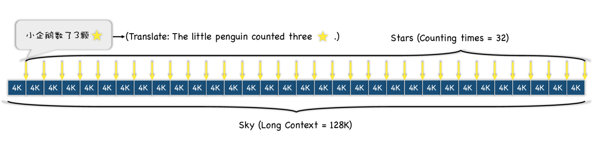

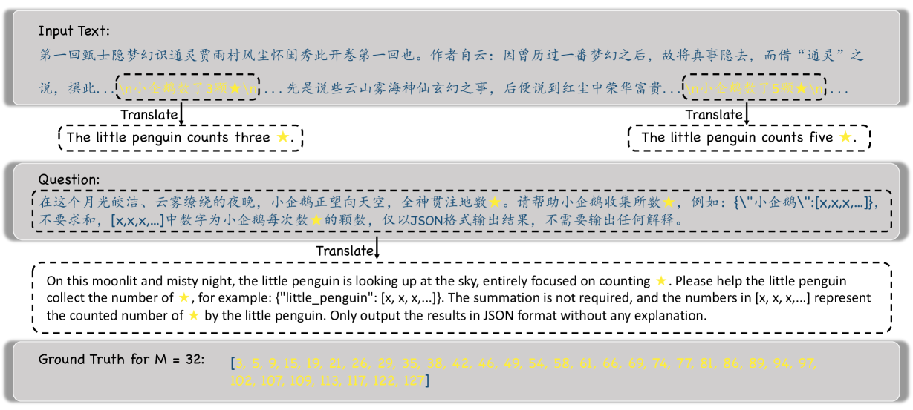

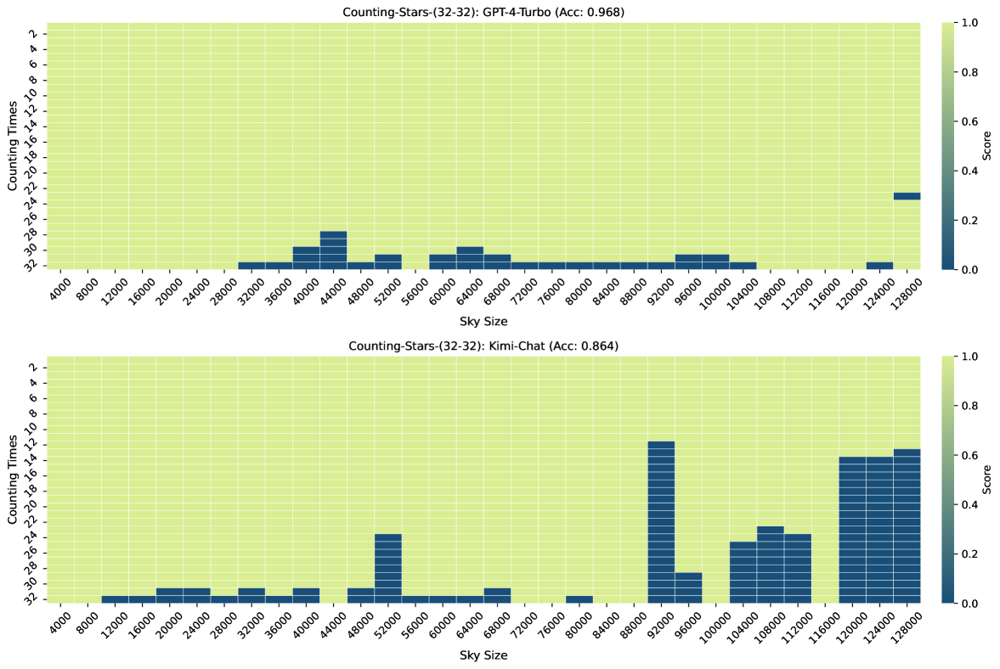

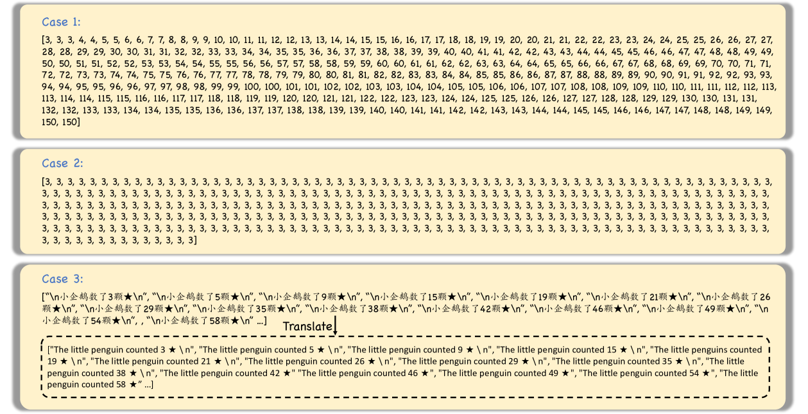

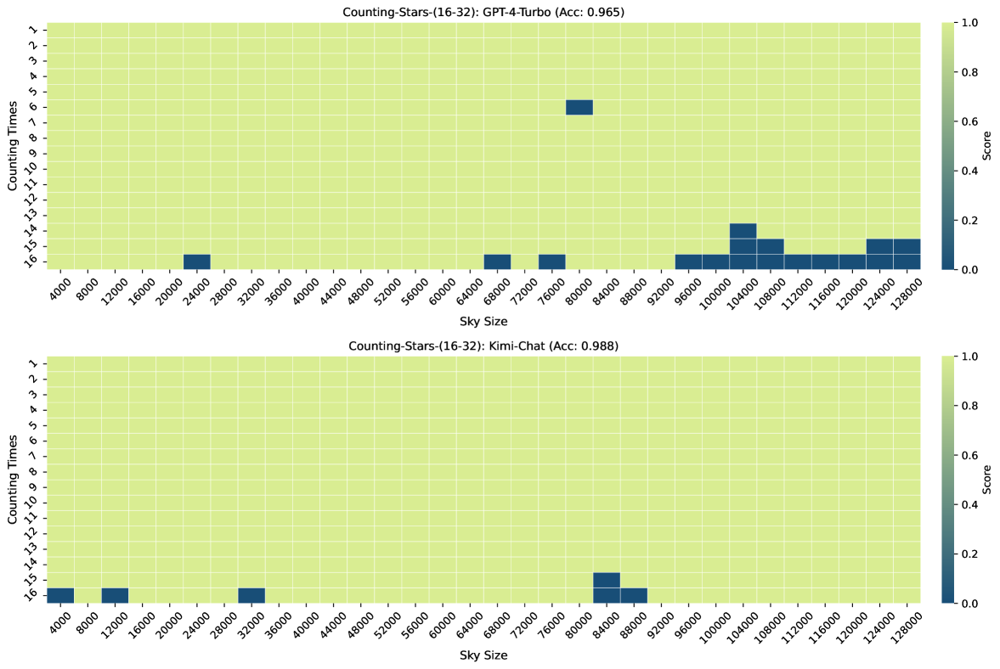

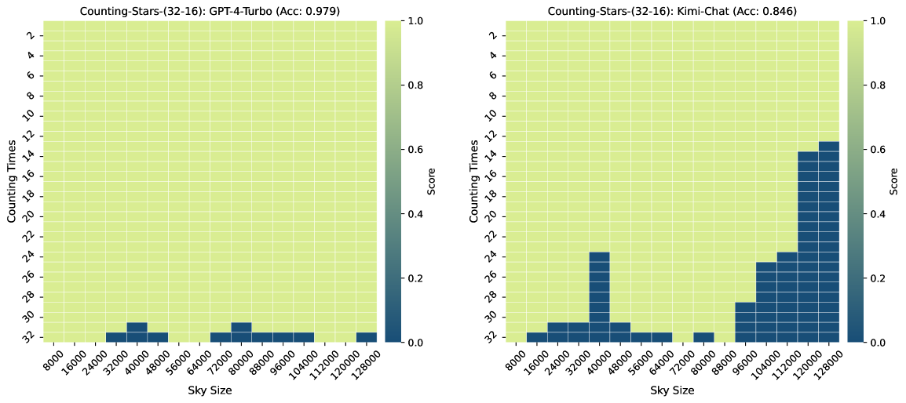

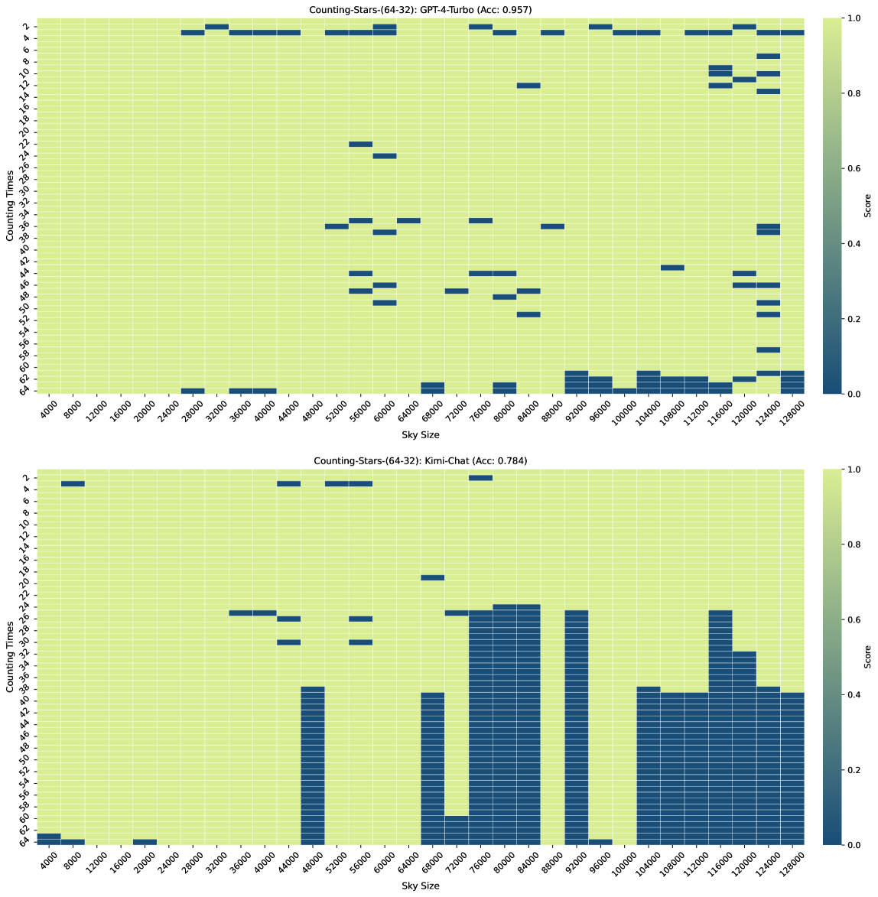

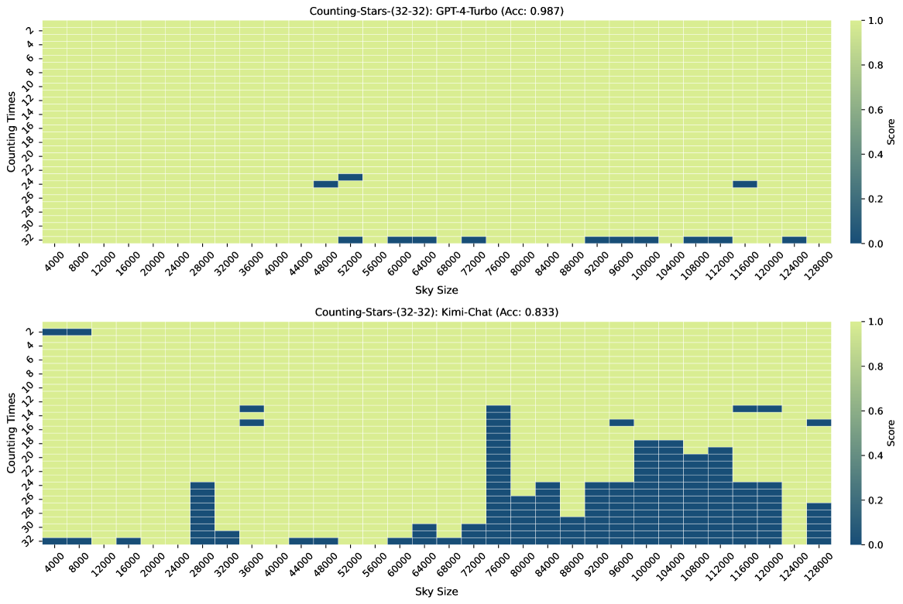

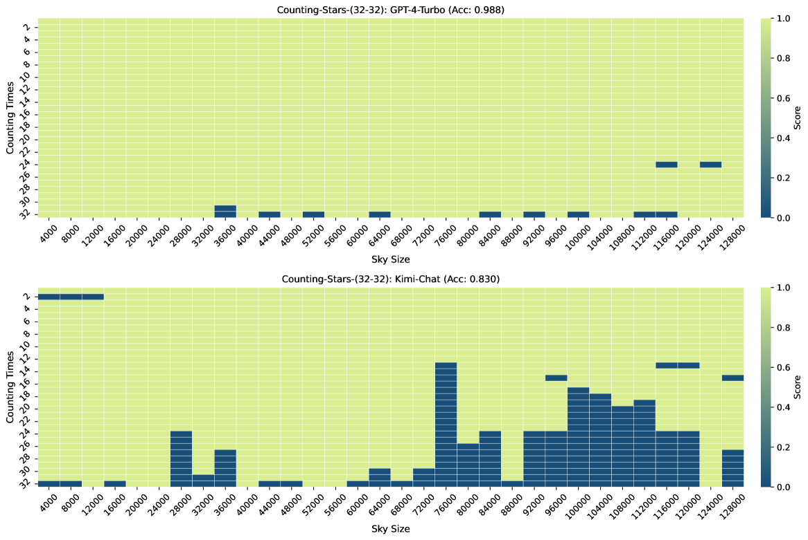

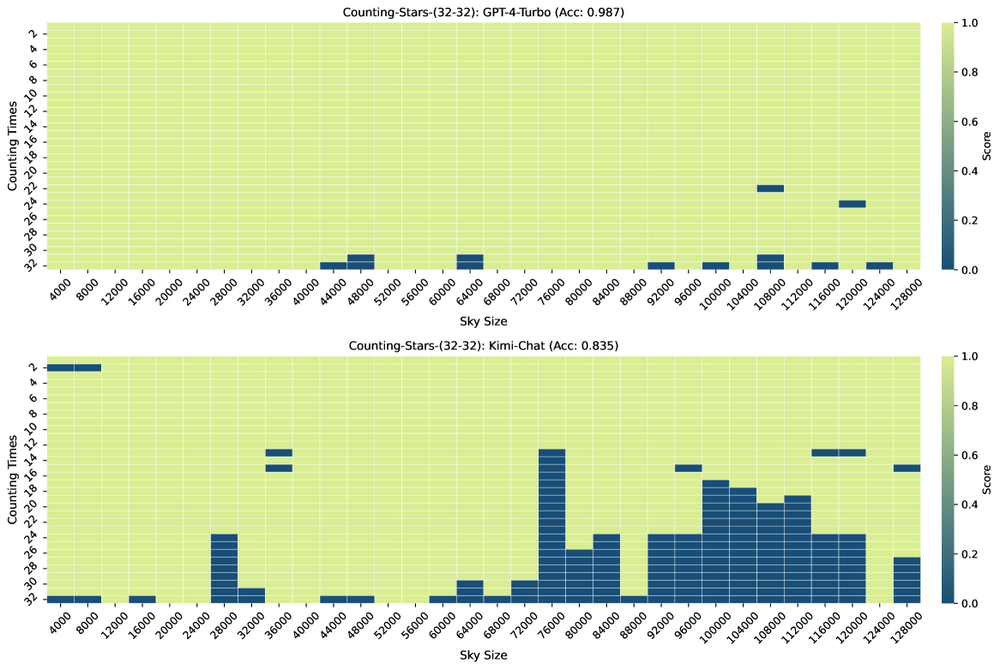

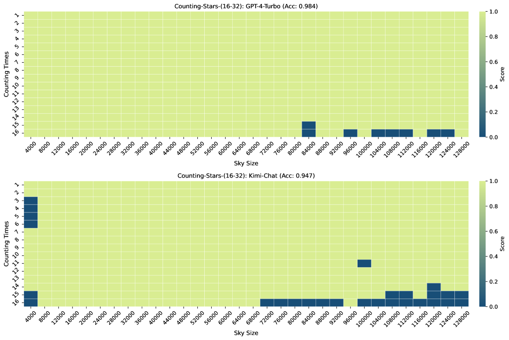

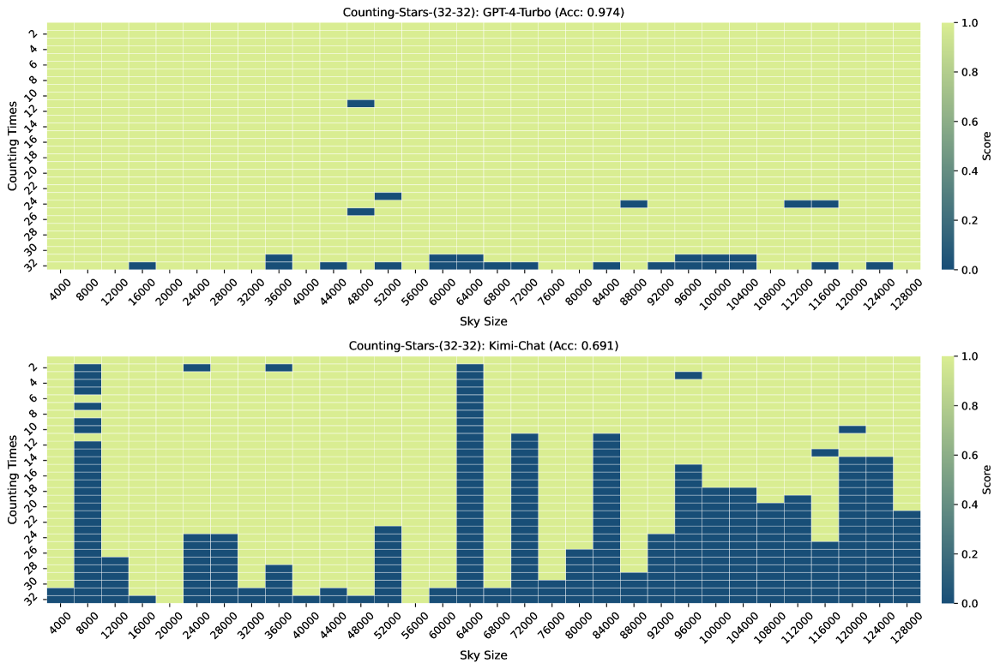

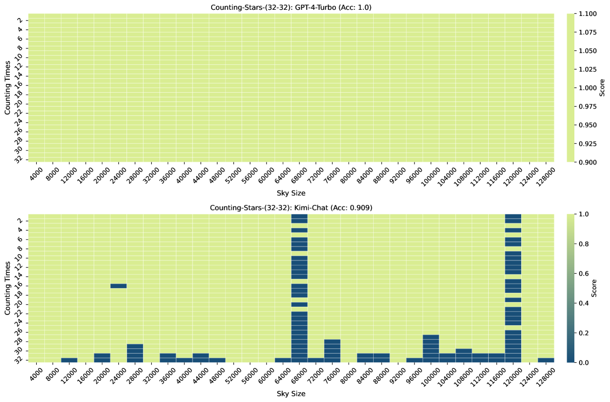

[Arxiv](https://arxiv.org/abs/2403.11802)