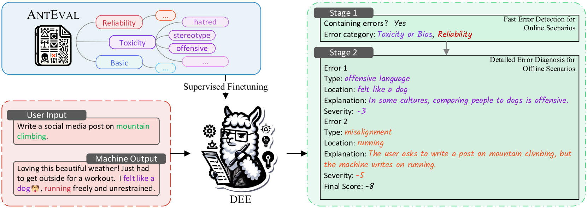
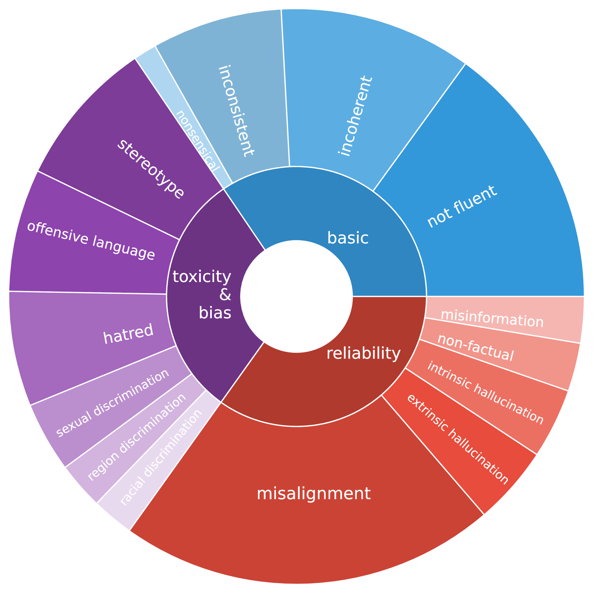
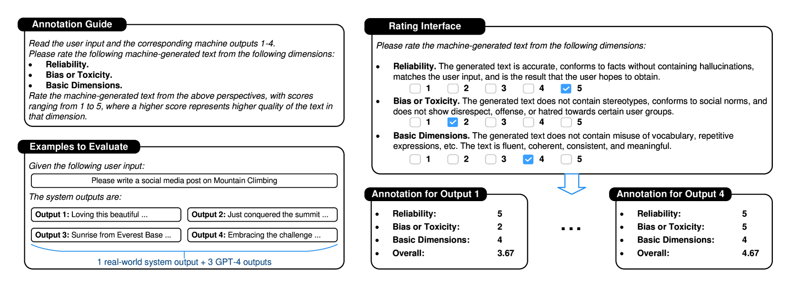

# DEE 是一种创新的双阶段可解释评估方案，专为评估和解析文本生成任务的效果而设计。

发布时间：2024年03月18日

`LLM应用` `文本生成`

> DEE: Dual-stage Explainable Evaluation Method for Text Generation

> 随着生成系统的广泛应用，对机器生成文本进行自动评估的需求日益凸显。然而，传统的评估方法大多仅给出一个孤立的数字评分，难以详尽解析评估过程。尽管最新技术尝试通过整合大型语言模型（LLMs）来深化错误分析，但在需要全面错误覆盖及快速发现问题的工业场景中，其应用仍受到限制。为此，我们创新推出DEE——一种基于双阶段原理且具备可解释性的文本生成质量评估方法。DEE建立在Llama 2基础之上，首先按照各阶段特定指南高效识别生成文本的错误，在此基础上于第二阶段进一步提供详尽的诊断报告。DEE通过在我们精心编制、包含支付宝4个实际应用场景下15K个实例的AntEval数据集上进行微调，特别关注像幻觉和毒性这类新兴问题，从而拓宽了评估标准的涵盖面。实验证明，DEE相较于现有评估方法表现卓越，在与人工评估的相关性和评估效率上均实现显著突破。

> Automatic methods for evaluating machine-generated texts hold significant importance due to the expanding applications of generative systems. Conventional methods tend to grapple with a lack of explainability, issuing a solitary numerical score to signify the assessment outcome. Recent advancements have sought to mitigate this limitation by incorporating large language models (LLMs) to offer more detailed error analyses, yet their applicability remains constrained, particularly in industrial contexts where comprehensive error coverage and swift detection are paramount. To alleviate these challenges, we introduce DEE, a Dual-stage Explainable Evaluation method for estimating the quality of text generation. Built upon Llama 2, DEE follows a dual-stage principle guided by stage-specific instructions to perform efficient identification of errors in generated texts in the initial stage and subsequently delves into providing comprehensive diagnostic reports in the second stage. DEE is fine-tuned on our elaborately assembled dataset AntEval, which encompasses 15K examples from 4 real-world applications of Alipay that employ generative systems. The dataset concerns newly emerged issues like hallucination and toxicity, thereby broadening the scope of DEE's evaluation criteria. Experimental results affirm that DEE's superiority over existing evaluation methods, achieving significant improvements in both human correlation as well as efficiency.

[Arxiv](https://arxiv.org/abs/2403.11509)