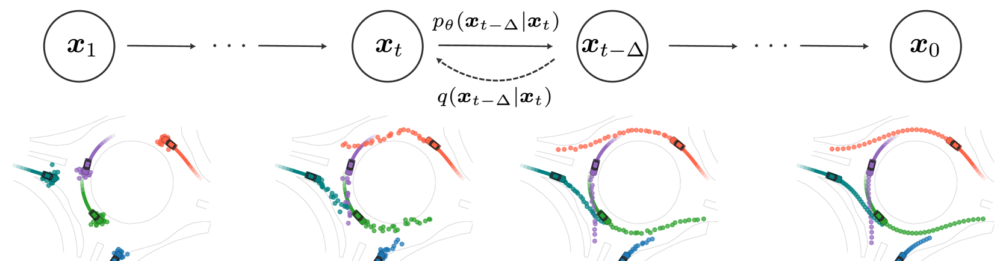
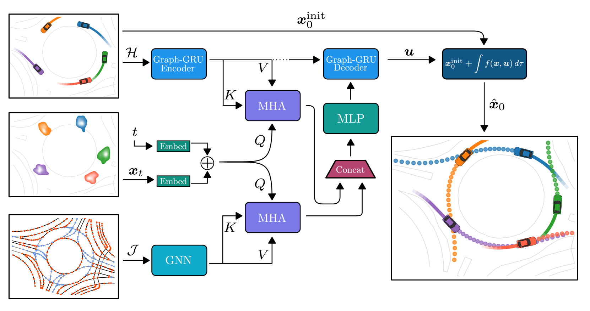
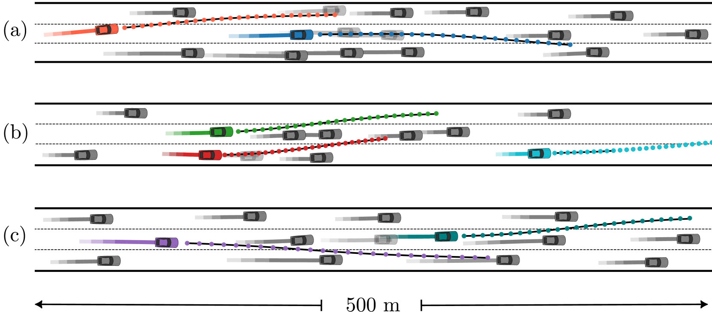
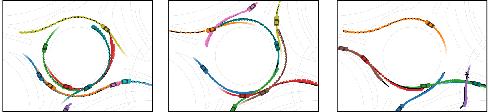
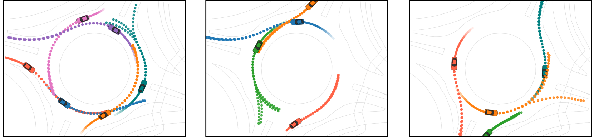
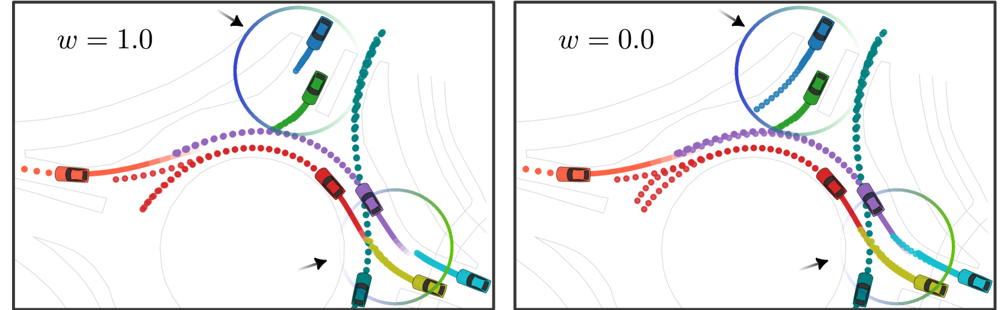

# 扩散模型驱动的环境敏感轨迹预测技术

发布时间：2024年03月18日

`Agent` `自动驾驶` `路径预测`

> Diffusion-Based Environment-Aware Trajectory Prediction

> 为了确保自动驾驶车辆安全、高效行驶，准确预测交通参与者的未来路径至关重要。本文创新性地提出了一种基于扩散理论的多智能体轨迹预测模型，它能够深度解析交通参与者间及与周围环境间的复杂互动，并精准掌握数据的多元模式特性。在对大规模真实交通场景数据集的实际检验中，我们的模型在预测精度上超越了多种已广泛应用的传统方法。通过引入微分运动约束机制，我们的模型能够生成丰富多样的、贴近现实的未来轨迹集合。此外，利用感知交互引导信号，我们还展示了模型能够灵活应对预测那些行为不甚合作的智能体的能力，从而凸显其在面对不确定交通状况时的实际应用潜力。

> The ability to predict the future trajectories of traffic participants is crucial for the safe and efficient operation of autonomous vehicles. In this paper, a diffusion-based generative model for multi-agent trajectory prediction is proposed. The model is capable of capturing the complex interactions between traffic participants and the environment, accurately learning the multimodal nature of the data. The effectiveness of the approach is assessed on large-scale datasets of real-world traffic scenarios, showing that our model outperforms several well-established methods in terms of prediction accuracy. By the incorporation of differential motion constraints on the model output, we illustrate that our model is capable of generating a diverse set of realistic future trajectories. Through the use of an interaction-aware guidance signal, we further demonstrate that the model can be adapted to predict the behavior of less cooperative agents, emphasizing its practical applicability under uncertain traffic conditions.

[Arxiv](https://arxiv.org/abs/2403.11643)