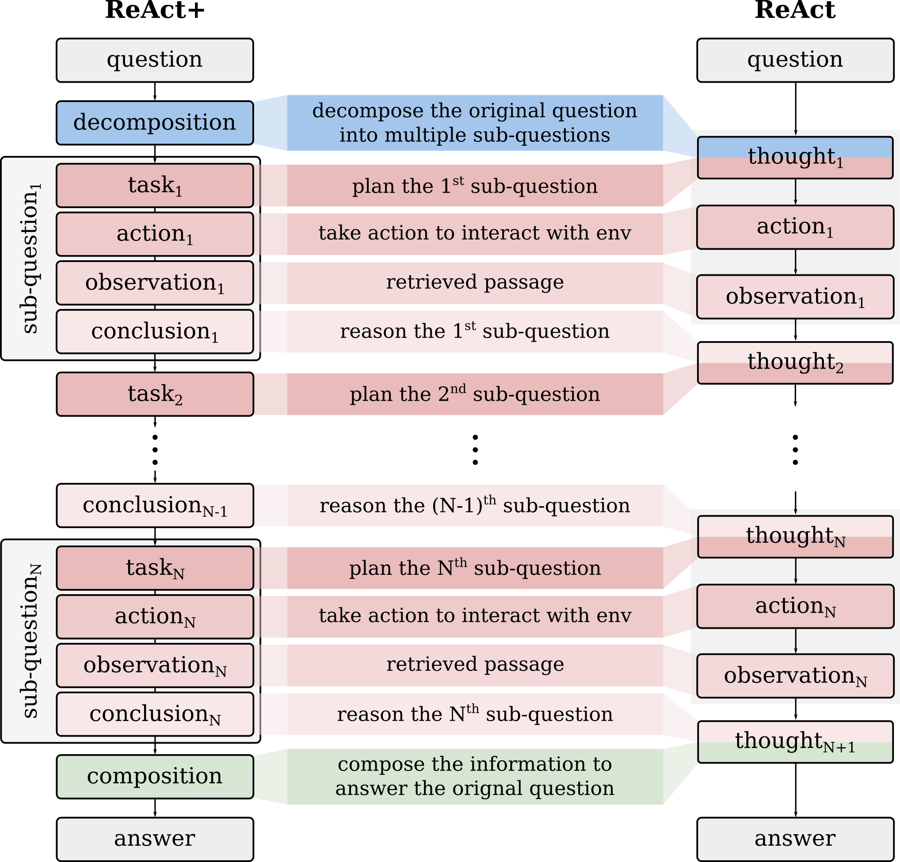
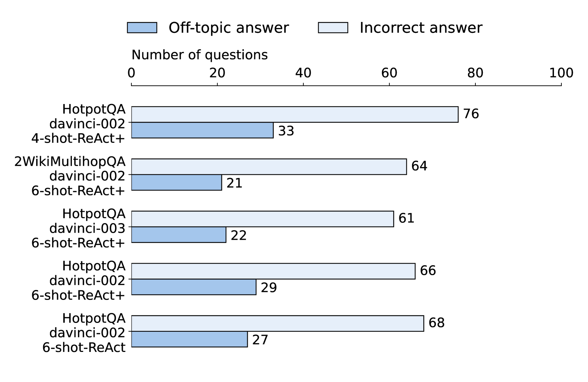
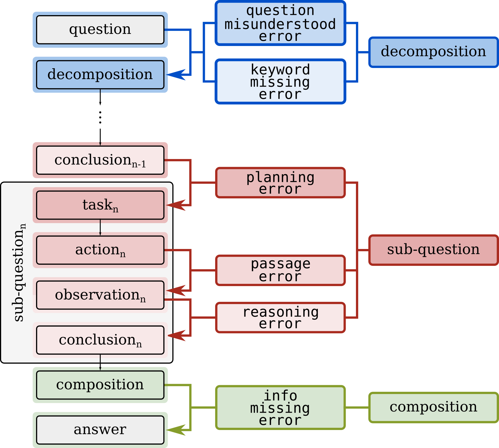
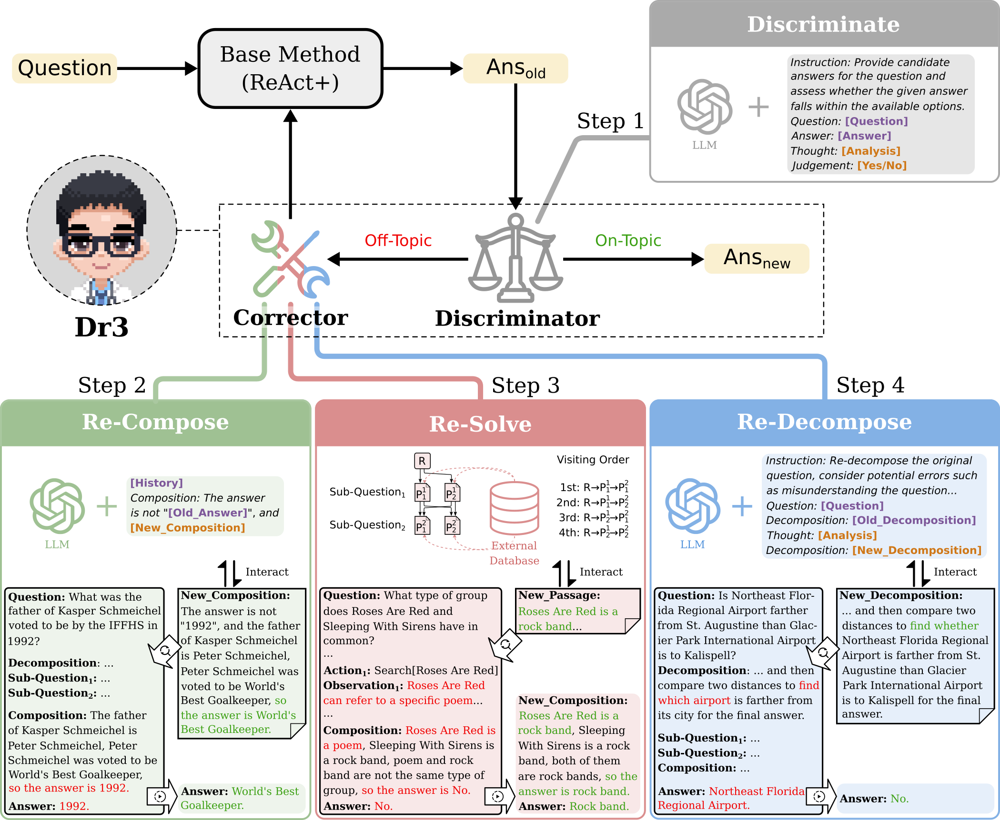
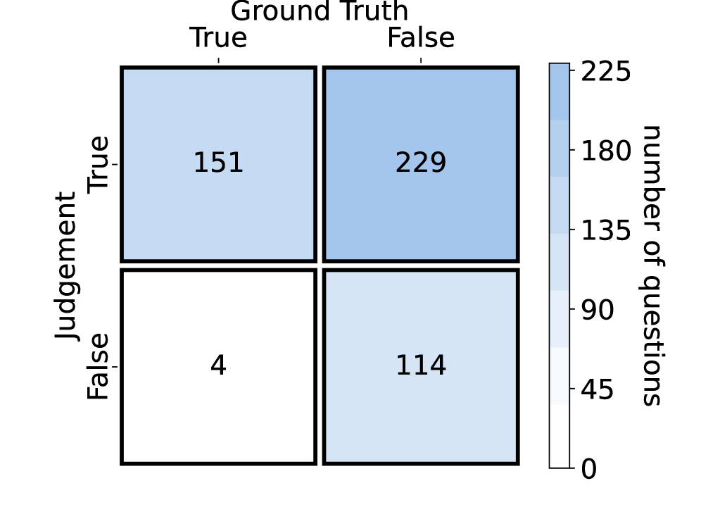
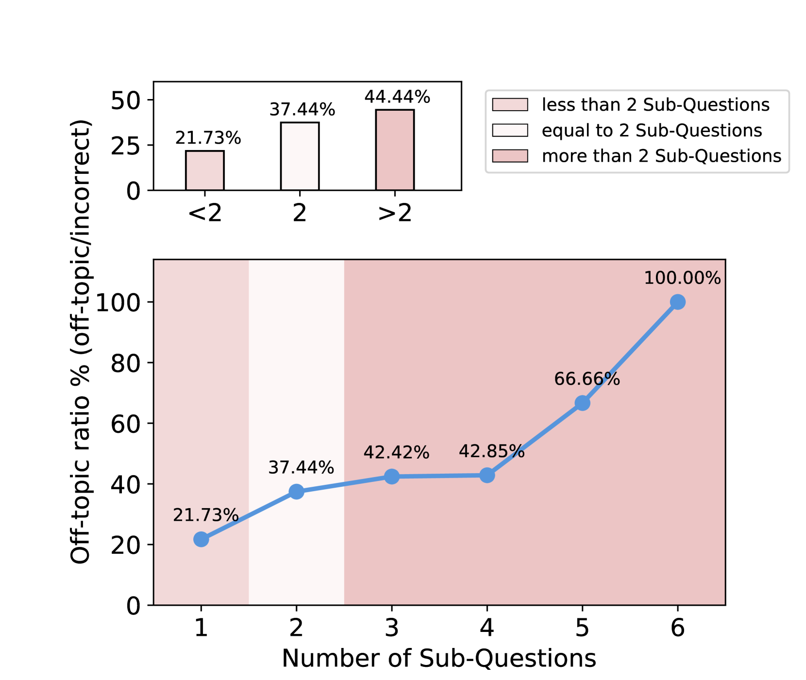
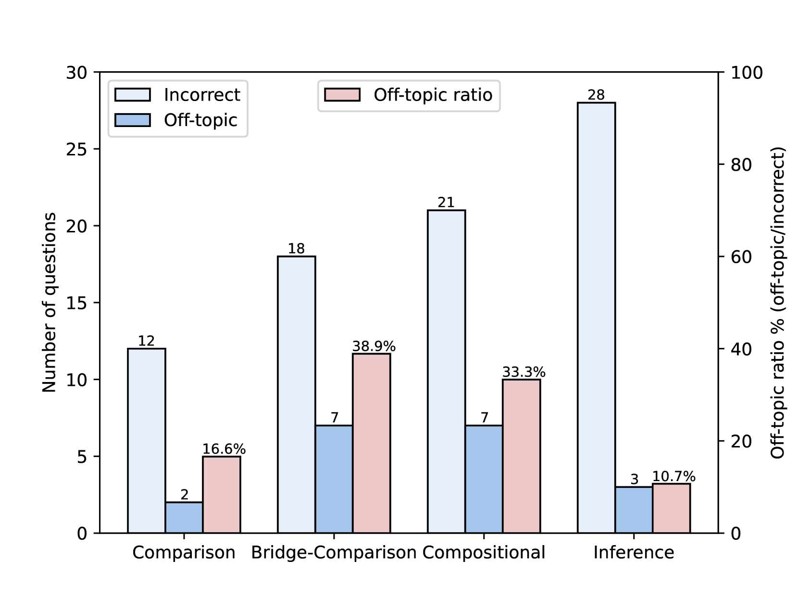

# Dr3 提议，在处理开放领域多跳问题回答时，应引导大语言模型避免提供与主题无关的答案。

发布时间：2024年03月18日

`LLM应用` `开放领域问答` `多跳推理`

> Dr3: Ask Large Language Models Not to Give Off-Topic Answers in Open Domain Multi-Hop Question Answering

> 开放领域多跳问答（ODMHQA）对于借助外部知识源检索信息并经过多阶段推理以解答复杂问题的NLP至关重要。近期，得益于强大的规划、推理及运用工具能力，大型语言模型（LLMs）在解决此类问题上展现出卓越成果。然而，在处理ODMHQA时，LLMs有时会产生偏离主题的答案，这类答案与原问题并无关联，且占据约三分之一的错误答案比例，却尚未得到深入探讨。为此，我们创新性地设计了“判别-重构-重解-再分解”（Dr3）机制。该机制中的判别组件会利用LLMs自身特性鉴别答案是否跑题，一旦发现跑题答案，校正组件就会沿着逆向推理链条逐步调整（重构-重解-再分解），直至得出切题的最终答案。实验证明，在HotpotQA和2WikiMultiHopQA两个数据集上，我们的Dr3机制成功将ODMHQA中偏离主题答案的发生率降低了接近13%，相较于无Dr3机制的基准方法，精确匹配（EM）指标提升了近3%。

> Open Domain Multi-Hop Question Answering (ODMHQA) plays a crucial role in Natural Language Processing (NLP) by aiming to answer complex questions through multi-step reasoning over retrieved information from external knowledge sources. Recently, Large Language Models (LLMs) have demonstrated remarkable performance in solving ODMHQA owing to their capabilities including planning, reasoning, and utilizing tools. However, LLMs may generate off-topic answers when attempting to solve ODMHQA, namely the generated answers are irrelevant to the original questions. This issue of off-topic answers accounts for approximately one-third of incorrect answers, yet remains underexplored despite its significance. To alleviate this issue, we propose the Discriminate->Re-Compose->Re- Solve->Re-Decompose (Dr3) mechanism. Specifically, the Discriminator leverages the intrinsic capabilities of LLMs to judge whether the generated answers are off-topic. In cases where an off-topic answer is detected, the Corrector performs step-wise revisions along the reversed reasoning chain (Re-Compose->Re-Solve->Re-Decompose) until the final answer becomes on-topic. Experimental results on the HotpotQA and 2WikiMultiHopQA datasets demonstrate that our Dr3 mechanism considerably reduces the occurrence of off-topic answers in ODMHQA by nearly 13%, improving the performance in Exact Match (EM) by nearly 3% compared to the baseline method without the Dr3 mechanism.

[Arxiv](https://arxiv.org/abs/2403.12393)