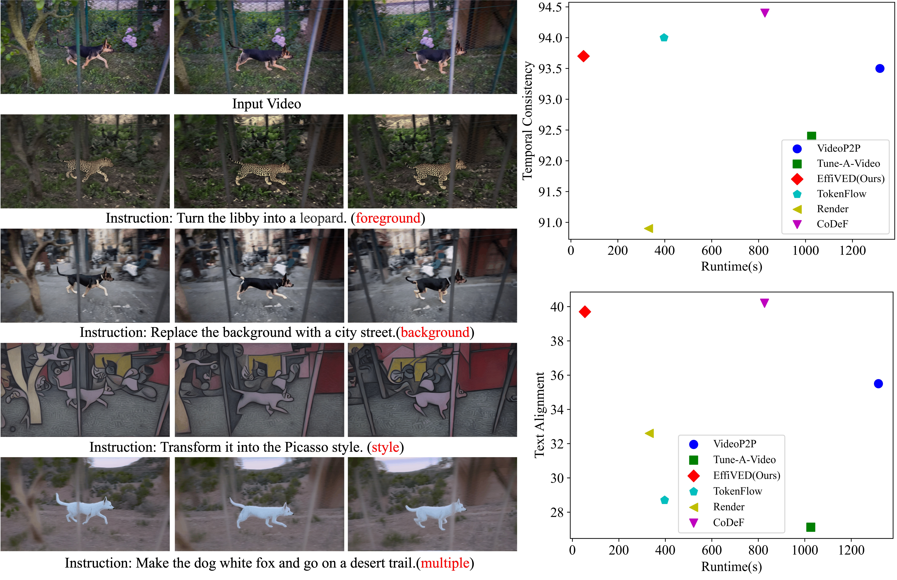
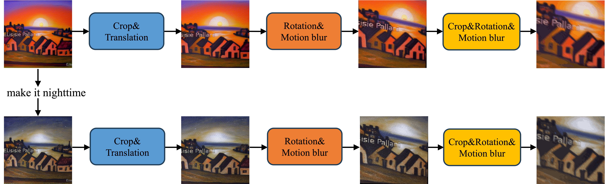
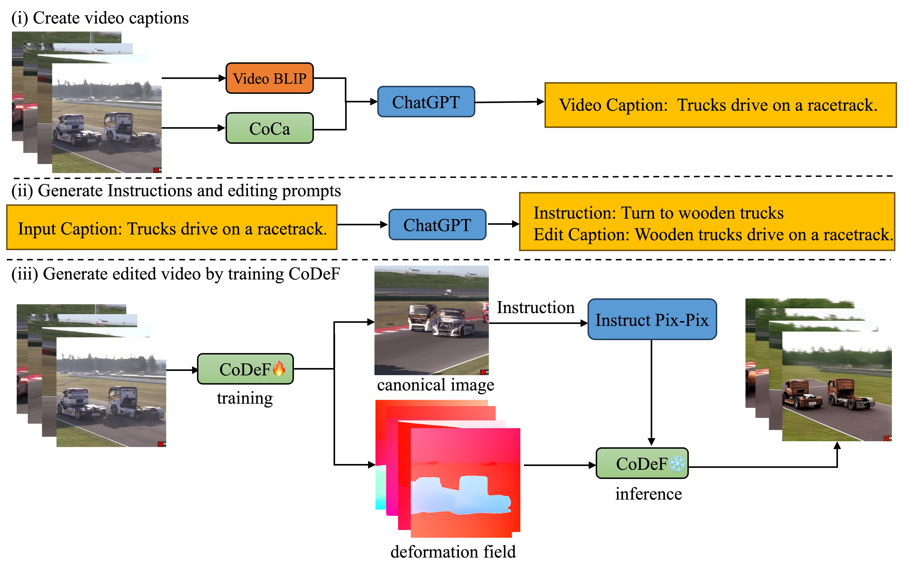
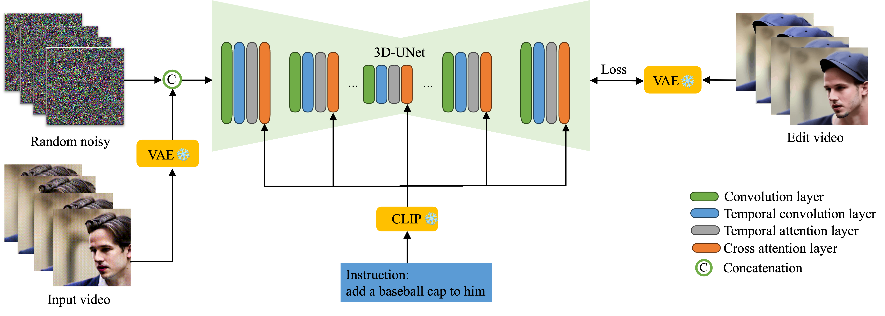
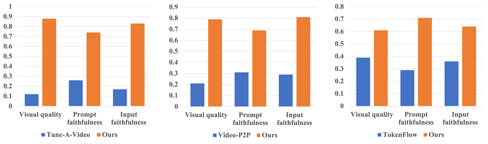
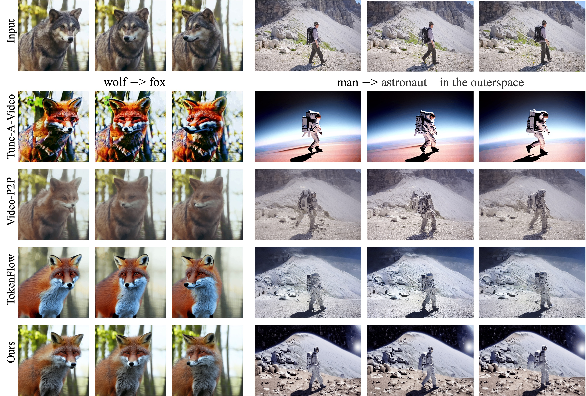
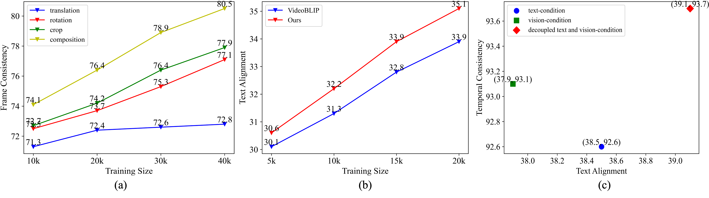

# EffiVED 是一种创新技术，借助于文本指令扩散模型，能够高效地进行视频编辑操作。

发布时间：2024年03月18日

`Agent` `视频编辑`

> EffiVED:Efficient Video Editing via Text-instruction Diffusion Models

> 尽管大规模文本转视频模型表现非凡，但受限于现有数据集规模，它们在直接应用于视频编辑时仍有困难。目前主流的视频编辑方法往往需对每个视频单独微调扩散模型，或运用特殊反向优化技术来保证编辑质量。本文推出了EffiVED——一个基于扩散模型、高效支持指令驱动视频编辑的新方案。为实现这一目标，我们创新设计了两种高效的工作流程，借助增强技术和基础的视听统一技术，成功将庞大的图像编辑数据集与开放视频资源转化为优质的数据集以训练EffiVED。实验证明EffiVED不仅能够产出高保真编辑视频，且运行速度快。此外，我们展示的数据采集策略明显提升了编辑性能，有望应对视频编辑数据稀缺的问题，相关数据集将在论文发表后对外开放。

> Large-scale text-to-video models have shown remarkable abilities, but their direct application in video editing remains challenging due to limited available datasets. Current video editing methods commonly require per-video fine-tuning of diffusion models or specific inversion optimization to ensure high-fidelity edits. In this paper, we introduce EffiVED, an efficient diffusion-based model that directly supports instruction-guided video editing. To achieve this, we present two efficient workflows to gather video editing pairs, utilizing augmentation and fundamental vision-language techniques. These workflows transform vast image editing datasets and open-world videos into a high-quality dataset for training EffiVED. Experimental results reveal that EffiVED not only generates high-quality editing videos but also executes rapidly. Finally, we demonstrate that our data collection method significantly improves editing performance and can potentially tackle the scarcity of video editing data. The datasets will be made publicly available upon publication.

[Arxiv](https://arxiv.org/abs/2403.11568)