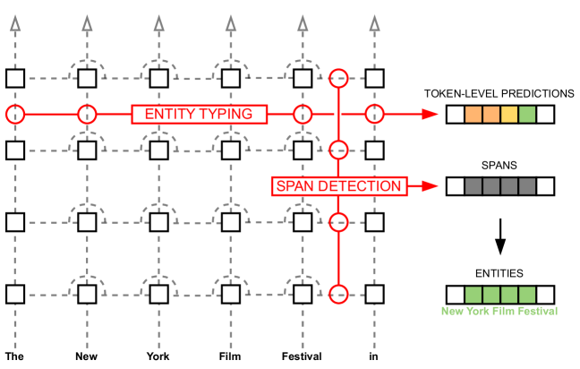
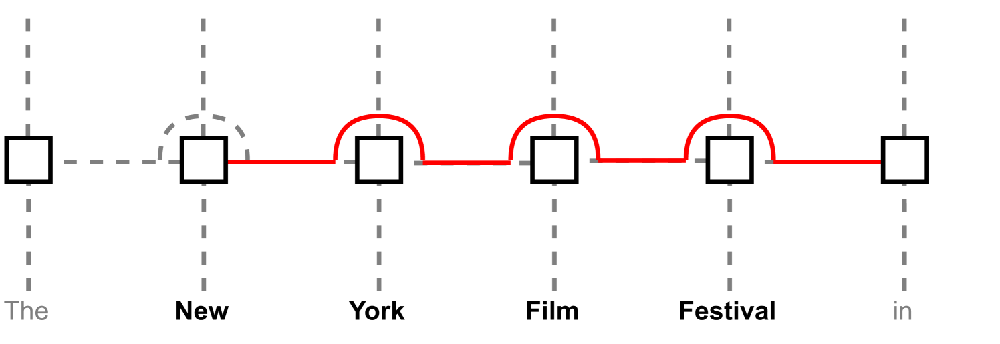
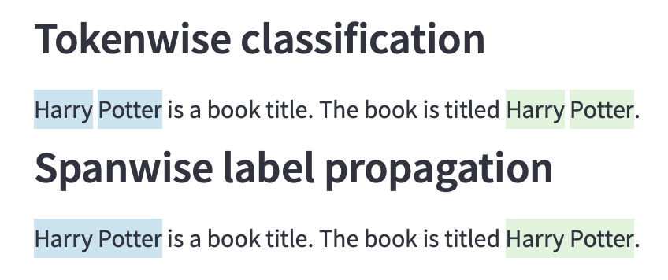

# 探查分类器在嵌入式命名实体识别技术中的应用，旨在通过该方法对文本中嵌入的实体进行精准识别。

发布时间：2024年03月18日

`RAG` `信息抽取`

> Embedded Named Entity Recognition using Probing Classifiers

# 摘要

> 为自动化核查和增强型检索生成任务提供便利，从生成文本中抽取出语义信息是一项重要技术。然而，现有方法要么在推理阶段引入额外模型导致计算成本增加，要么需对语言模型进行破坏性微调。我们提出一种新方案，利用探查分类器直接向预训练语言模型内嵌信息抽取功能，实现在生成文本同时高效抽取信息。为此，我们推出名为EMBER的方法，并演示其无需微调解码器仅语言模型，便能在推理时近乎无感地（仅带来约1%的速度下降）实现命名实体识别，相比之下，使用独立NER模型时速度会降低43.64%。更多详情及实验数据可访问：https://github.com/nicpopovic/EMBER。

> Extracting semantic information from generated text is a useful tool for applications such as automated fact checking or retrieval augmented generation. Currently, this requires either separate models during inference, which increases computational cost, or destructive fine-tuning of the language model. Instead, we propose directly embedding information extraction capabilities into pre-trained language models using probing classifiers, enabling efficient simultaneous text generation and information extraction. For this, we introduce an approach called EMBER and show that it enables named entity recognition in decoder-only language models without fine-tuning them and while incurring minimal additional computational cost at inference time. Specifically, our experiments using GPT-2 show that EMBER maintains high token generation rates during streaming text generation, with only a negligible decrease in speed of around 1% compared to a 43.64% slowdown measured for a baseline using a separate NER model. Code and data are available at https://github.com/nicpopovic/EMBER.

[Arxiv](https://arxiv.org/abs/2403.11747)