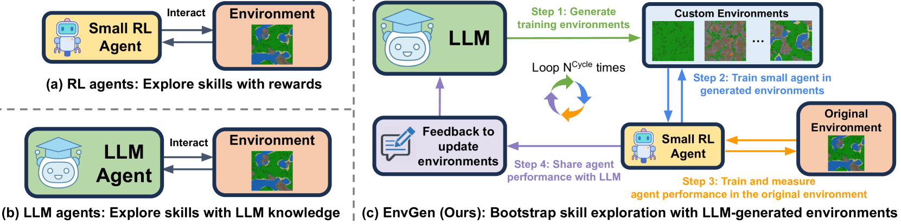
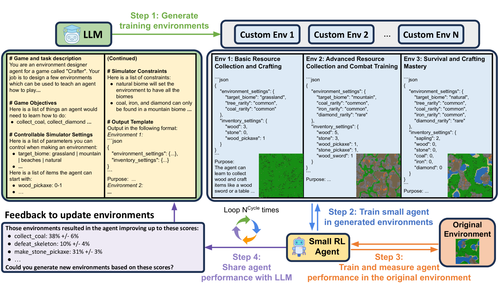
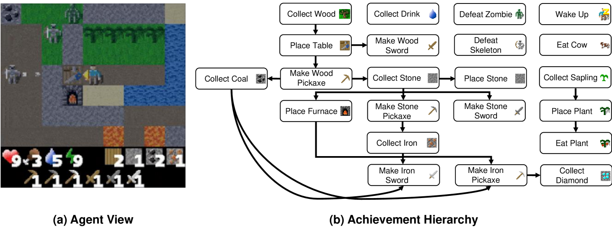
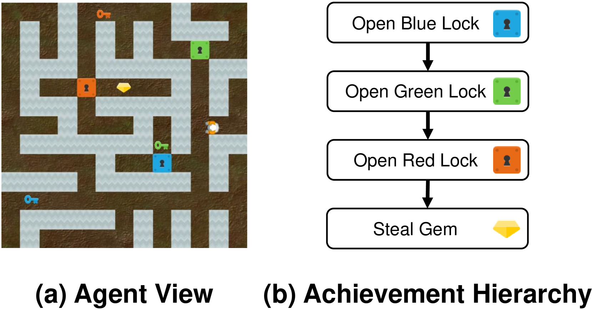
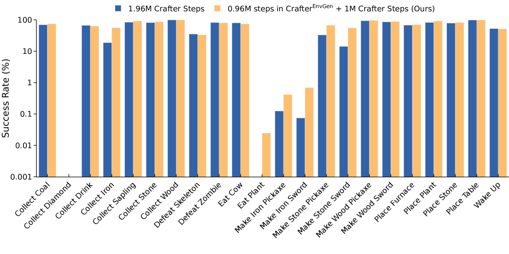
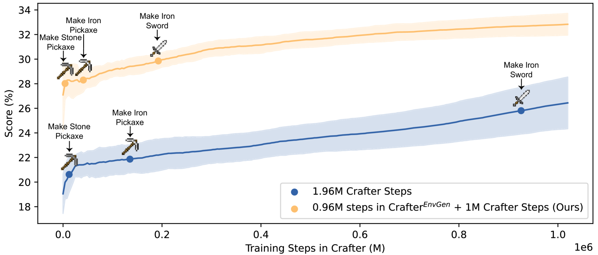
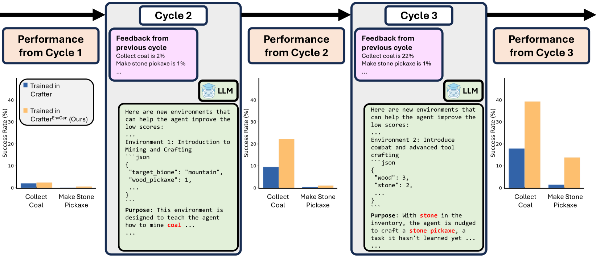
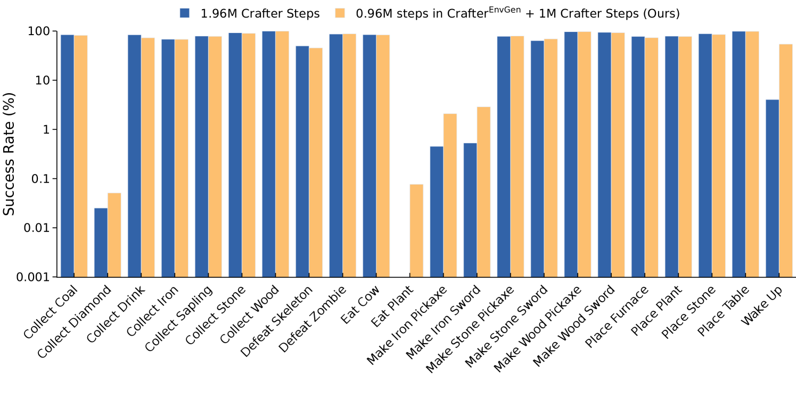
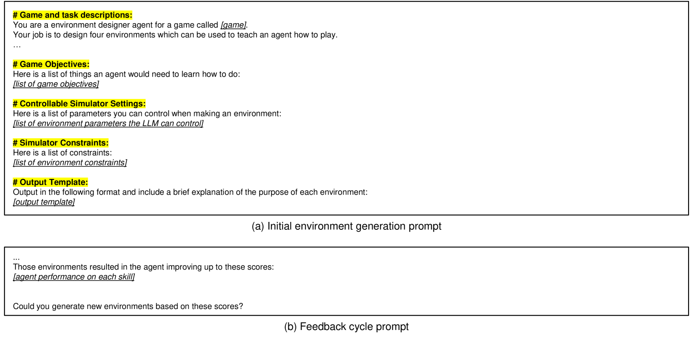

# EnvGen 是一项利用 LLM 技术，针对具身智能体训练而设计的环境生成与适应方法。它能够动态创建并调整适宜的虚拟环境，以满足具身智能体的学习需求。

发布时间：2024年03月18日

`Agent` `游戏AI`

> EnvGen: Generating and Adapting Environments via LLMs for Training Embodied Agents

> 近期针对具身学习的前沿方法利用大型语言模型(LLMs)作为智能体，在环境中决策下一步行动，表现出了优于以往基于强化学习(RL)的小型智能体的强大性能。然而，频繁调用LLMs不仅耗时且成本高昂。为此，我们提出了一种名为EnvGen的新颖框架，旨在探索是否可以通过运用LLMs强大的推理能力来动态构建训练环境，从而帮助小型具身RL智能体高效掌握自身薄弱的技能。在EnvGen中，我们首先引导LLM根据给定的任务描述和模拟器目标生成一系列多元化的训练环境配置（比如不同地形、给予智能体的不同道具等）。接着，我们在原生环境与LLM生成环境的混合场景下训练小型RL智能体。随着训练进行，我们会根据智能体的表现实时反馈给LLM，让其不断优化生成的环境，针对性地提升智能体在弱势技能上的表现。通过在Crafter和Heist等环境下的广泛实验证明了EnvGen的有效性。实验结果显示，采用EnvGen训练的小型RL智能体不仅能击败包括GPT-4智能体在内的多种SOTA方法，在执行长期任务时学习速度也有显著提升。同时，我们还直观展示了LLM如何随着时间推移适应性地调整训练环境以辅助RL智能体改进其短板技能。值得一提的是，EnvGen框架大大提升了效率，整个过程中只需极少次数的LLM调用（如总计4次），远低于那些需要数千次LLM调用的LLM智能体方案。最后，我们深入探讨了EnvGen设计选项的具体影响，进行了细致的消融研究。

> Recent SOTA approaches for embodied learning via interaction directly employ large language models (LLMs) as agents to determine the next steps in an environment. Due to their world knowledge and reasoning capabilities, LLM agents achieve stronger performance than previous smaller agents based on reinforcement learning (RL); however, frequently calling LLMs is slow and expensive. Instead of directly employing LLMs as agents, can we use LLMs' reasoning capabilities to adaptively create training environments to help smaller embodied RL agents learn useful skills that they are weak at? We propose EnvGen, a novel framework to address this question. First, we prompt an LLM to generate training environments that allow agents to quickly learn different tasks in parallel. Concretely, the LLM is given the task description and simulator objectives that the agents should learn and is then asked to generate a set of environment configurations (e.g., different terrains, items given to agents, etc.). Next, we train a small RL agent in a mixture of the original and LLM-generated environments. Then, we enable the LLM to continuously adapt the generated environments to progressively improve the skills that the agent is weak at, by providing feedback to the LLM in the form of the agent's performance. We demonstrate the usefulness of EnvGen with comprehensive experiments in Crafter and Heist environments. We find that a small RL agent trained with EnvGen can outperform SOTA methods, including a GPT-4 agent, and learns long-horizon tasks significantly faster. We show qualitatively how the LLM adapts training environments to help improve RL agents' weaker skills over time. Additionally, EnvGen is substantially more efficient as it only uses a small number of LLM calls (e.g., 4 in total), whereas LLM agents require thousands of LLM calls. Lastly, we present detailed ablation studies for our design choices.

[Arxiv](https://arxiv.org/abs/2403.12014)