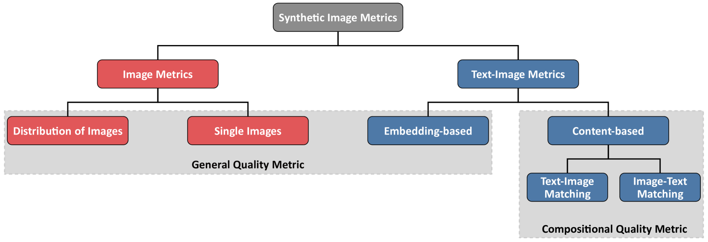

# 探究文本生成图像的质量评估：本研究对图像质量度量进行详尽梳理，并构建了一套针对文本到图像合成任务的度量指标分类体系。

发布时间：2024年03月18日

`Agent` `图像生成`

> Evaluating Text to Image Synthesis: Survey and Taxonomy of Image Quality Metrics

> 得益于基础模型融合语言和视觉能力的最新突破，文本到图像合成技术取得了显著进步。这些模型在海量网络或大型数据库中汲取了大量的图文配对数据进行预训练。随着对高质量图像生成需求日益聚焦于保证文本与图像内容的高度对应，新的评估指标应运而生，力求模拟人类评价标准。为此，研究者们开始收集包含丰富注解、结构愈发复杂的文本-图像数据集，用以探究视觉-语言模型的组合性特征及其作为衡量图文内容匹配质量的有效工具。在本研究中，我们将全面梳理现有文本到图像合成的评估指标，并创新提出一套新的分类体系。同时，在讨论如何优化文本到图像合成模型以满足质量和人类审美偏好之前，我们还会回顾一些常用的图文基准数据集。最后，我们将归纳出提升文本到图像评估方法的实践指南，并深入探讨当前面临的挑战与局限。

> Recent advances in text-to-image synthesis have been enabled by exploiting a combination of language and vision through foundation models. These models are pre-trained on tremendous amounts of text-image pairs sourced from the World Wide Web or other large-scale databases. As the demand for high-quality image generation shifts towards ensuring content alignment between text and image, novel evaluation metrics have been developed with the aim of mimicking human judgments. Thus, researchers have started to collect datasets with increasingly complex annotations to study the compositionality of vision-language models and their incorporation as a quality measure of compositional alignment between text and image contents. In this work, we provide a comprehensive overview of existing text-to-image evaluation metrics and propose a new taxonomy for categorizing these metrics. We also review frequently adopted text-image benchmark datasets before discussing techniques to optimize text-to-image synthesis models towards quality and human preferences. Ultimately, we derive guidelines for improving text-to-image evaluation and discuss the open challenges and current limitations.

[Arxiv](https://arxiv.org/abs/2403.11821)