# FlexCap：致力于在图像中生成既丰富多样、定位精准又具备灵活性的标题

发布时间：2024年03月18日

`Agent` `图像识别`

> FlexCap: Generating Rich, Localized, and Flexible Captions in Images

> 我们推出一款强大的FlexCap视觉语言模型，专长于生成针对图像特定区域、长度可调的描述。这款模型接受边界框输入并基于此生成适应长度的标题，使得输出信息量可控，从精炼的物体标签直至详尽的描述均可胜任。为此，我们创新构建了大规模训练数据集，包含各种长度的图像区域描述，源自带注释的图片。FlexCap的“灵活captioning”能力在多个应用场景中大放异彩：一方面，在Visual Genome数据集的密集captioning任务中，FlexCap的表现遥遥领先。另一方面，利用FlexCap生成局部精细化描述输入大型语言模型，我们成功构建了一个视觉问答(VQA)系统，并在多个VQA数据集上刷新了零样本学习的最新纪录。此外，FlexCap采用的“定位后描述”策略在开放性对象检测任务上超越了传统“描述后定位”的VLM方法。值得一提的是，FlexCap拥有一项独特优势——能通过前缀条件化抽取丰富的视觉信息。最后，我们通过实例演示了FlexCap广泛适用于图像标注、物体属性识别以及视觉对话等各类任务。更多详情，请访问项目网站：https://flex-cap.github.io 。

> We introduce a versatile $\textit{flexible-captioning}$ vision-language model (VLM) capable of generating region-specific descriptions of varying lengths. The model, FlexCap, is trained to produce length-conditioned captions for input bounding boxes, and this allows control over the information density of its output, with descriptions ranging from concise object labels to detailed captions. To achieve this we create large-scale training datasets of image region descriptions of varying length, starting from captioned images. This flexible-captioning capability has several valuable applications.
  First, FlexCap demonstrates superior performance in dense captioning tasks on the Visual Genome dataset. Second, a visual question answering (VQA) system can be built by employing FlexCap to generate localized descriptions as inputs to a large language model. The resulting system achieves state-of-the-art zero-shot performance on a number of VQA datasets. We also demonstrate a $\textit{localize-then-describe}$ approach with FlexCap can be better at open-ended object detection than a $\textit{describe-then-localize}$ approach with other VLMs. We highlight a novel characteristic of FlexCap, which is its ability to extract diverse visual information through prefix conditioning. Finally, we qualitatively demonstrate FlexCap's broad applicability in tasks such as image labeling, object attribute recognition, and visual dialog. Project webpage: https://flex-cap.github.io .

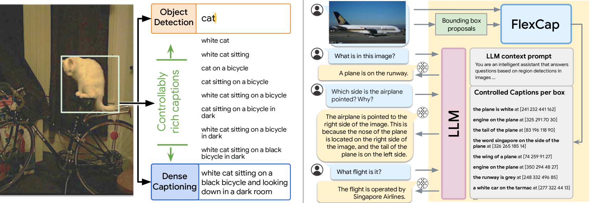

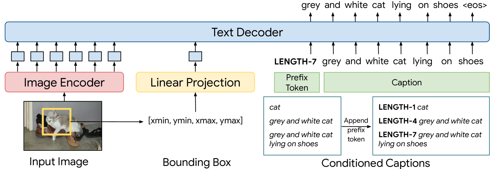

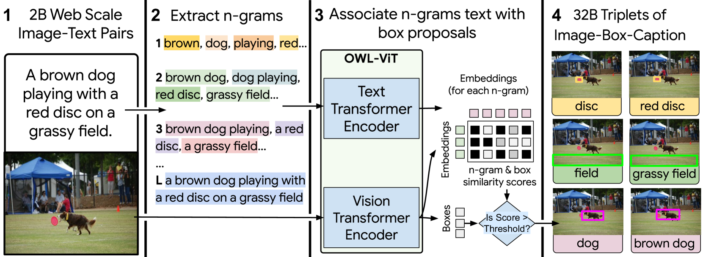

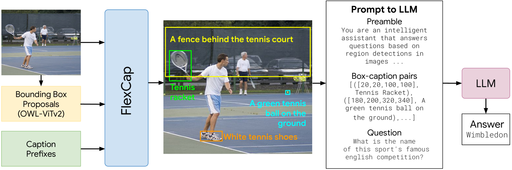

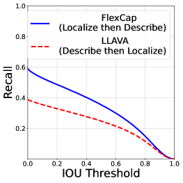

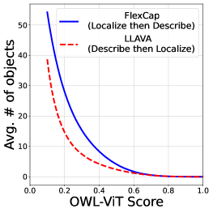

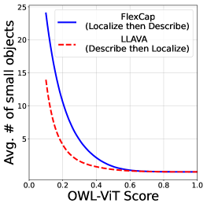

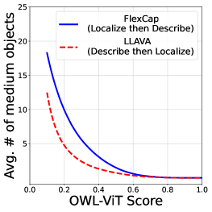

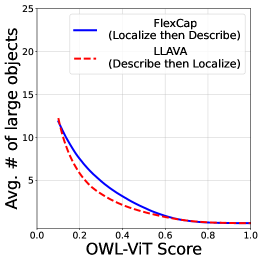

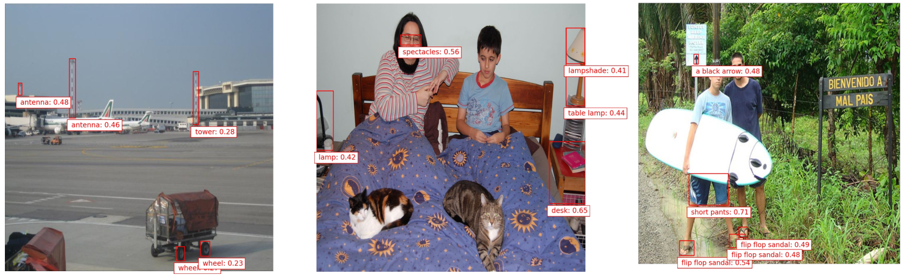

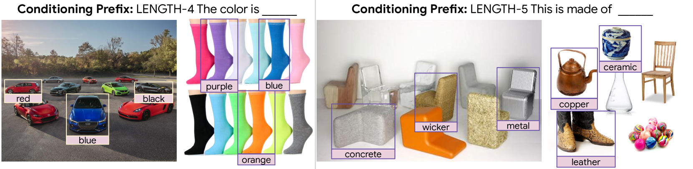

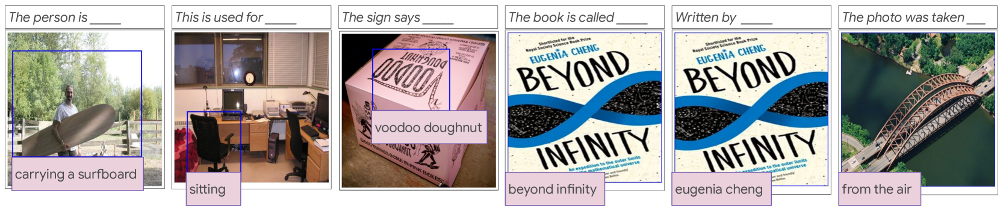

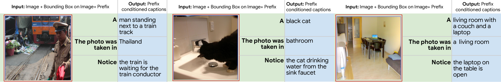

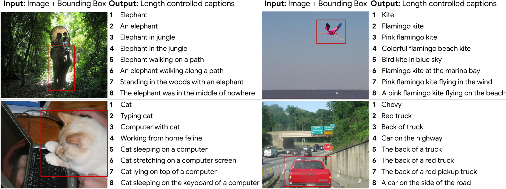

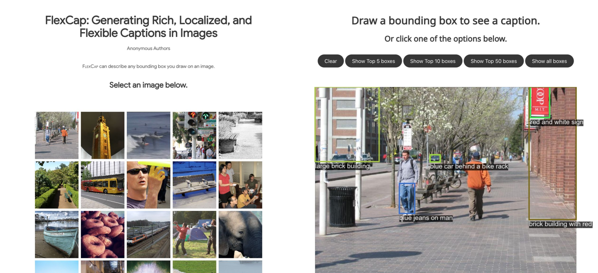

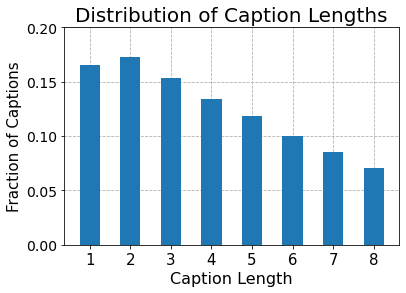

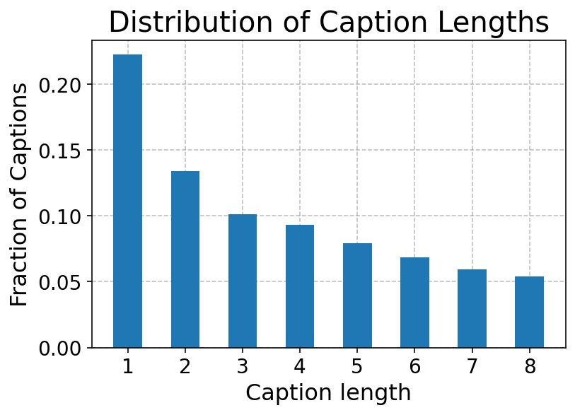

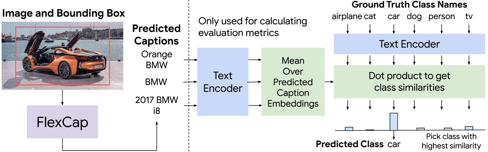

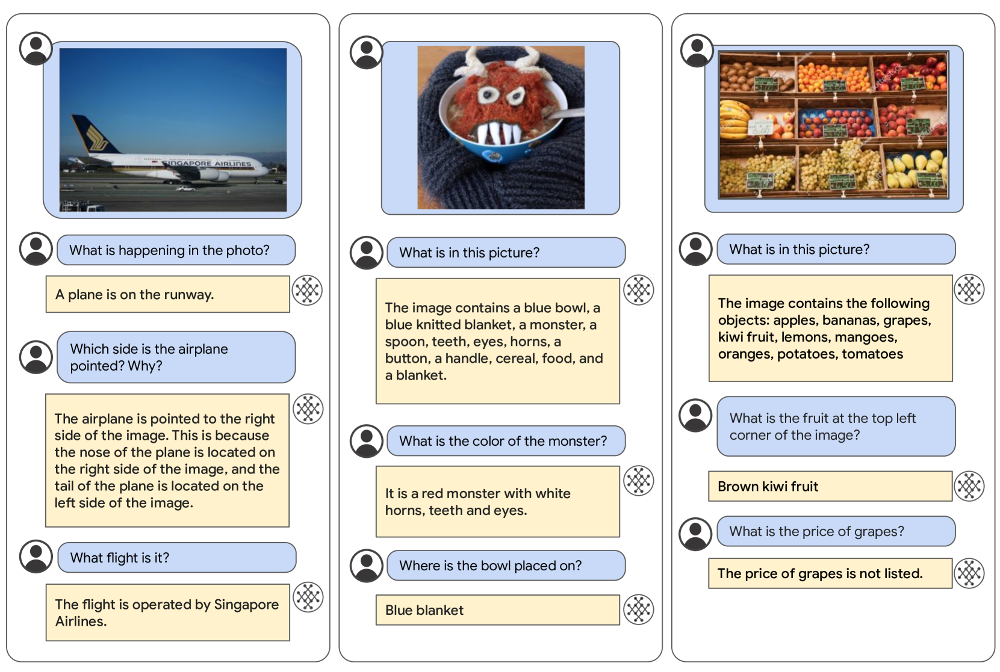

[Arxiv](https://arxiv.org/abs/2403.12026)