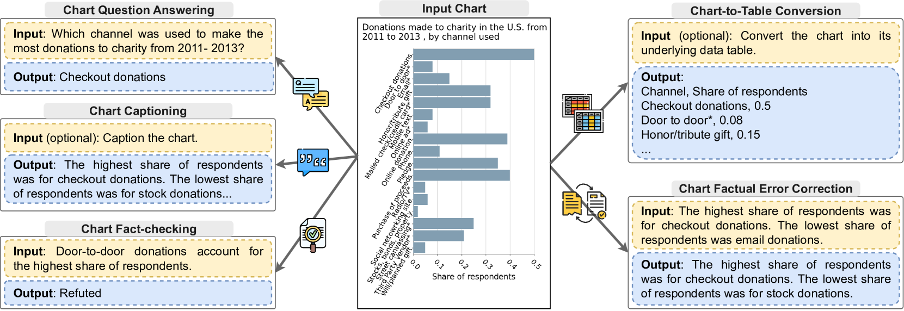
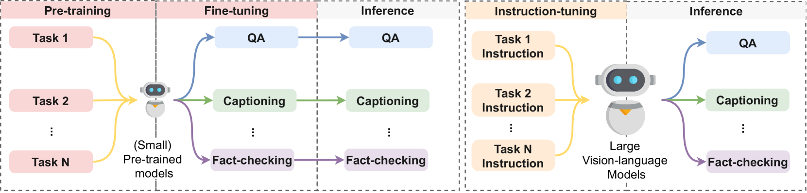

# 在大型基础模型盛行的时代，这篇综述文章带领我们探索从原始像素出发，深入理解自动图表解析的历程。

发布时间：2024年03月18日

`LLM应用` `数据可视化`

> From Pixels to Insights: A Survey on Automatic Chart Understanding in the Era of Large Foundation Models

> 图表形式的数据可视化是数据分析的关键一环，助力洞见挖掘和决策制定。近年来，得益于大型基础模型的发展，自动图表理解技术实现了显著飞跃。像LLMs这样的基础模型已彻底变革了多种NLP任务，并正逐渐渗透至图表理解任务中。本文通过全面梳理，介绍了在基础模型框架下图表理解领域的最新进展、挑战以及未来发展趋势。开篇便对图表理解的概念进行了界定，明确了问题表述，并阐述了深入探究该领域所需的基础构件。接下来，在任务与数据集章节中，我们涉猎了图表理解内部的不同任务类型，详细讨论了其评估标准及图表与文本输入资源。随后，文章探讨了涵盖分类和生成两类方法的建模策略，以及提升图表理解效能的工具增强技术。同时，我们也评析了各任务目前的尖端表现，并就如何进一步优化性能展开探讨。文章特别设立章节专论挑战与未来展望，聚焦于特定领域图表的理解难题、评估工作的不足以及面向智能体场景的应用局限性。这份综述旨在为借助大型基础模型推进图表理解的未来研究提供宝贵启示与导向，文中引用的相关研究及其不断涌现的新成果将持续在以下网址更新：https://github.com/khuangaf/Awesome-Chart-Understanding。

> Data visualization in the form of charts plays a pivotal role in data analysis, offering critical insights and aiding in informed decision-making. Automatic chart understanding has witnessed significant advancements with the rise of large foundation models in recent years. Foundation models, such as large language models (LLMs), have revolutionized various natural language processing (NLP) tasks and are increasingly being applied to chart understanding tasks. This survey paper provides a comprehensive overview of the recent developments, challenges, and future directions in chart understanding within the context of these foundation models. The paper begins by defining chart understanding, outlining problem formulations, and discussing fundamental building blocks crucial for studying chart understanding tasks. In the section on tasks and datasets, we explore various tasks within chart understanding and discuss their evaluation metrics and sources of both charts and textual inputs. Modeling strategies are then examined, encompassing both classification-based and generation-based approaches, along with tool augmentation techniques that enhance chart understanding performance. Furthermore, we discuss the state-of-the-art performance of each task and discuss how we can improve the performance. Challenges and future directions are addressed in a dedicated section, highlighting issues such as domain-specific charts, lack of efforts in evaluation, and agent-oriented settings. This survey paper serves to provide valuable insights and directions for future research in chart understanding leveraging large foundation models. The studies mentioned in this paper, along with emerging new research, will be continually updated at: https://github.com/khuangaf/Awesome-Chart-Understanding.

[Arxiv](https://arxiv.org/abs/2403.12027)