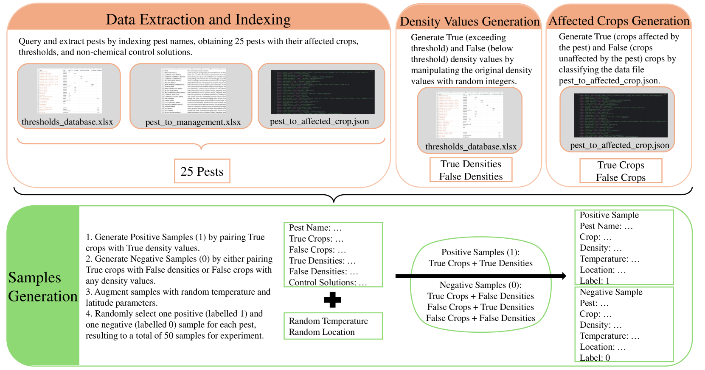

# GPT-4 担纲评估员角色，针对农业害虫管理领域对大型语言模型进行深入测评。

发布时间：2024年03月18日

`LLM应用` `害虫管理`

> GPT-4 as Evaluator: Evaluating Large Language Models on Pest Management in Agriculture

# 摘要

> 在日新月异的AI天地里，LLMs在农业特别是害虫管理的应用尚处萌芽阶段。为了验证其实用价值，我们对包括OpenAI GPT系列及谷歌FLAN系列在内的LLMs生成的害虫管理建议进行了内容评估。鉴于农业指导具有情境特殊性，如何自动衡量与量化LLMs产生的文本质量成为一项艰巨任务。为此，我们创新性地引入GPT-4作为评估工具，从连贯性、逻辑一致性、流畅度、相关性、易懂性和全面性六个维度评价生成内容的质量，并结合基于作物阈值数据构建的专家系统作为参照，评估其事实精确度（即判断田间害虫是否需采取管理行动）。各模型得分经过百分比权重处理后得出总分。实验结果显示，GPT-3.4和GPT-4在多数评估类别上超越FLAN模型。此外，借助融入特定领域知识的指令式提示，证实LLMs能够作为农业的有效工具，达到72%的准确率，充分展示了LLMs在提供害虫管理建议上的高效性能。

> In the rapidly evolving field of artificial intelligence (AI), the application of large language models (LLMs) in agriculture, particularly in pest management, remains nascent. We aimed to prove the feasibility by evaluating the content of the pest management advice generated by LLMs, including the Generative Pre-trained Transformer (GPT) series from OpenAI and the FLAN series from Google. Considering the context-specific properties of agricultural advice, automatically measuring or quantifying the quality of text generated by LLMs becomes a significant challenge. We proposed an innovative approach, using GPT-4 as an evaluator, to score the generated content on Coherence, Logical Consistency, Fluency, Relevance, Comprehensibility, and Exhaustiveness. Additionally, we integrated an expert system based on crop threshold data as a baseline to obtain scores for Factual Accuracy on whether pests found in crop fields should take management action. Each model's score was weighted by percentage to obtain a final score. The results showed that GPT-3.4 and GPT-4 outperform the FLAN models in most evaluation categories. Furthermore, the use of instruction-based prompting containing domain-specific knowledge proved the feasibility of LLMs as an effective tool in agriculture, with an accuracy rate of 72%, demonstrating LLMs' effectiveness in providing pest management suggestions.

[Arxiv](https://arxiv.org/abs/2403.11858)