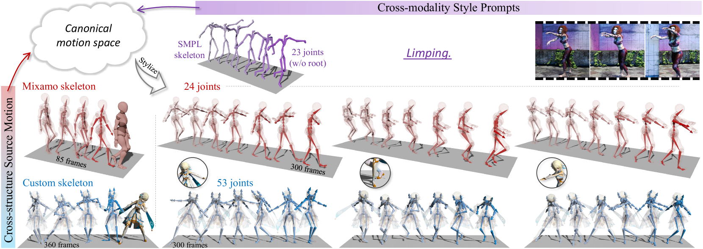
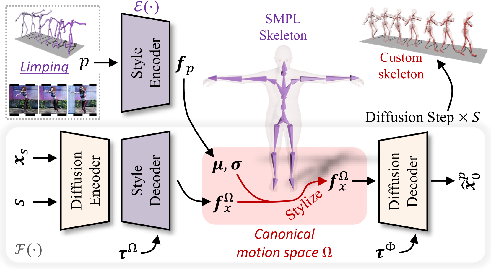
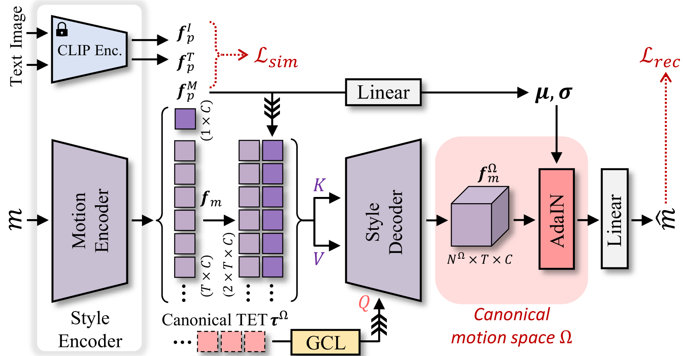
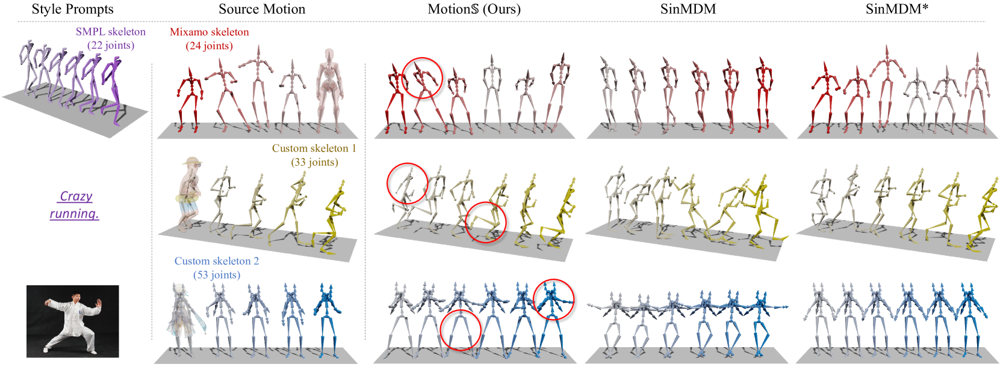
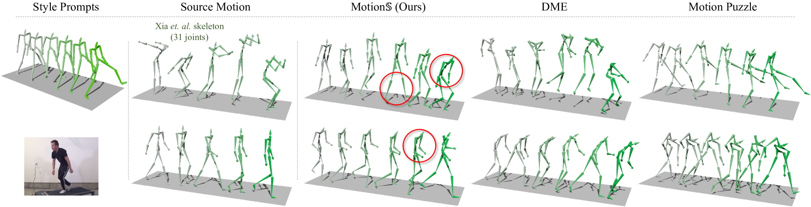
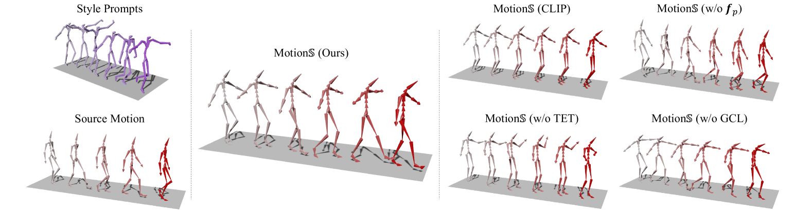
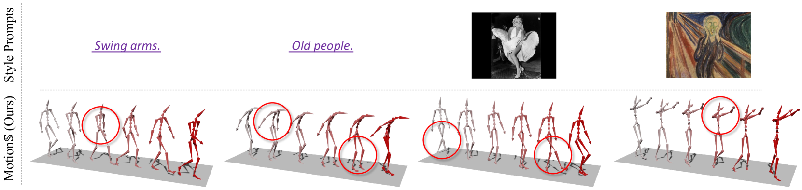
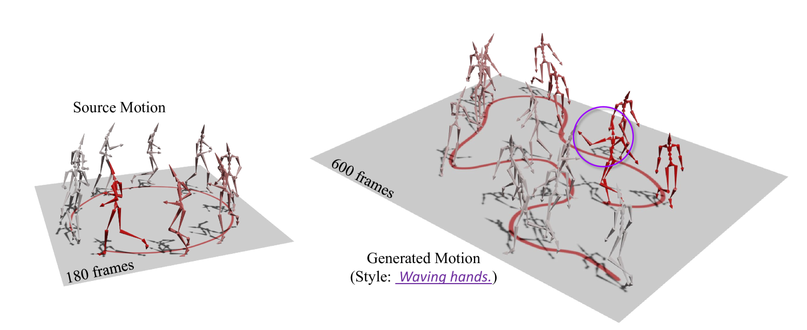
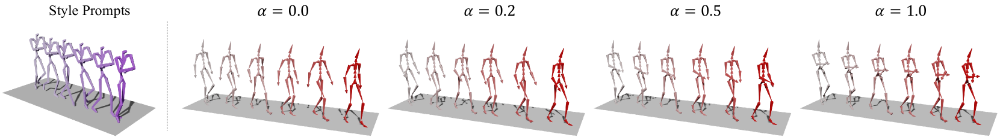
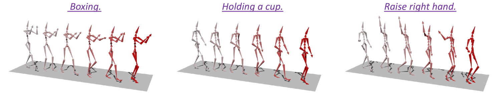

# 我们专注于在规范化运动空间中进行生成式运动风格化研究，旨在探索如何在这个框架内实现和控制各种动态运动的风格表现。

发布时间：2024年03月18日

`Agent` `游戏开发`

> Generative Motion Stylization within Canonical Motion Space

> 赋予角色活力的是风格化的动作，但现有的基于数据的运动合成技术受限于固定骨架结构和单一风格表达，难以为各类角色创造出多样的风格化动作。为此，我们创新性地提出了一种名为MotionS的生成式运动风格化解决方案，它运用跨模态风格提示，在不同结构的角色间成功合成丰富多变的风格化动作。MotionS的核心在于将运动风格融入跨模态潜在空间，并能感知和适应跨结构的骨架拓扑结构，从而使风格化在统一的动作框架下得以实现。具体而言，我们借助大规模CLIP模型的力量，构建了一个灵活容纳多种风格表达的跨模态潜在空间。同时，我们还训练了两个能够捕捉规范和特定骨架拓扑结构的拓扑编码令牌，助力实现跨结构的骨架拓扑转换。接下来，我们设计了拓扑转移风格扩散算法，依据多模态风格描述，在调整后的标准动作空间内为特定骨架生成动作内容并施以相应的风格化处理。通过大量实例展示和严谨的定性、定量实验，我们证实了MotionS方案不仅对各类角色和风格描述具有极强的适应性和普适性，而且其生成的高质量风格化动作效果明显优于当前最先进方法。

> Stylized motion breathes life into characters. However, the fixed skeleton structure and style representation hinder existing data-driven motion synthesis methods from generating stylized motion for various characters. In this work, we propose a generative motion stylization pipeline, named MotionS, for synthesizing diverse and stylized motion on cross-structure characters using cross-modality style prompts. Our key insight is to embed motion style into a cross-modality latent space and perceive the cross-structure skeleton topologies, allowing for motion stylization within a canonical motion space. Specifically, the large-scale Contrastive-Language-Image-Pre-training (CLIP) model is leveraged to construct the cross-modality latent space, enabling flexible style representation within this space. Additionally, two topology-encoded tokens are learned to capture the canonical and specific skeleton topologies, facilitating cross-structure topology shifting. Subsequently, the topology-shifted stylization diffusion is designed to generate motion content for the specific skeleton and stylize it in the shifted canonical motion space using multi-modality style descriptions. Through an extensive set of examples, we demonstrate the flexibility and generalizability of our pipeline across various characters and style descriptions. Qualitative and quantitative experiments underscore the superiority of our pipeline over state-of-the-art methods, consistently delivering high-quality stylized motion across a broad spectrum of skeletal structures.

[Arxiv](https://arxiv.org/abs/2403.11469)