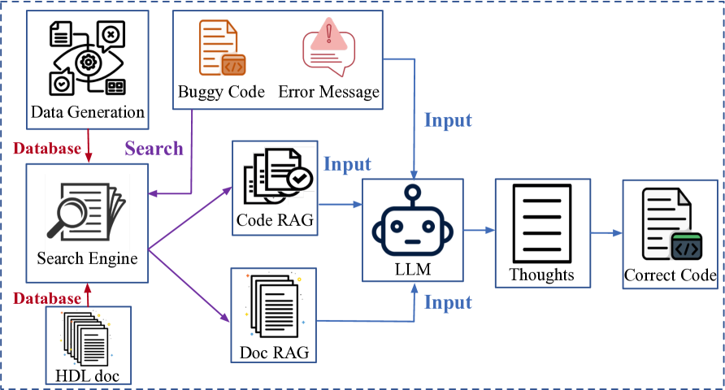
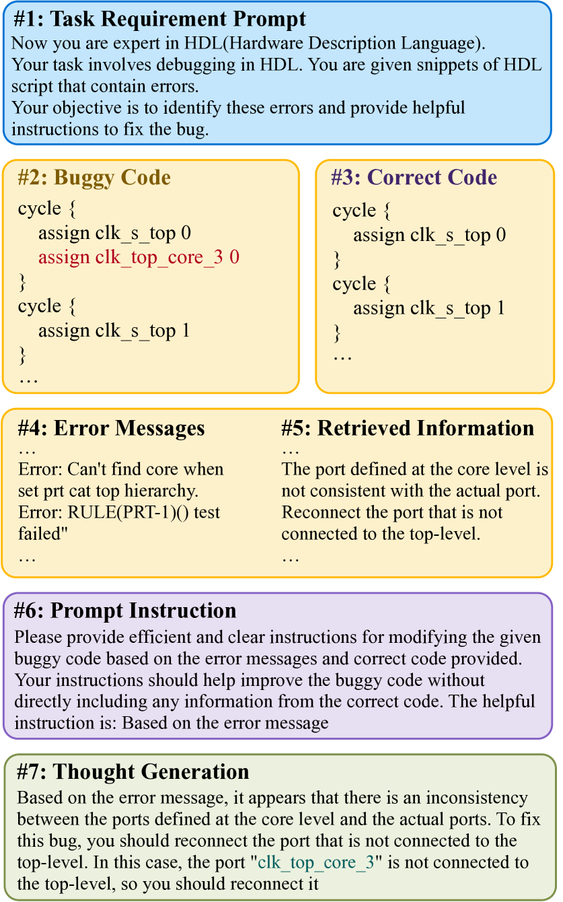
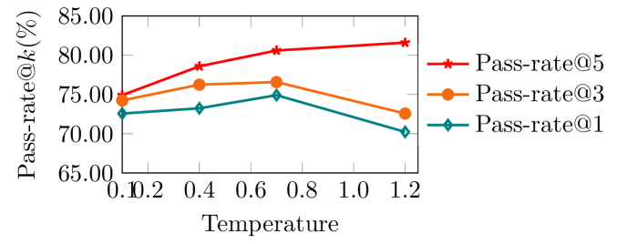
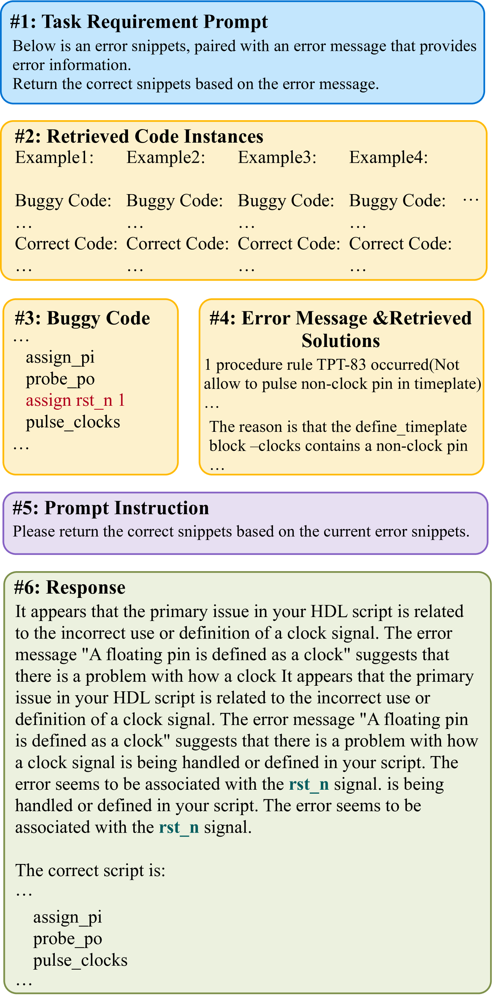

# HDLdebugger——利用大型语言模型实现HDL调试过程的高效化和简化

发布时间：2024年03月18日

`LLM应用` `芯片设计` `软件工程`

> HDLdebugger: Streamlining HDL debugging with Large Language Models

# 摘要

> 在芯片设计这一领域，HDLs至关重要但却因复杂语法及匮乏的在线资源导致调试困难重重，即便是资深工程师也需耗费大量时间和精力。为此，亟需研发自动化的HDL代码调试模型，为硬件工程师减负。虽然LLMs在软件代码生成、补全及调试等方面表现强劲，但在HDL调试这一细分领域中的应用尚不充分，至今未取得理想效果。本文提出的HDLdebugger是一个结合LLM辅助技术的HDL调试框架，它采用逆向工程技术生成调试数据，配备检索增强型生成搜索引擎，并融入检索增强型LLM微调策略。通过集成这些要素，HDLdebugger成功实现了芯片设计中HDL调试的自动化与高效化。我们在源自华为的HDL代码数据集上进行了广泛实验，结果显示HDLdebugger超越了13个顶尖LLM基准模型，在HDL代码调试上的表现尤为出色。

> In the domain of chip design, Hardware Description Languages (HDLs) play a pivotal role. However, due to the complex syntax of HDLs and the limited availability of online resources, debugging HDL codes remains a difficult and time-intensive task, even for seasoned engineers. Consequently, there is a pressing need to develop automated HDL code debugging models, which can alleviate the burden on hardware engineers. Despite the strong capabilities of Large Language Models (LLMs) in generating, completing, and debugging software code, their utilization in the specialized field of HDL debugging has been limited and, to date, has not yielded satisfactory results. In this paper, we propose an LLM-assisted HDL debugging framework, namely HDLdebugger, which consists of HDL debugging data generation via a reverse engineering approach, a search engine for retrieval-augmented generation, and a retrieval-augmented LLM fine-tuning approach. Through the integration of these components, HDLdebugger can automate and streamline HDL debugging for chip design. Our comprehensive experiments, conducted on an HDL code dataset sourced from Huawei, reveal that HDLdebugger outperforms 13 cutting-edge LLM baselines, displaying exceptional effectiveness in HDL code debugging.

[Arxiv](https://arxiv.org/abs/2403.11671)