# 面对多智能体环境下的决策制定，我们对LLMs（大型语言模型）的能力探索到了何种程度？此研究致力于评估LLMs在游戏中展现的多智能体交互决策能力。

发布时间：2024年03月18日

`Agent` `决策制定` `多智能体系统`

> How Far Are We on the Decision-Making of LLMs? Evaluating LLMs' Gaming Ability in Multi-Agent Environments

> 决策制定这一复杂任务，为我们测评大型语言模型(LLMs)的能力提供了一个绝佳场景。本研究借助博弈论这一成熟的理论体系，探究LLMs在决策制定上的表现，尤其关注支持多个智能体同步参与的游戏。我们构建了名为GAMA-Bench的框架，其中包括8款经典的多智能体游戏，并设计了一套量化评分系统，以精确评估模型在游戏中发挥的优劣。通过GAMA-Bench测试，我们深入研究了LLMs的稳健性、普适性和强化策略效果。实验结果显示，尽管GPT-3.5展现出了良好的稳健性，但在通用性上尚存局限；不过，采用类似Chain-of-Thought的方法能够有效提升其表现。进一步对比多种LLMs时，我们发现GPT-4在GAMA-Bench评测上脱颖而出，得分高达72.5分。而GPT-3.5历经三次迭代升级（0613、1106、0125版本），每一次更新均展现出模型智能度的明显跃升。所有代码及实验数据已公开至https://github.com/CUHK-ARISE/GAMABench。

> Decision-making, a complicated task requiring various types of abilities, presents an excellent framework for assessing Large Language Models (LLMs). Our research investigates LLMs' decision-making capabilities through the lens of a well-established field, Game Theory. We focus specifically on games that support the participation of more than two agents simultaneously. Subsequently, we introduce our framework, GAMA-Bench, including eight classical multi-agent games. We design a scoring scheme to assess a model's performance in these games quantitatively. Through GAMA-Bench, we investigate LLMs' robustness, generalizability, and enhancement strategies. Results reveal that while GPT-3.5 shows satisfying robustness, its generalizability is relatively limited. However, its performance can be improved through approaches such as Chain-of-Thought. Additionally, we conduct evaluations across various LLMs and find that GPT-4 outperforms other models on GAMA-Bench, achieving a score of 72.5. Moreover, the increasingly higher scores across the three iterations of GPT-3.5 (0613, 1106, 0125) demonstrate marked advancements in the model's intelligence with each update. The code and experimental results are made publicly available via https://github.com/CUHK-ARISE/GAMABench.

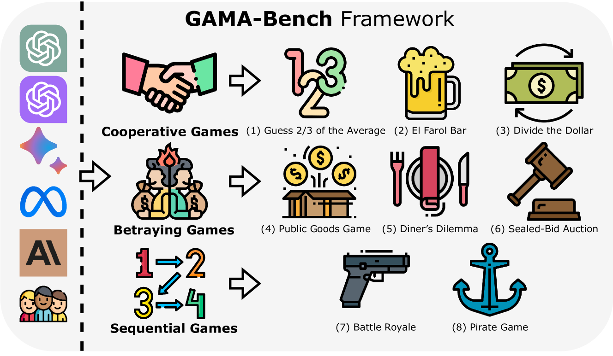

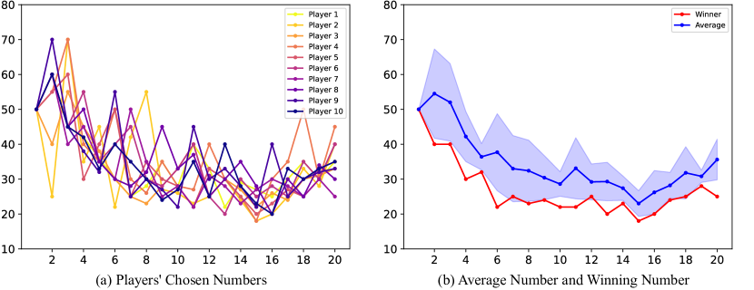

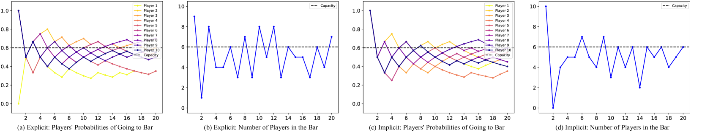

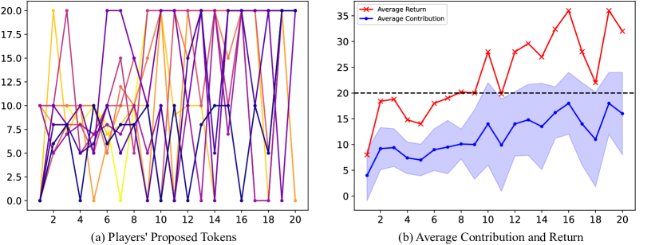

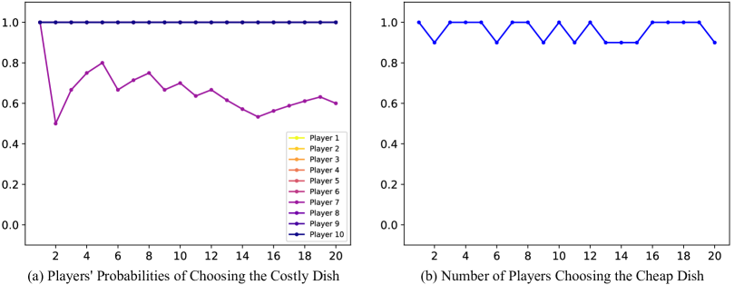

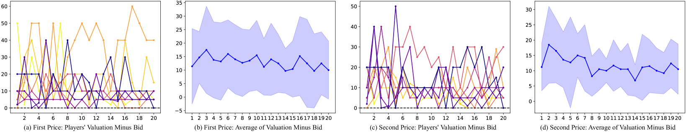

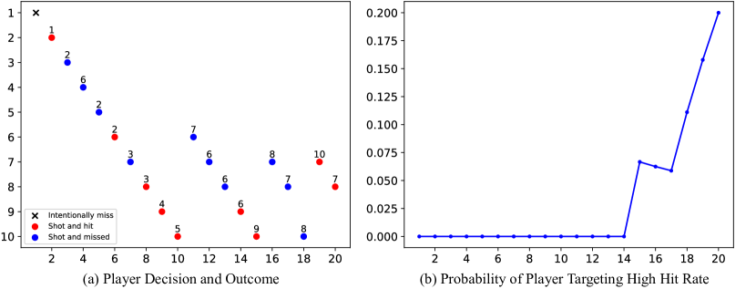

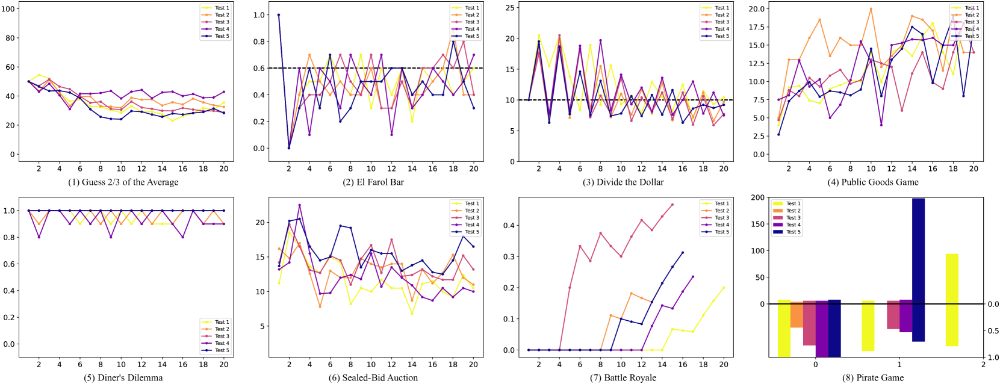

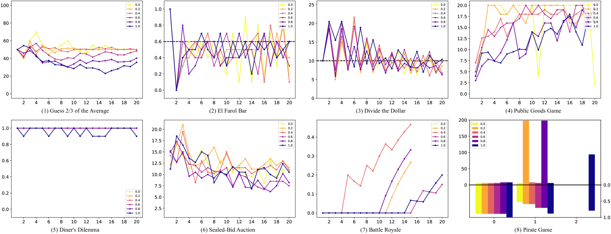

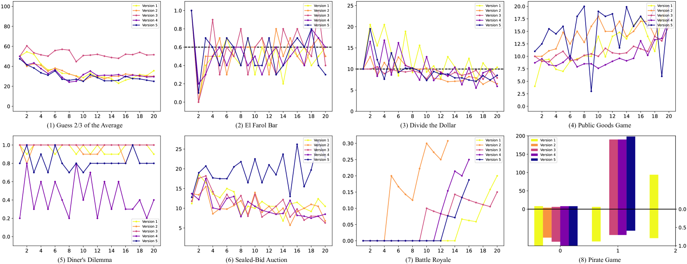

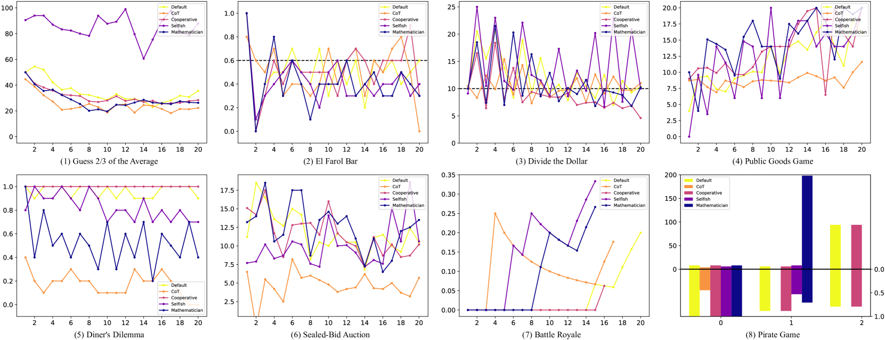

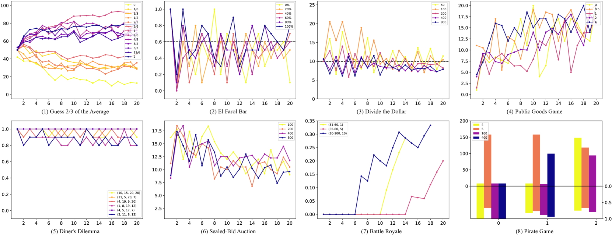

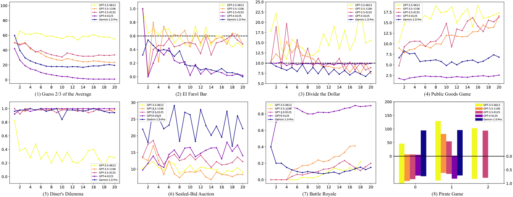

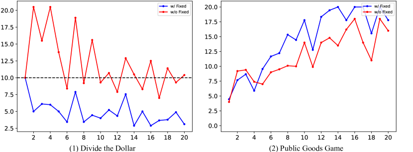

[Arxiv](https://arxiv.org/abs/2403.11807)