# 研究如何利用大型语言模型对对话系统进行用户满意度的可解释性估计

发布时间：2024年03月18日

`LLM应用` `对话系统` `用户满意度分析`

> Interpretable User Satisfaction Estimation for Conversational Systems with Large Language Models

> 为了更好地理解、评价并持续优化对话系统，精准且易于理解的用户满意度估计（USE）显得尤为重要。无论是通用对话系统（例如ChatGPT和Bing Copilot），还是任务导向的客服聊天机器人，用户都会通过各种对话方式表达满意或不满。目前依赖特征化ML模型或文本嵌入的方法，在捕捉普适性规律方面存在不足，且难以解读。本文指出，与基于嵌入的方法相比，大型语言模型（LLMs）能更有效地从用户的自然语言表达中抽取出反映用户满意度的可解释信号。进一步地，我们提出了一种借助带标签样例进行迭代提示训练的框架，以针对性地调整LLM用于实现USE。所得到的方法SPUR（监督提示下的用户满意度评价准则），不仅精度更高，还因其采用习得的详细评价准则对用户满意度打分而更具可解释性。

> Accurate and interpretable user satisfaction estimation (USE) is critical for understanding, evaluating, and continuously improving conversational systems. Users express their satisfaction or dissatisfaction with diverse conversational patterns in both general-purpose (ChatGPT and Bing Copilot) and task-oriented (customer service chatbot) conversational systems. Existing approaches based on featurized ML models or text embeddings fall short in extracting generalizable patterns and are hard to interpret. In this work, we show that LLMs can extract interpretable signals of user satisfaction from their natural language utterances more effectively than embedding-based approaches. Moreover, an LLM can be tailored for USE via an iterative prompting framework using supervision from labeled examples. The resulting method, Supervised Prompting for User satisfaction Rubrics (SPUR), not only has higher accuracy but is more interpretable as it scores user satisfaction via learned rubrics with a detailed breakdown.

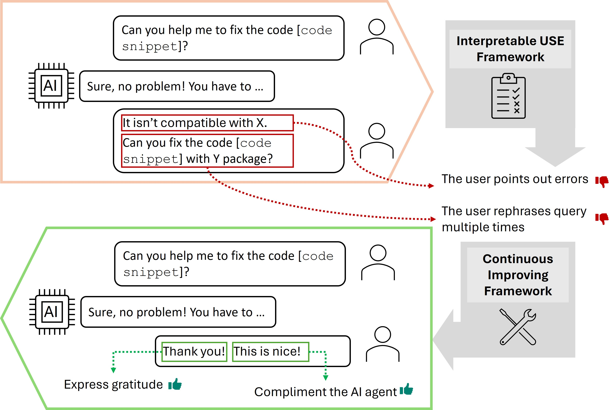

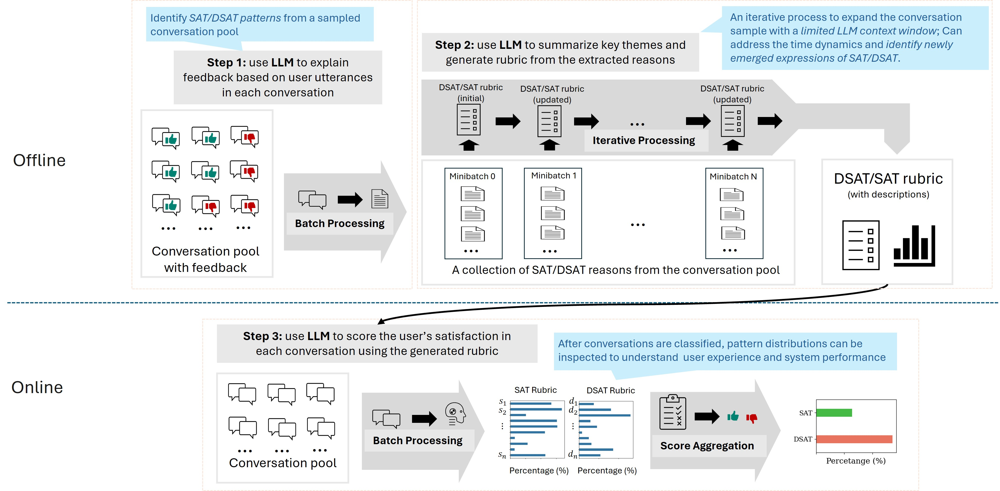

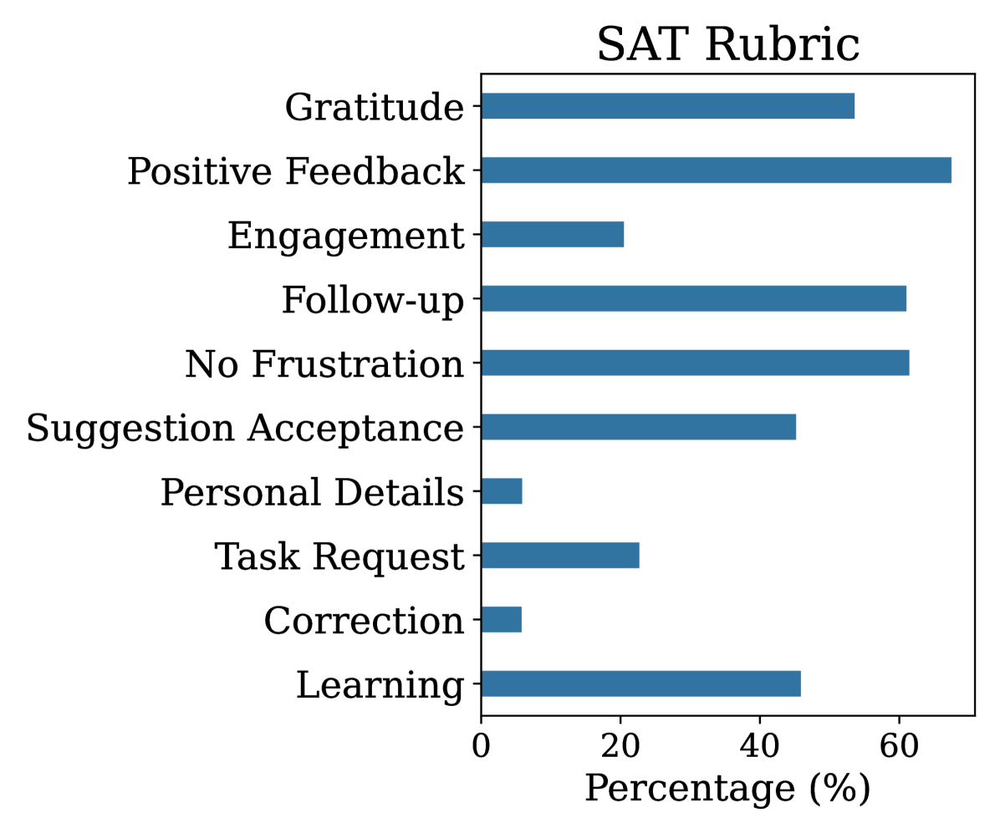

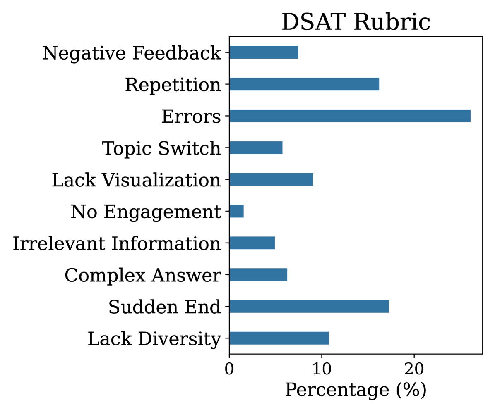

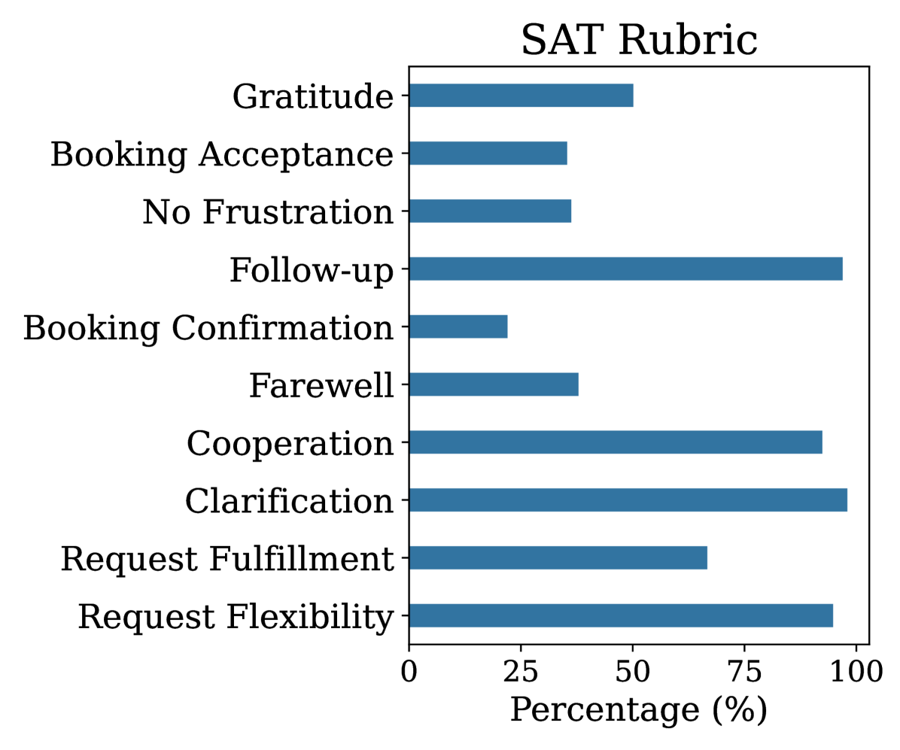

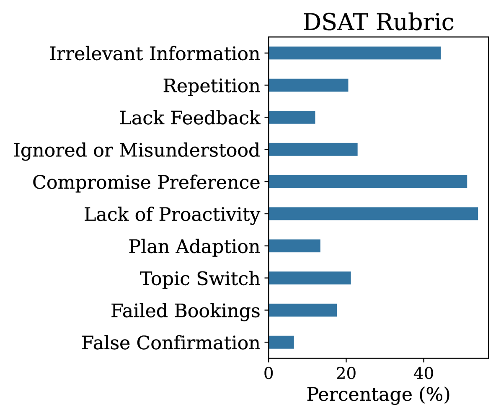

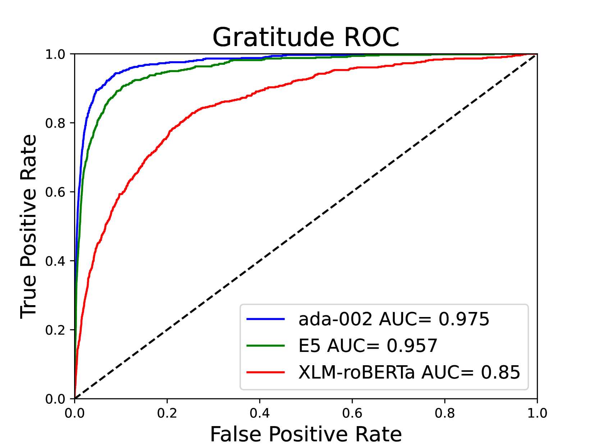

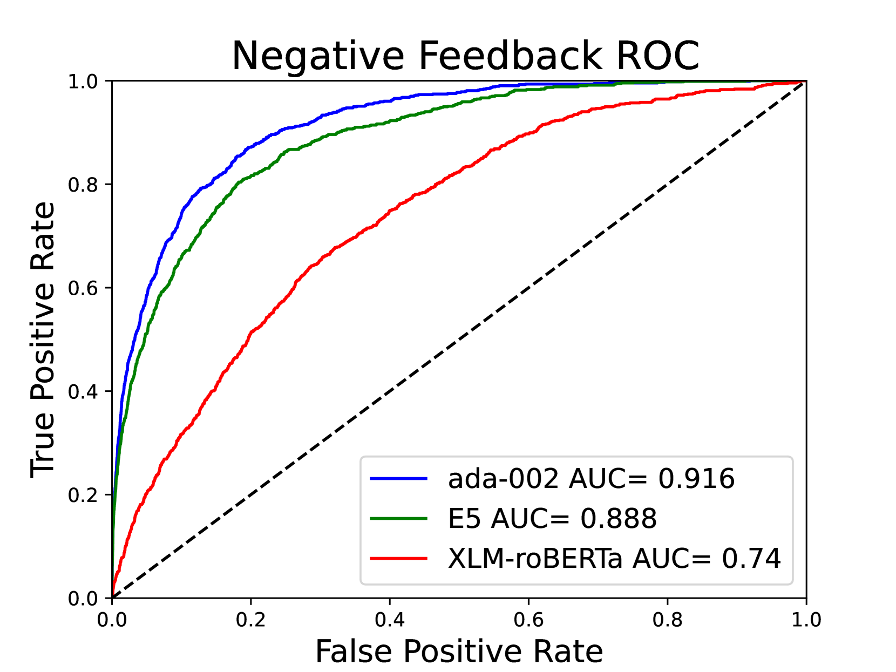

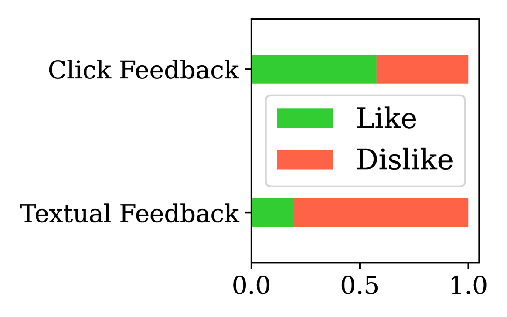

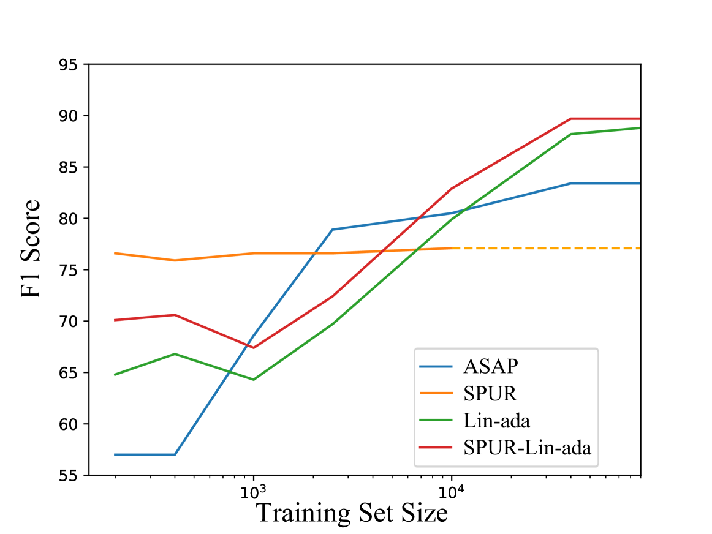

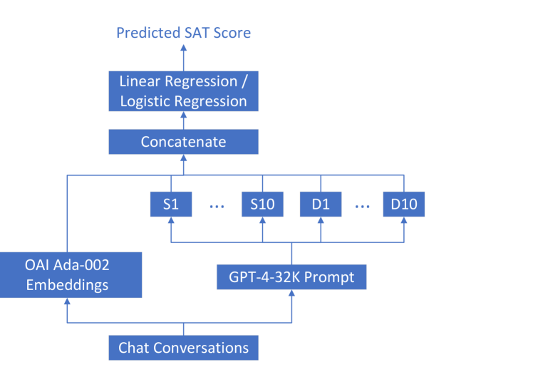

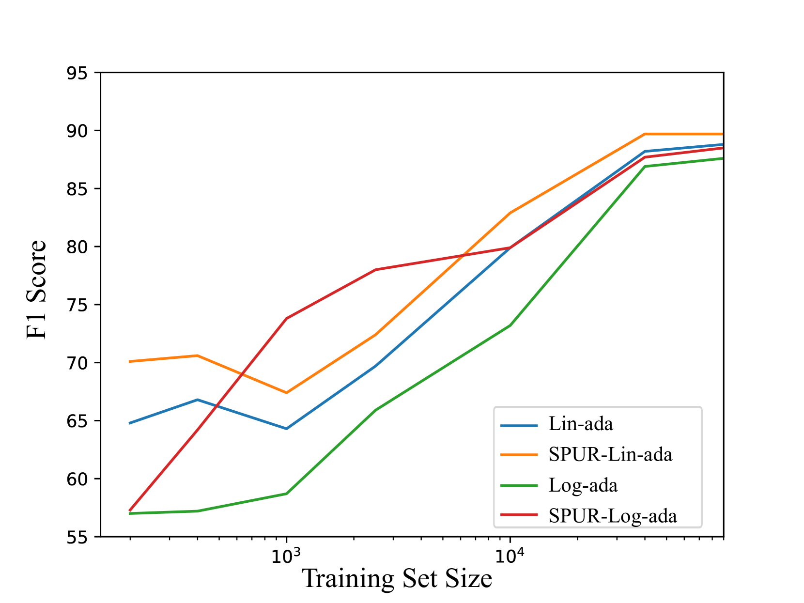

[Arxiv](https://arxiv.org/abs/2403.12388)