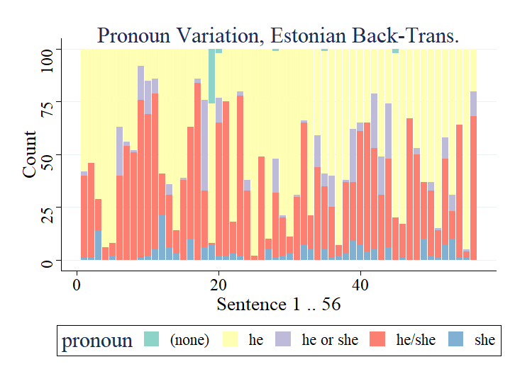
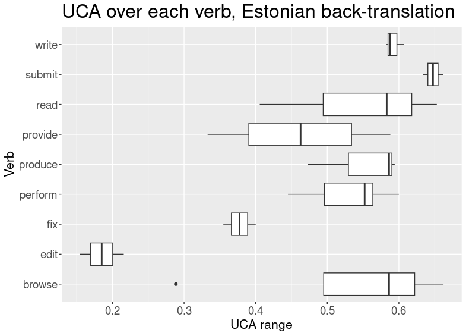

# 本研究深入探究了机器翻译系统中存在的性别偏见标记及其产生原因，旨在揭示驱动这一现象的背后因素。

发布时间：2024年03月18日

`LLM应用` `软件工程`

> Investigating Markers and Drivers of Gender Bias in Machine Translations

> 针对LLMs中存在的隐性性别偏见这一公认问题，以及自动翻译中可能传递真实世界偏见的性别含义，本研究另辟蹊径，借助DeepL翻译API，运用回译技术分析了LLMs在56个软件工程任务上的性别偏见现象。我们让每句话以“她”开始，经过“无性别”中间语言的转换后再返回英文，重点关注回译文本中的代词选择情况。在此基础上，我们创新性地从多角度深化了对该问题的研究：对比了芬兰语、印尼语等五种中间语言的回译结果；设计了一种新颖的指标，以减少对个别代词的过度解读，从而准确衡量多次翻译中性别暗示的波动；探究了哪些句子特征可能导致偏见产生；并通过对不同时期数据集的比对确保了方法的可复现性。研究揭示，部分语言在代词使用上呈现相似模式，大体可分为三大类别，但各组之间又有所不同，提示我们应关注多语言环境的影响。同时，我们发现句子的主要动词可能是影响翻译中性别暗示的关键因素。实验结果展现了良好的复制性，即使DeepL翻译API在研究期间表现有所变化，所提出的变异度量指标仍保持稳定有效。总之，这项研究表明，通过回译法能更深入地洞察语言模型中的偏见问题。

> Implicit gender bias in Large Language Models (LLMs) is a well-documented problem, and implications of gender introduced into automatic translations can perpetuate real-world biases. However, some LLMs use heuristics or post-processing to mask such bias, making investigation difficult. Here, we examine bias in LLMss via back-translation, using the DeepL translation API to investigate the bias evinced when repeatedly translating a set of 56 Software Engineering tasks used in a previous study. Each statement starts with 'she', and is translated first into a 'genderless' intermediate language then back into English; we then examine pronoun- choice in the back-translated texts. We expand prior research in the following ways: (1) by comparing results across five intermediate languages, namely Finnish, Indonesian, Estonian, Turkish and Hungarian; (2) by proposing a novel metric for assessing the variation in gender implied in the repeated translations, avoiding the over-interpretation of individual pronouns, apparent in earlier work; (3) by investigating sentence features that drive bias; (4) and by comparing results from three time-lapsed datasets to establish the reproducibility of the approach. We found that some languages display similar patterns of pronoun use, falling into three loose groups, but that patterns vary between groups; this underlines the need to work with multiple languages. We also identify the main verb appearing in a sentence as a likely significant driver of implied gender in the translations. Moreover, we see a good level of replicability in the results, and establish that our variation metric proves robust despite an obvious change in the behaviour of the DeepL translation API during the course of the study. These results show that the back-translation method can provide further insights into bias in language models.

[Arxiv](https://arxiv.org/abs/2403.11896)