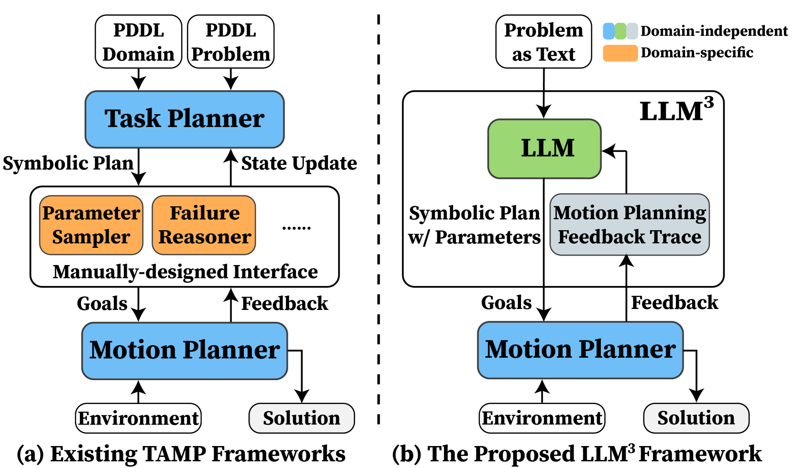
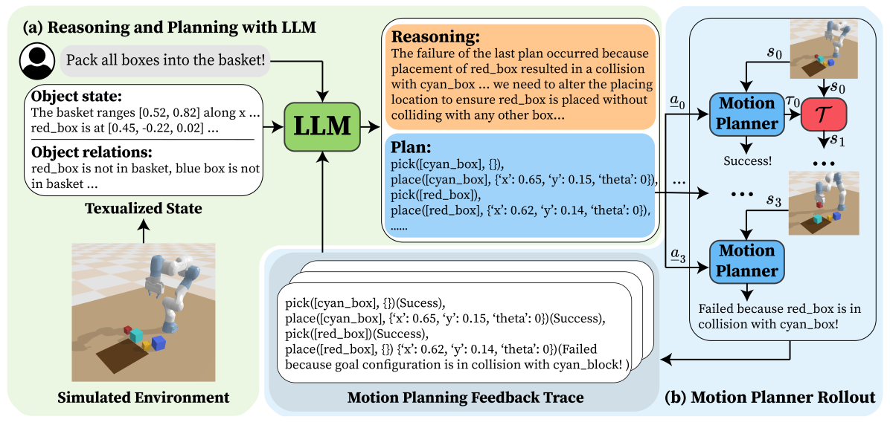
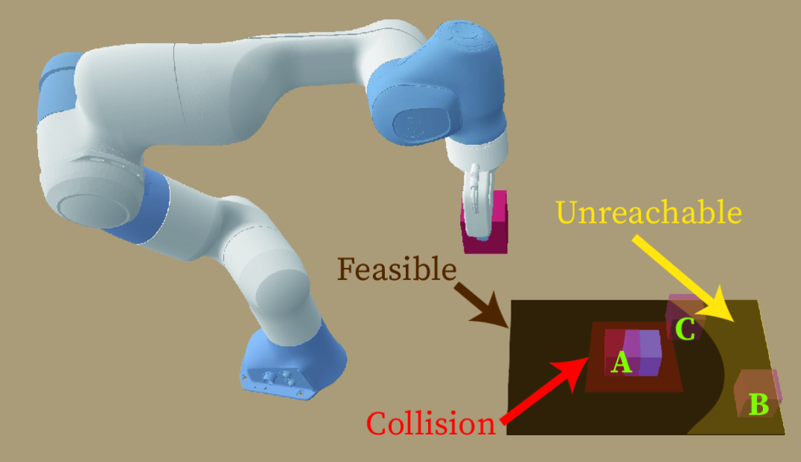
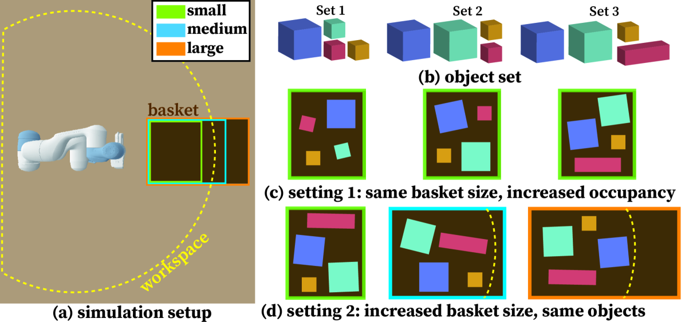
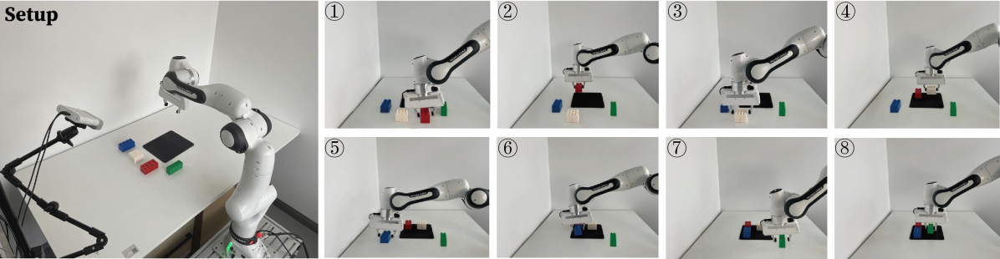

# LLM^3 是一种将大型语言模型应用于任务与运动规划的方法，并融入了对运动失败原因的深入推理。这一技术旨在利用 LLM 的强大能力，为复杂任务与运动规划提供智能解决方案，同时能够理解和解释可能发生的运动失败原因。

发布时间：2024年03月18日

`Agent` `机器人` `自动化技术`

> LLM^3:Large Language Model-based Task and Motion Planning with Motion Failure Reasoning

> 传统TAMP技术需借助人工设计接口，将符号任务规划与连续运动生成紧密结合，但这种领域特异且耗时的方法难以适应真实场景中新出现的任务。为此，我们创新推出了基于大型语言模型（LLM）的TAMP框架——LLM^3，其核心亮点是采用了一个不受领域限制的通用接口。我们巧妙运用预训练LLM强大的推理与规划能力，自动生成符号动作序列，并精准选取运动规划所需的连续动作参数。特别值得一提的是，LLM^3通过提示反馈机制，让LLM能够通过反思运动失败原因来循环改进方案。这样一来，LLM^3如同一座桥梁，无缝衔接任务规划与运动规划，大大简化了处理两者间领域特异信息的复杂设计流程。我们在装箱任务的一系列仿真试验中，用数据有力证明了LLM^3在解决TAMP问题上的高效性和在动作参数选择上的优越性。进一步的消融研究揭示了运动失败推理对LLM^3成功的关键作用。最后，我们在实物机械臂上进行的定性实验，生动展现了我们方法在真实应用场景下的实用可行性。

> Conventional Task and Motion Planning (TAMP) approaches rely on manually crafted interfaces connecting symbolic task planning with continuous motion generation. These domain-specific and labor-intensive modules are limited in addressing emerging tasks in real-world settings. Here, we present LLM^3, a novel Large Language Model (LLM)-based TAMP framework featuring a domain-independent interface. Specifically, we leverage the powerful reasoning and planning capabilities of pre-trained LLMs to propose symbolic action sequences and select continuous action parameters for motion planning. Crucially, LLM^3 incorporates motion planning feed- back through prompting, allowing the LLM to iteratively refine its proposals by reasoning about motion failure. Consequently, LLM^3 interfaces between task planning and motion planning, alleviating the intricate design process of handling domain- specific messages between them. Through a series of simulations in a box-packing domain, we quantitatively demonstrate the effectiveness of LLM^3 in solving TAMP problems and the efficiency in selecting action parameters. Ablation studies un- derscore the significant contribution of motion failure reasoning to the success of LLM^3. Furthermore, we conduct qualitative experiments on a physical manipulator, demonstrating the practical applicability of our approach in real-world settings.

[Arxiv](https://arxiv.org/abs/2403.11552)