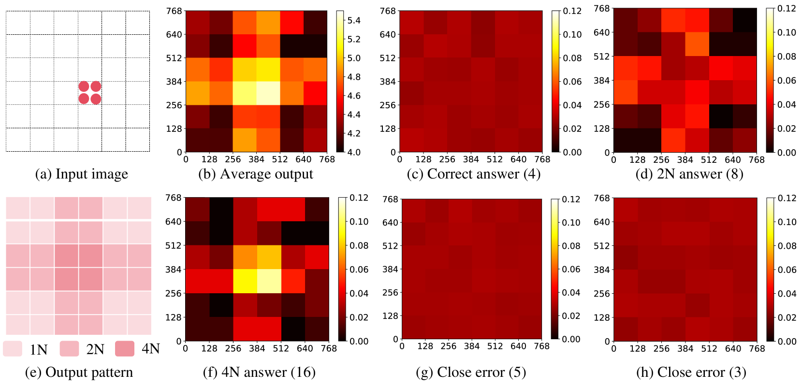
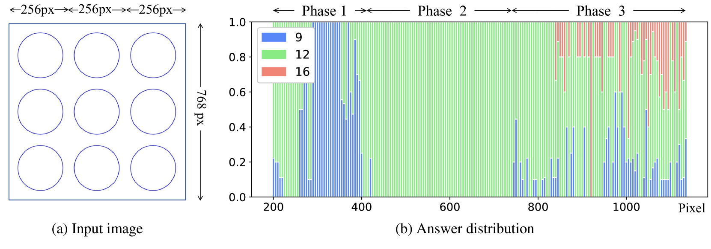
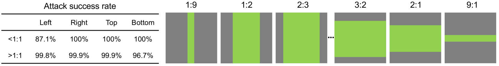
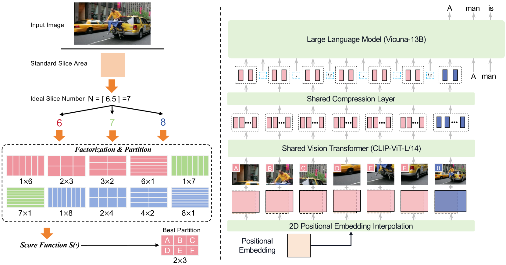
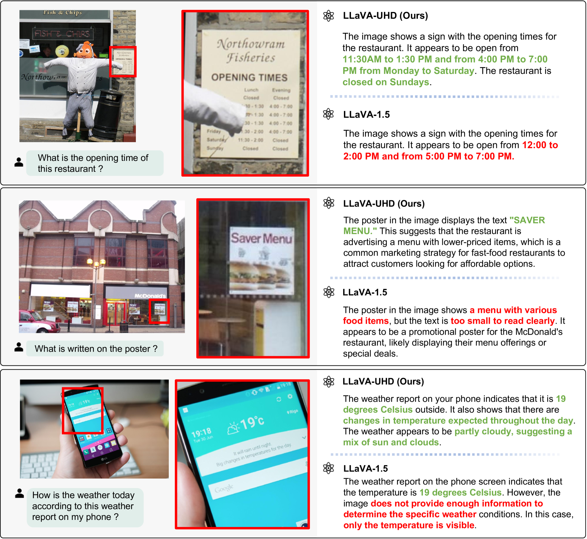
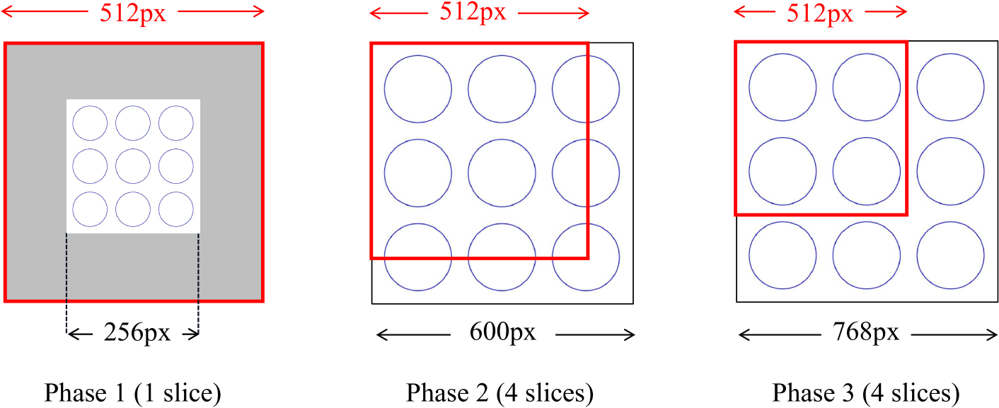

# LLaVA-UHD，一款能够灵活处理任意纵横比、高清图像的 LMM 模型。

发布时间：2024年03月18日

`LLM应用` `计算机视觉`

> LLaVA-UHD: an LMM Perceiving Any Aspect Ratio and High-Resolution Images

> 视觉编码是大型多模态模型理解视觉信息的核心所在，但常规LMMs受限于固定的图像尺寸与有限分辨率，近期研究虽有进展，却在灵活性、效能及准确性等方面存在局限。本研究以GPT-4V和LLaVA-1.5为例，深入剖析其内在视觉编码策略存在的根本问题，并据此提出了一种全新的大型多模态模型——LLaVA-UHD，它能高效解析任意比例和高分辨率的图像。LLaVA-UHD包括三大创新组件：一是灵活高效的图像模块化方案，将原生分辨率图像切割为大小各异的切片进行编码；二是深度压缩模块，对视觉编码器生成的图像令牌进一步精简；三是为空间结构设计的组织方式，便于LLMs处理切片令牌。广泛的实验验证显示，在9项基准测试中，LLaVA-UHD即使面对训练数据量大出2至3个数量级的既有LMMs也能表现优越。尤其值得一提的是，基于LLaVA-1.5 336x336版本改进的LLaVA-UHD模型，只需占用94%的推理计算资源，就可处理高达672x1088分辨率的图像，同时在TextVQA任务上提高了6.4个百分点的精度。此外，该模型在学术环境下具有良好的训练效率，利用8块A100 GPU可在23小时内完成训练（对比LLaVA-1.5的26小时）。相关数据和代码已开放获取，地址为https://github.com/thunlp/LLaVA-UHD。

> Visual encoding constitutes the basis of large multimodal models (LMMs) in understanding the visual world. Conventional LMMs process images in fixed sizes and limited resolutions, while recent explorations in this direction are limited in adaptivity, efficiency, and even correctness. In this work, we first take GPT-4V and LLaVA-1.5 as representative examples and expose systematic flaws rooted in their visual encoding strategy. To address the challenges, we present LLaVA-UHD, a large multimodal model that can efficiently perceive images in any aspect ratio and high resolution. LLaVA-UHD includes three key components: (1) An image modularization strategy that divides native-resolution images into smaller variable-sized slices for efficient and extensible encoding, (2) a compression module that further condenses image tokens from visual encoders, and (3) a spatial schema to organize slice tokens for LLMs. Comprehensive experiments show that LLaVA-UHD outperforms established LMMs trained with 2-3 orders of magnitude more data on 9 benchmarks. Notably, our model built on LLaVA-1.5 336x336 supports 6 times larger (i.e., 672x1088) resolution images using only 94% inference computation, and achieves 6.4 accuracy improvement on TextVQA. Moreover, the model can be efficiently trained in academic settings, within 23 hours on 8 A100 GPUs (vs. 26 hours of LLaVA-1.5). We make the data and code publicly available at https://github.com/thunlp/LLaVA-UHD.

[Arxiv](https://arxiv.org/abs/2403.11703)