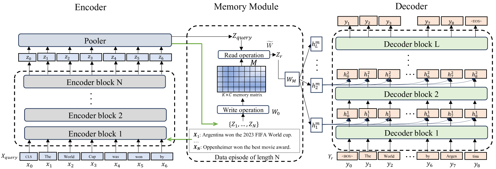
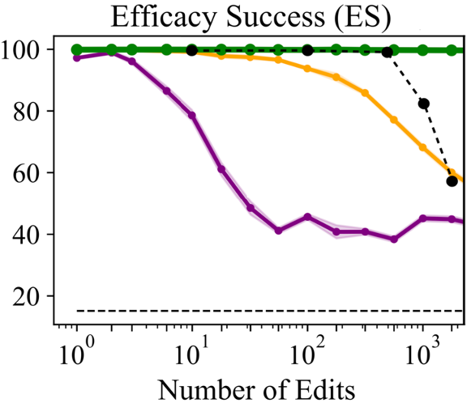
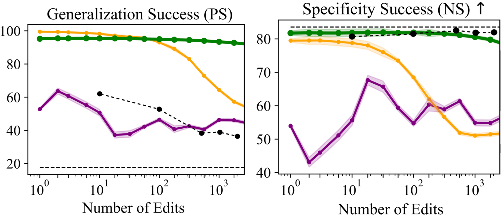
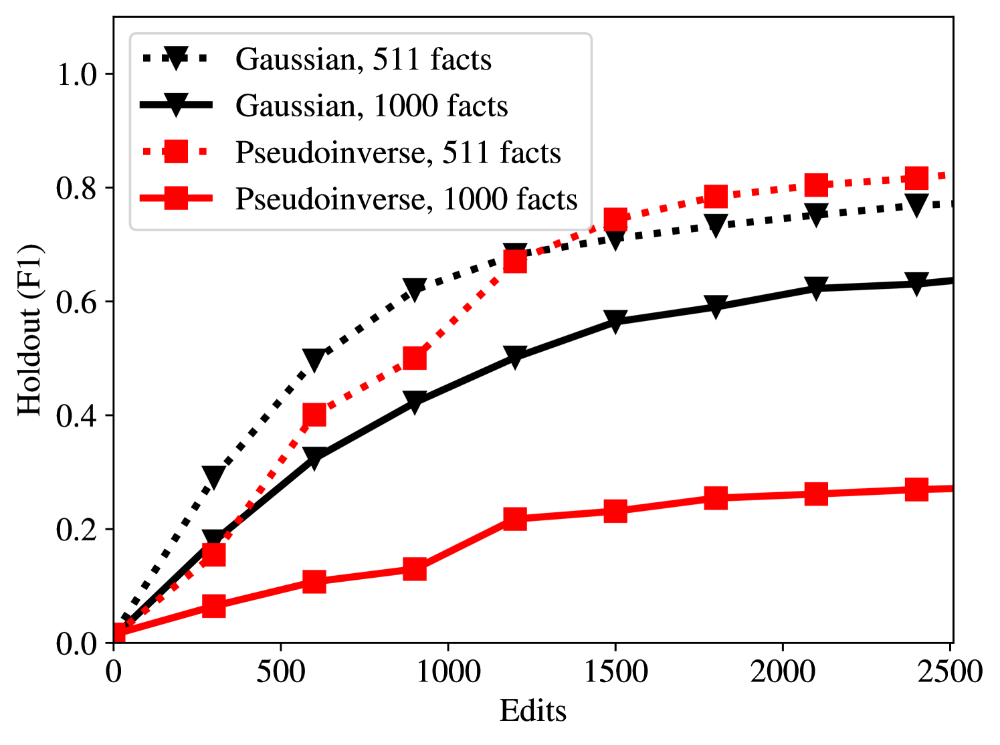
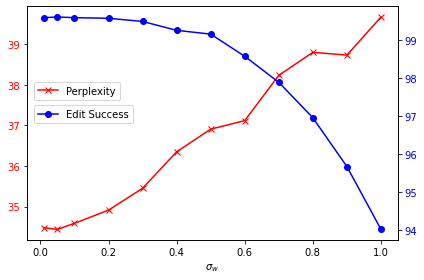

# Larimar 是一种具备情境记忆控制功能的大型语言模型，它能够在处理和生成文本时利用情境记忆进行更精准、灵活和上下文相关的操作。

发布时间：2024年03月18日

`LLM应用` `大型语言模型`

> Larimar: Large Language Models with Episodic Memory Control

# 摘要

> 如今，如何有效且精准地更新大型语言模型中的知识储存是一项亟待解决的重要研究课题。本文介绍了一种创新的大脑启发式架构——Larimar，它利用分布式事件记忆功能优化了LLMs的表现。Larimar所拥有的记忆模块能够实现动态的一次性知识更新，无需耗费大量计算资源进行重新训练或微调。在多个事实编辑基准测试中，Larimar展现出了与当前最先进基准相媲美的精确度，即便是在严苛的序列编辑环境下亦能保持高准确率，同时，在速度方面更胜一筹，根据不同基础LLM可获得4至10倍的速度提升，且因其架构简洁、独立于LLM特性之外而具有广泛的适用性和灵活性。此外，我们还为Larimar设计了选择性遗忘事实和适应不同输入上下文长度的机制，并验证了这些机制的有效性。

> Efficient and accurate updating of knowledge stored in Large Language Models (LLMs) is one of the most pressing research challenges today. This paper presents Larimar - a novel, brain-inspired architecture for enhancing LLMs with a distributed episodic memory. Larimar's memory allows for dynamic, one-shot updates of knowledge without the need for computationally expensive re-training or fine-tuning. Experimental results on multiple fact editing benchmarks demonstrate that Larimar attains accuracy comparable to most competitive baselines, even in the challenging sequential editing setup, but also excels in speed - yielding speed-ups of 4-10x depending on the base LLM - as well as flexibility due to the proposed architecture being simple, LLM-agnostic, and hence general. We further provide mechanisms for selective fact forgetting and input context length generalization with Larimar and show their effectiveness.

[Arxiv](https://arxiv.org/abs/2403.11901)