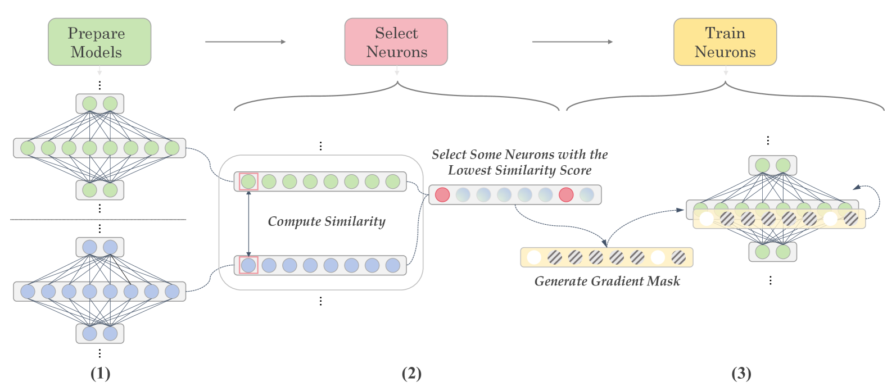
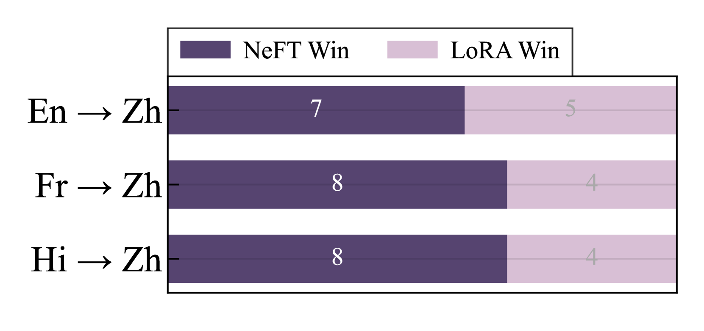
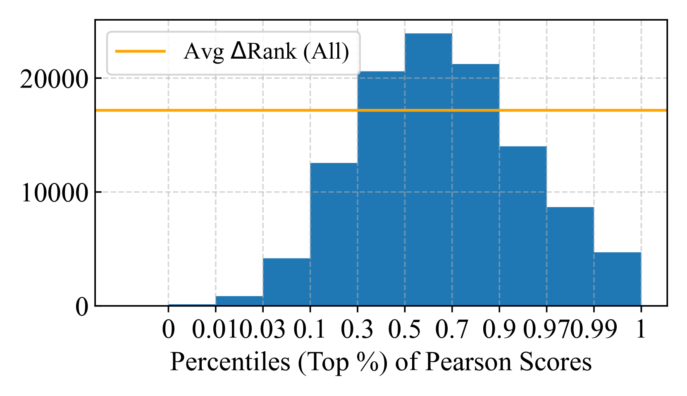
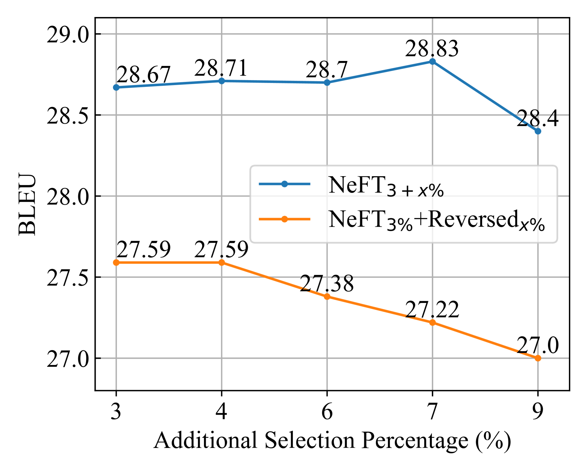
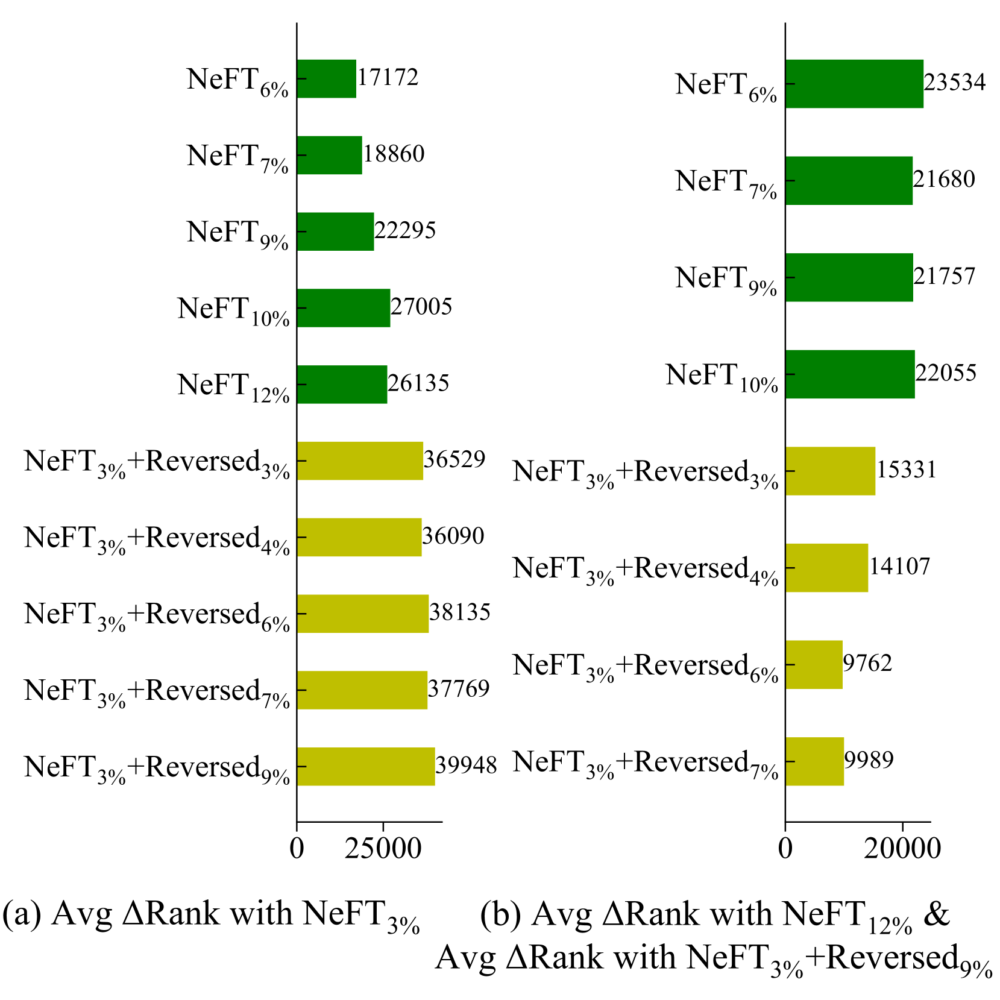
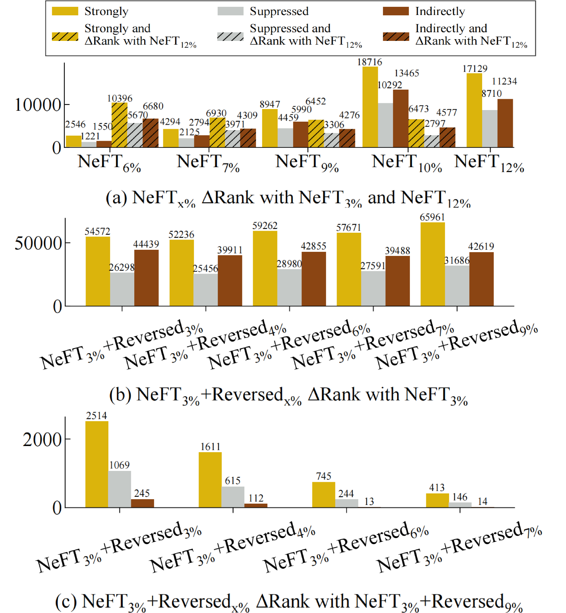

# 本文将关注大型语言模型的神经元层级监督微调技术，旨在通过细致到神经元级别的调整，提升其性能表现。

发布时间：2024年03月18日

`LLM理论`

> Let's Focus on Neuron: Neuron-Level Supervised Fine-tuning for Large Language Model

# 摘要

> 随着LLMs规模的增大，其中的神经元展现出多样化的特性和功能。近期研究揭示，不是所有神经元在各数据集中都会活跃，而这种活性的稀疏性与任务特异性能力之间存在正相关关系，这一发现有助于推动模型剪枝和提高训练效率。常规的全参数微调方法虽然全面涉及LLMs的所有参数，却消耗大量计算资源且未必必需。与此相反，PEFT技术致力于减少需要训练的参数数量，但其调整范围仍停留在较为宏观的层次，如层级调整。为此，我们创新性地提出了NeFT——神经元级微调技术，该技术将参数训练精细化至单个神经元级别，使模型更新更为精准且高效。实验证明，NeFT不仅在性能上超越了全参数微调和PEFT方法，而且为深入剖析神经元特性提供了崭新的视角。

> Large Language Models (LLMs) are composed of neurons that exhibit various behaviors and roles, which become increasingly diversified as models scale. Recent studies have revealed that not all neurons are active across different datasets, and this sparsity correlates positively with the task-specific ability, leading to advancements in model pruning and training efficiency. Traditional fine-tuning methods engage all parameters of LLMs, which is computationally expensive and may not be necessary. In contrast, Parameter-Efficient Fine-Tuning (PEFT) approaches aim to minimize the number of trainable parameters, yet they still operate at a relatively macro scale (e.g., layer-level). We introduce Neuron-Level Fine-Tuning (NeFT), a novel approach that refines the granularity of parameter training down to the individual neuron, enabling more precise and computationally efficient model updates. The experimental results show that NeFT not only exceeded the performance of full-parameter fine-tuning and PEFT but also provided insights into the analysis of neurons.

[Arxiv](https://arxiv.org/abs/2403.11621)