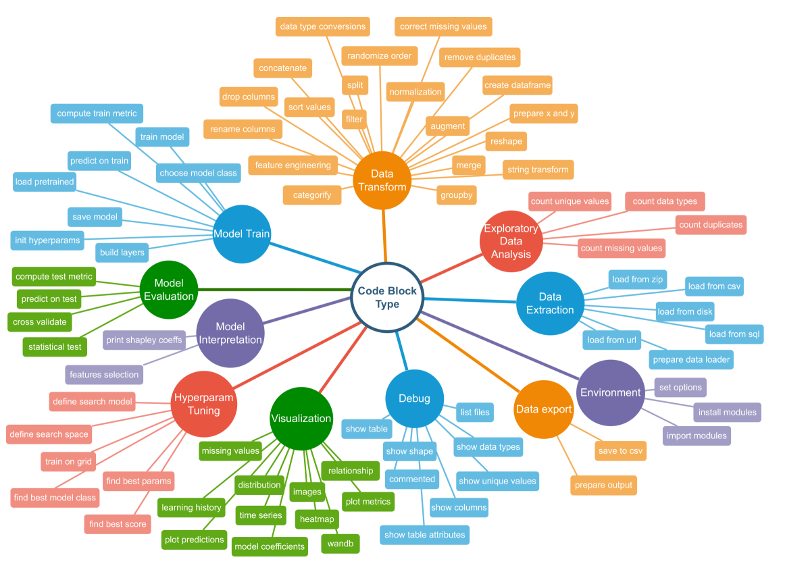
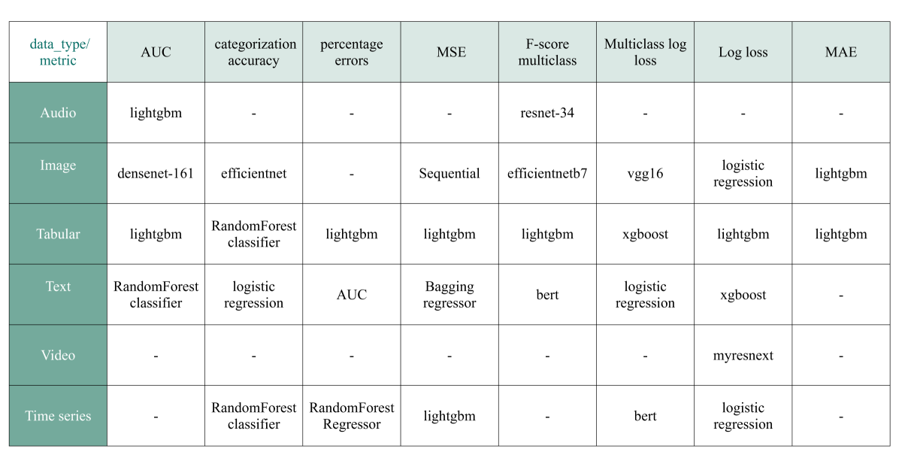
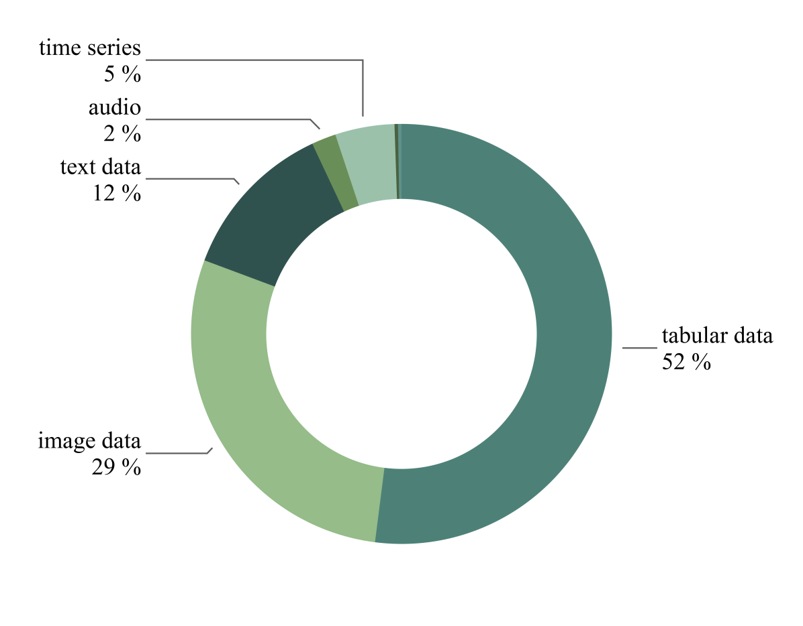
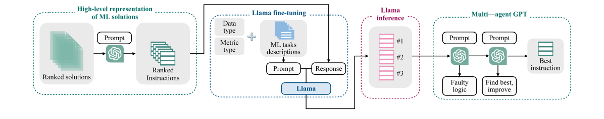
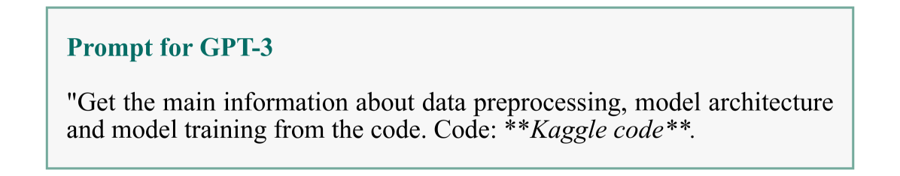
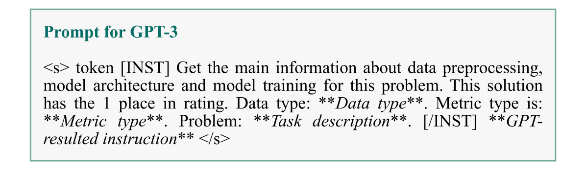
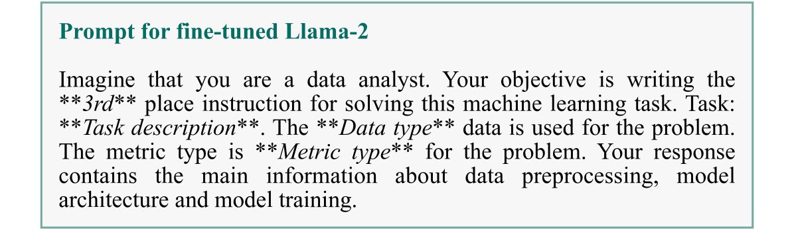
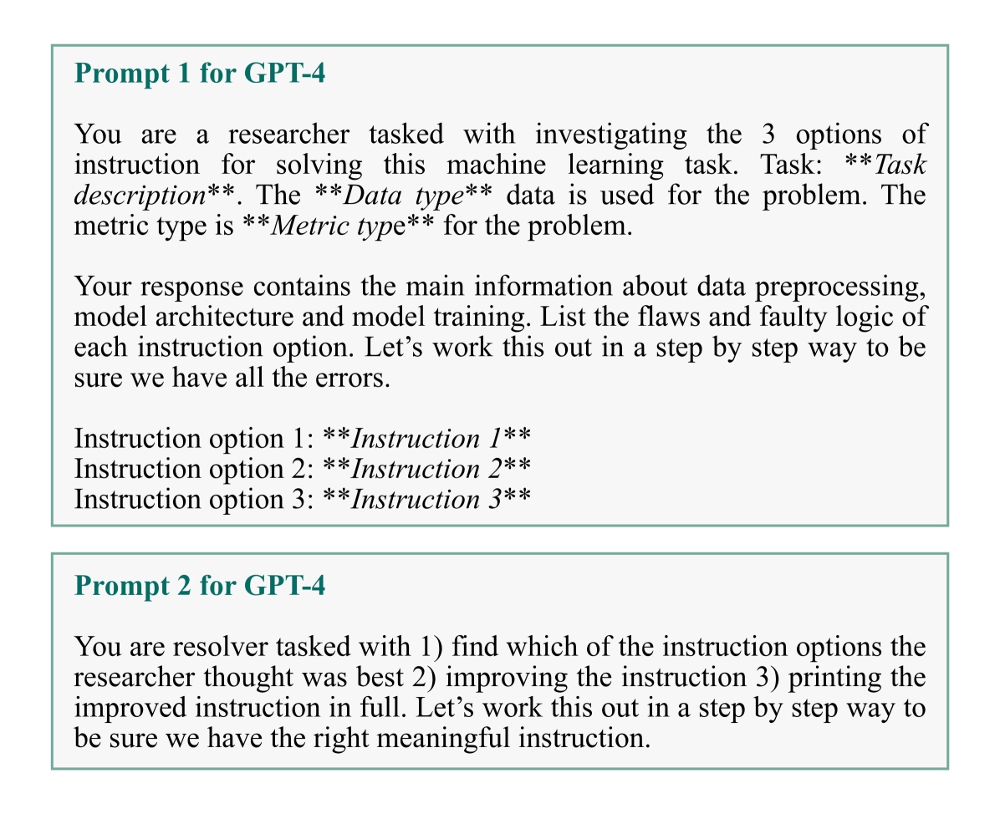
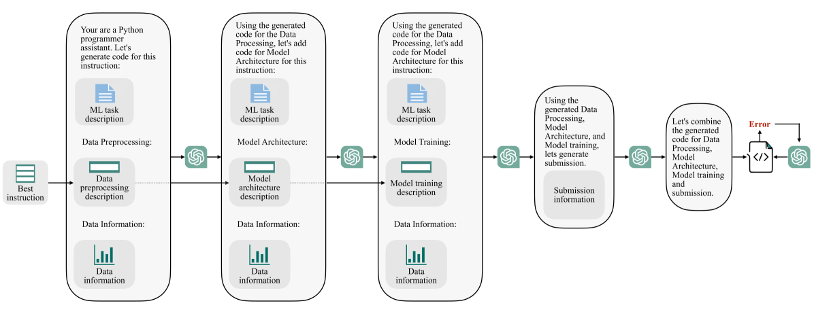

# Linguacodus 是一个专为机器学习流水线设计的协同式框架，致力于实现革命性的代码生成过程。

发布时间：2024年03月18日

`LLM应用` `机器学习` `自动代码生成`

> Linguacodus: A Synergistic Framework for Transformative Code Generation in Machine Learning Pipelines

> 面对机器学习领域中将自然语言描述流畅转换为可执行代码的难题，本文推出了创新框架——Linguacodus。此框架采用动态流水线，通过一系列高级数据整形指令逐步将自然语言任务说明转化为实际代码。Linguacodus的心脏部位是一款精心微调的大型语言模型（LLM），能针对各类问题评估多种解决方案并为特定任务挑选最佳方案。本文详述了微调流程，并揭秘了如何将自然语言描述“翻译”成功能性的编程代码。Linguacodus标志着自动代码生成技术的一大进步，成功连接起任务描述与可执行代码之间的桥梁，在各领域推进机器学习应用的发展具有广阔前景。同时，我们还提出了一个能在极小人工介入情况下将机器学习任务自然描述转化为代码的算法。基于源自Kaggle的庞大机器学习代码数据集上的深入实验，我们充分展示了Linguacodus的强大效能。研究凸显了该技术在众多领域内的广泛应用潜力，特别是在各科学领域对实用机器学习的深远影响。

> In the ever-evolving landscape of machine learning, seamless translation of natural language descriptions into executable code remains a formidable challenge. This paper introduces Linguacodus, an innovative framework designed to tackle this challenge by deploying a dynamic pipeline that iteratively transforms natural language task descriptions into code through high-level data-shaping instructions. The core of Linguacodus is a fine-tuned large language model (LLM), empowered to evaluate diverse solutions for various problems and select the most fitting one for a given task. This paper details the fine-tuning process, and sheds light on how natural language descriptions can be translated into functional code. Linguacodus represents a substantial leap towards automated code generation, effectively bridging the gap between task descriptions and executable code. It holds great promise for advancing machine learning applications across diverse domains. Additionally, we propose an algorithm capable of transforming a natural description of an ML task into code with minimal human interaction. In extensive experiments on a vast machine learning code dataset originating from Kaggle, we showcase the effectiveness of Linguacodus. The investigations highlight its potential applications across diverse domains, emphasizing its impact on applied machine learning in various scientific fields.

[Arxiv](https://arxiv.org/abs/2403.11585)