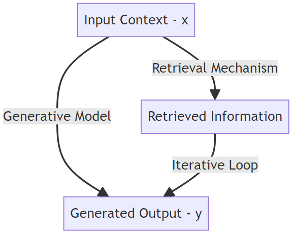
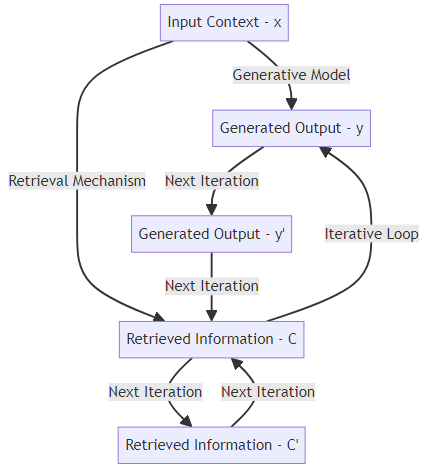
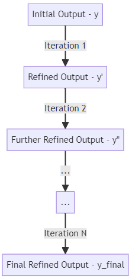

# LoRAG（检索增强生成中的循环机制）是一项技术，通过在文本生成过程中融入检索增强策略形成循环结构，以提升内容质量和生成效果。

发布时间：2024年03月18日

`RAG` `文本生成`

> Loops On Retrieval Augmented Generation (LoRAG)

> 本文介绍了一项创新框架——LoRAG（基于检索增强生成的循环机制），它通过融入迭代循环机制，显著提升了检索增强文本生成的质量。该架构集成了生成模型、检索组件及动态循环模块，使系统能够在与输入语境中的相关信息交互过程中逐步优化生成文本。实验证明，在多个评价指标如BLEU得分、ROUGE得分及困惑度上，LoRAG均超越了当前最先进模型，充分展示其在生成既有连贯性又具相关性的文本方面的优越性能。深入的定性分析进一步突显了LoRAG产出丰富连贯语境内容的能力。这一研究深度探讨了迭代循环在应对文本生成难题中的巨大潜力，从而将LoRAG定位为该领域的一项颇具前景的技术突破。

> This paper presents Loops On Retrieval Augmented Generation (LoRAG), a new framework designed to enhance the quality of retrieval-augmented text generation through the incorporation of an iterative loop mechanism. The architecture integrates a generative model, a retrieval mechanism, and a dynamic loop module, allowing for iterative refinement of the generated text through interactions with relevant information retrieved from the input context. Experimental evaluations on benchmark datasets demonstrate that LoRAG surpasses existing state-of-the-art models in terms of BLEU score, ROUGE score, and perplexity, showcasing its effectiveness in achieving both coherence and relevance in generated text. The qualitative assessment further illustrates LoRAG's capability to produce contextually rich and coherent outputs. This research contributes valuable insights into the potential of iterative loops in mitigating challenges in text generation, positioning LoRAG as a promising advancement in the field.

[Arxiv](https://arxiv.org/abs/2403.15450)