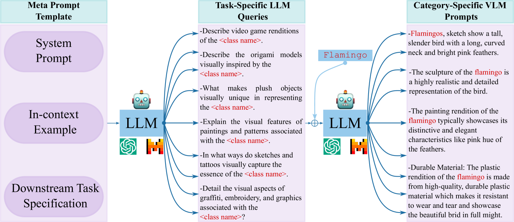
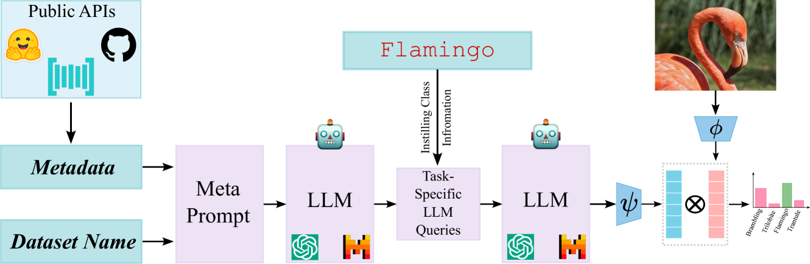
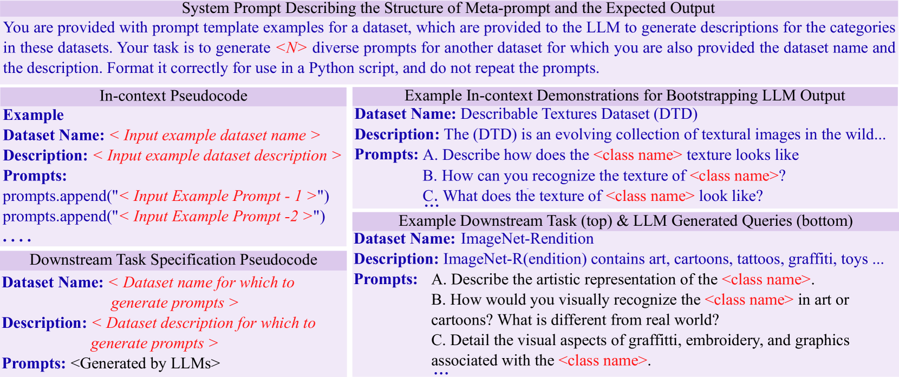
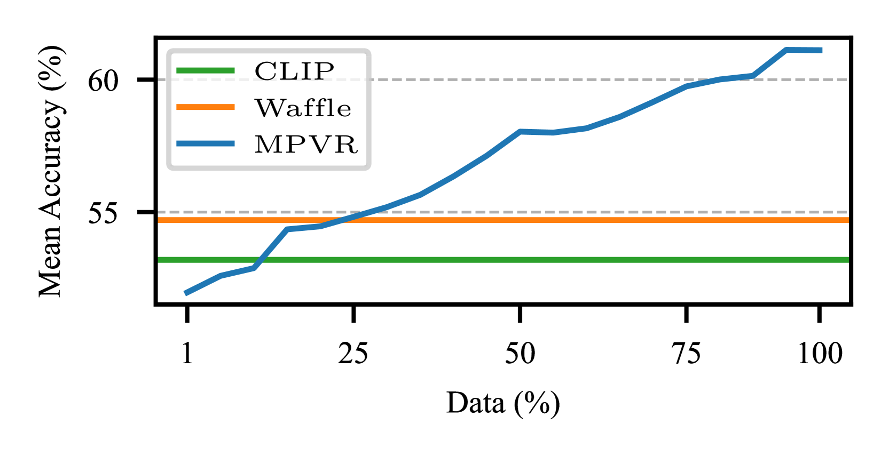
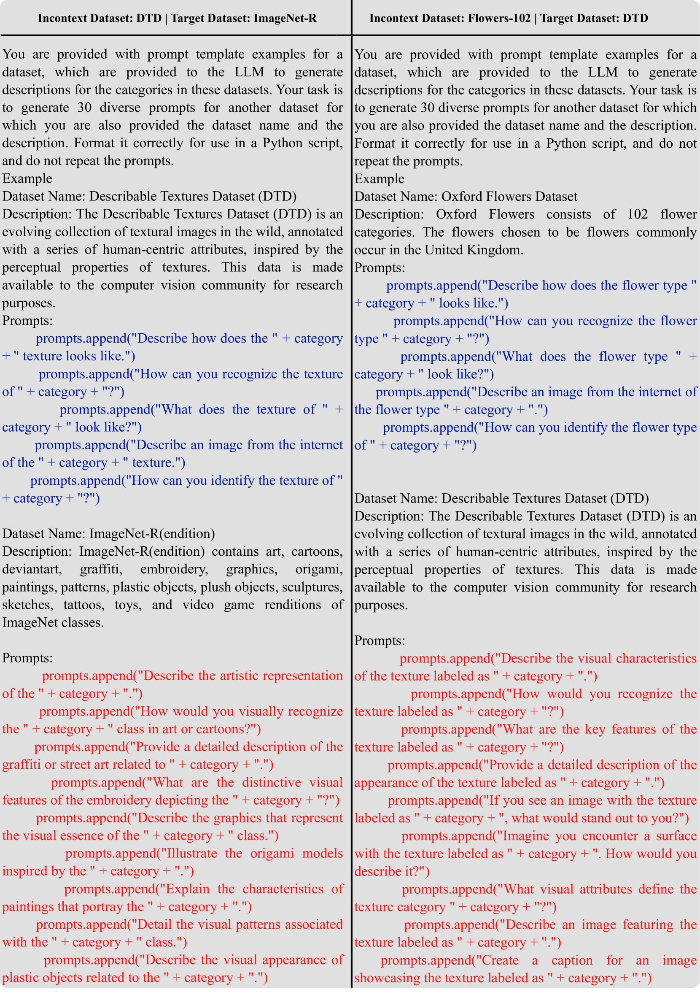
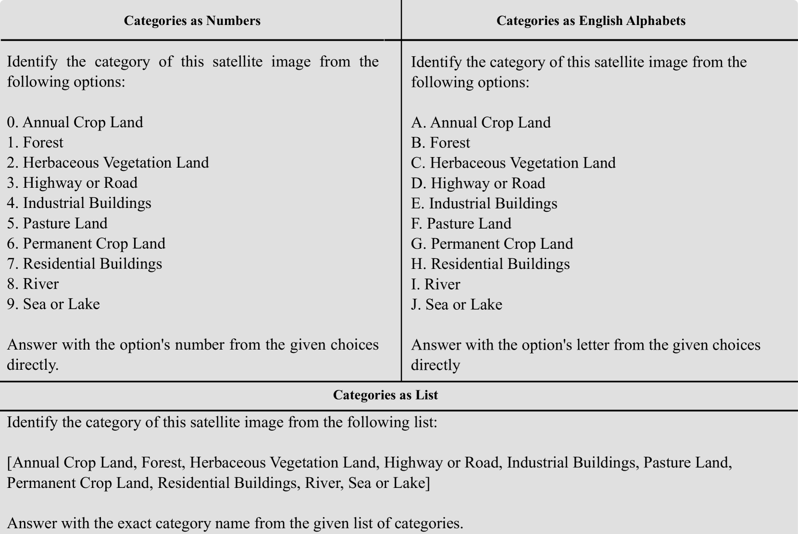

# 运用元提示方法，借助LLMs自动实现零样本视觉识别任务的高效处理。

发布时间：2024年03月18日

`LLM应用` `图像识别`

> Meta-Prompting for Automating Zero-shot Visual Recognition with LLMs

# 摘要

> 通过将手工设计的类别特定提示进行Prompt Ensemble，已成为增强VLM零样本识别能力的有力手段，特别是在大型语言模型(LLM)中。但现有方法仍受限于人工编写特定任务提示，且难以全面覆盖各类别相关的丰富视觉概念及任务特有表达方式。为此，我们提出了一种新颖的MPVR（Meta-Prompting for Visual Recognition）方案，旨在实现零样本识别过程中提示生成的完全自动化。MPVR只需依据目标任务简洁的自然语言描述和相关类别标签列表，即可自动生成多元化的类别特定提示，形成强大的零样本分类器。经验证，无论是在何种背景下的流行零样本图像识别基准测试，亦或是搭配多种LLM和VLM，MPVR均能展现出优秀的泛化能力。比如，在CLIP的基础上，结合GPT和Mixtral LLM，MPVR分别提升了最高达19.8%和18.2%的零样本识别精度，而在20个数据集上的平均提升幅度则分别为5.0%和4.5%。

> Prompt ensembling of Large Language Model (LLM) generated category-specific prompts has emerged as an effective method to enhance zero-shot recognition ability of Vision-Language Models (VLMs). To obtain these category-specific prompts, the present methods rely on hand-crafting the prompts to the LLMs for generating VLM prompts for the downstream tasks. However, this requires manually composing these task-specific prompts and still, they might not cover the diverse set of visual concepts and task-specific styles associated with the categories of interest. To effectively take humans out of the loop and completely automate the prompt generation process for zero-shot recognition, we propose Meta-Prompting for Visual Recognition (MPVR). Taking as input only minimal information about the target task, in the form of its short natural language description, and a list of associated class labels, MPVR automatically produces a diverse set of category-specific prompts resulting in a strong zero-shot classifier. MPVR generalizes effectively across various popular zero-shot image recognition benchmarks belonging to widely different domains when tested with multiple LLMs and VLMs. For example, MPVR obtains a zero-shot recognition improvement over CLIP by up to 19.8% and 18.2% (5.0% and 4.5% on average over 20 datasets) leveraging GPT and Mixtral LLMs, respectively

[Arxiv](https://arxiv.org/abs/2403.11755)