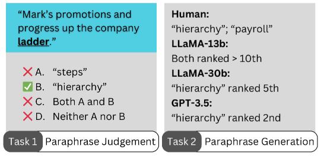
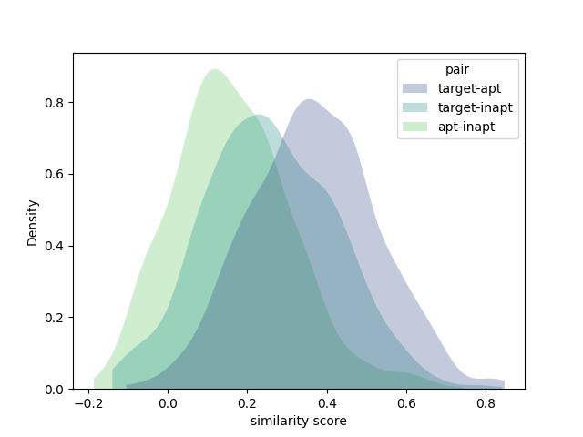
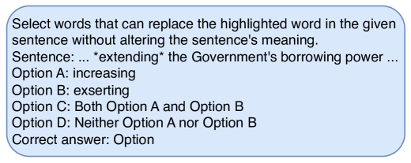
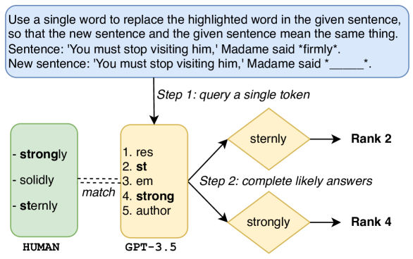
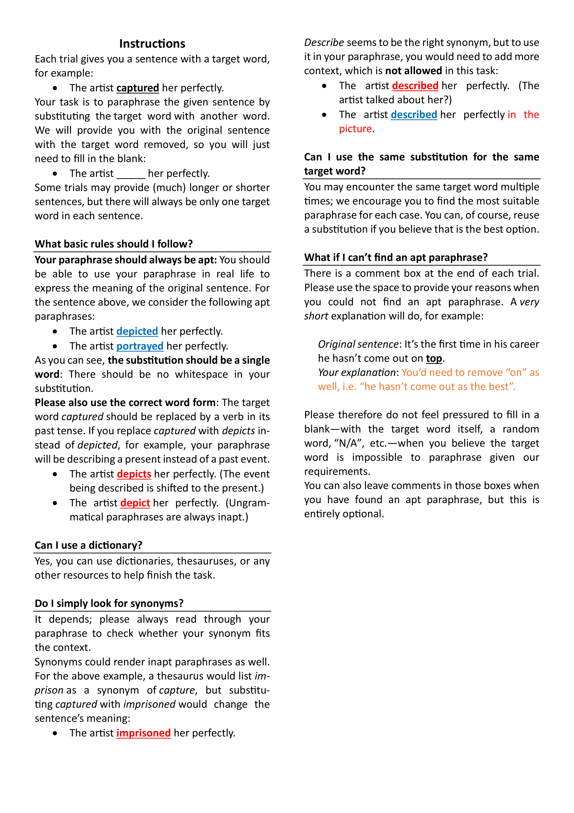
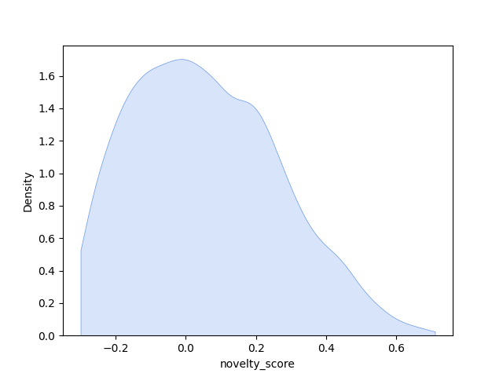
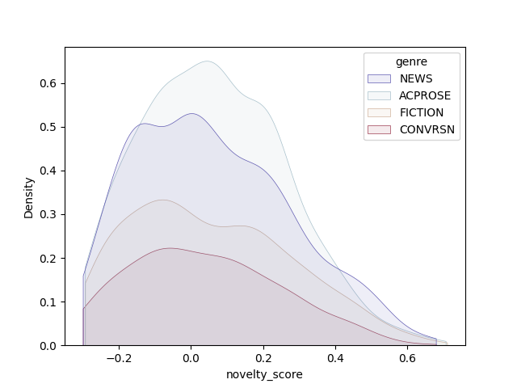

# LLMs 隐喻理解挑战数据集，专为检验大型语言模型对复杂隐喻的理解能力而设计

发布时间：2024年03月18日

`LLM应用` `认知科学`

> Metaphor Understanding Challenge Dataset for LLMs

> 自然语言中的隐喻揭示了人类认知机制的核心，如类比思维与分类，且在日常沟通中无处不在。为了测试LLMs能否有效理解和解析隐喻，我们构建并公开了Metaphor Understanding Challenge Dataset（MUNCH）。这个数据集中包含了超过1万条含有隐喻表达的句子及其多种合理释义，另外还精选了1500条刻意设计的不恰当释义作为对照组，用于判断模型是否真正在做深入的隐喻解读，而非简单依赖词汇层面的相似度。所有释义均已由人工细致标注，涵盖学术、新闻、小说和对话四大文体中自然出现的各种新颖程度不同的隐喻用例。通过与LLaMA和GPT-3.5模型的实际验证，MUNCH展现出对LLMs极具挑战性的检测价值。您可以在GitHub网址https://github.com/xiaoyuisrain/metaphor-understanding-challenge免费访问此数据集。

> Metaphors in natural language are a reflection of fundamental cognitive processes such as analogical reasoning and categorisation, and are deeply rooted in everyday communication. Metaphor understanding is therefore an essential task for large language models (LLMs). We release the Metaphor Understanding Challenge Dataset (MUNCH), designed to evaluate the metaphor understanding capabilities of LLMs. The dataset provides over 10k paraphrases for sentences containing metaphor use, as well as 1.5k instances containing inapt paraphrases. The inapt paraphrases were carefully selected to serve as control to determine whether the model indeed performs full metaphor interpretation or rather resorts to lexical similarity. All apt and inapt paraphrases were manually annotated. The metaphorical sentences cover natural metaphor uses across 4 genres (academic, news, fiction, and conversation), and they exhibit different levels of novelty. Experiments with LLaMA and GPT-3.5 demonstrate that MUNCH presents a challenging task for LLMs. The dataset is freely accessible at https://github.com/xiaoyuisrain/metaphor-understanding-challenge.

[Arxiv](https://arxiv.org/abs/2403.11810)