# MineDreamer，一种创新方法，通过“链式想象”机制，在模拟世界的控制情境中实现对指令的精准跟随。

发布时间：2024年03月18日

`Agent` `人工智能`

> MineDreamer: Learning to Follow Instructions via Chain-of-Imagination for Simulated-World Control

# 摘要

> 一直以来，我们都期望打造一个能像人一样灵活执行多样化指令的通用型具身智能体。现有技术常常因难以理解和执行抽象及序列化的自然语言指令而无法稳定完成任务。为此，我们推出了一款名为MineDreamer的开创性开放式具身智能体，它依托于颇具挑战性的Minecraft模拟器，并结合了最新的多模态大型语言模型（MLLMs）与扩散模型技术。MineDreamer独具匠心地采用了“链式想象”机制，通过逐步设想指令执行过程，并将这些想象精准转化为与当前状态适配的视觉提示，进而生成高效的键盘和鼠标动作来一一落实这些想象，确保每一步都能稳稳地遵循指令执行。大量实验证明，MineDreamer在执行单步和多步指令时表现出色且稳定性强，明显优于目前最优的通用型智能体基准，甚至使其性能近乎翻倍。进一步的定性分析显示，MineDreamer具备强大的想象力与开放世界的泛化理解能力。

> It is a long-lasting goal to design a generalist-embodied agent that can follow diverse instructions in human-like ways. However, existing approaches often fail to steadily follow instructions due to difficulties in understanding abstract and sequential natural language instructions. To this end, we introduce MineDreamer, an open-ended embodied agent built upon the challenging Minecraft simulator with an innovative paradigm that enhances instruction-following ability in low-level control signal generation. Specifically, MineDreamer is developed on top of recent advances in Multimodal Large Language Models (MLLMs) and diffusion models, and we employ a Chain-of-Imagination (CoI) mechanism to envision the step-by-step process of executing instructions and translating imaginations into more precise visual prompts tailored to the current state; subsequently, the agent generates keyboard-and-mouse actions to efficiently achieve these imaginations, steadily following the instructions at each step. Extensive experiments demonstrate that MineDreamer follows single and multi-step instructions steadily, significantly outperforming the best generalist agent baseline and nearly doubling its performance. Moreover, qualitative analysis of the agent's imaginative ability reveals its generalization and comprehension of the open world.

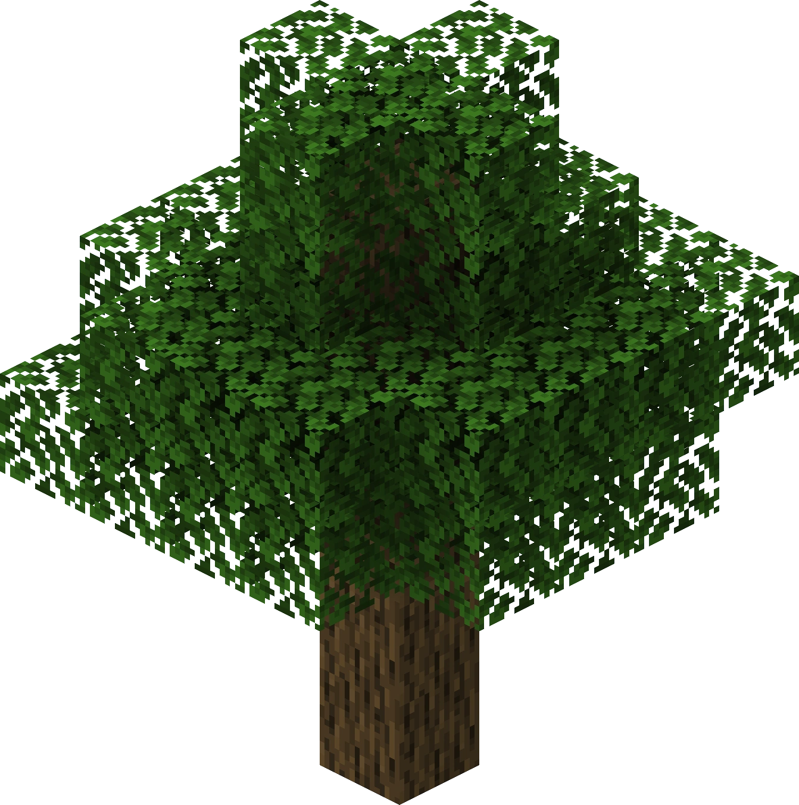

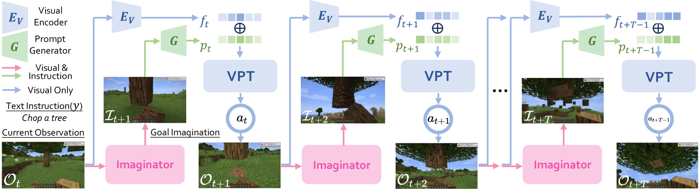

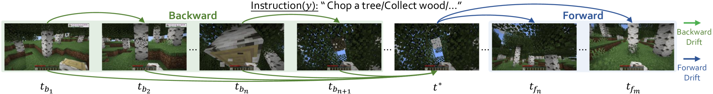

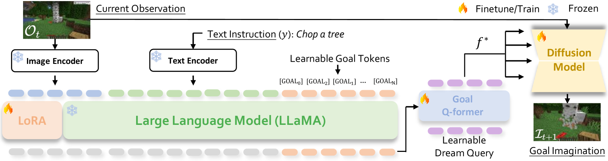

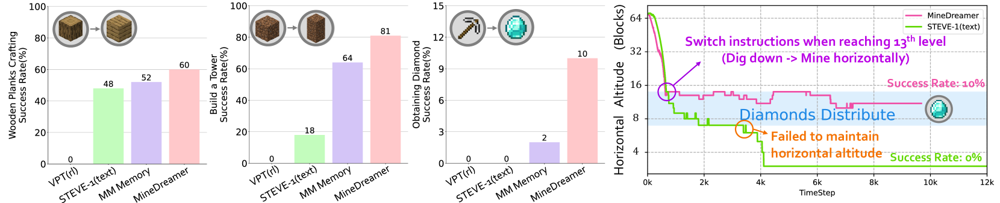

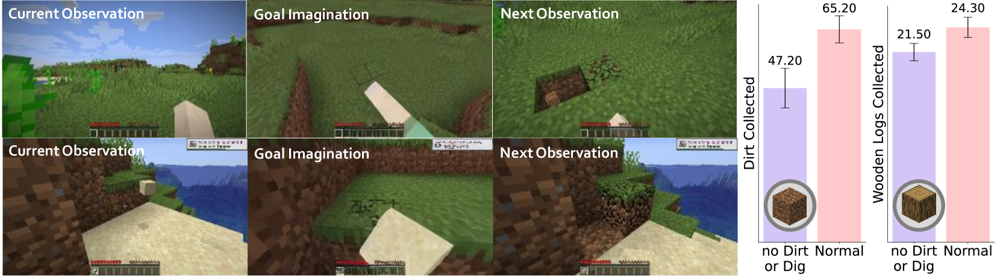

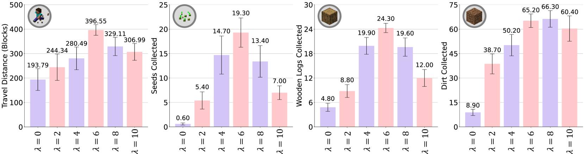

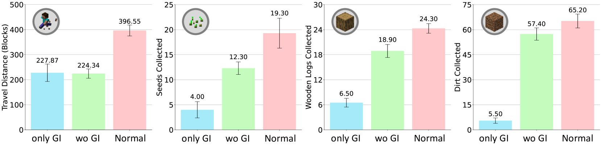

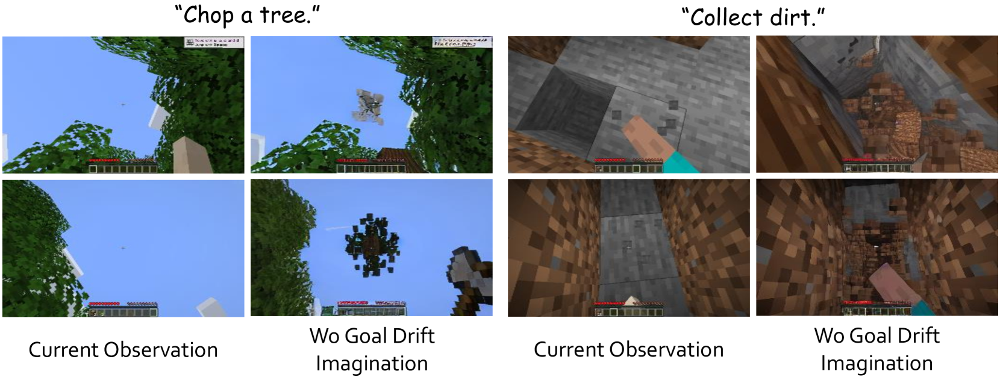

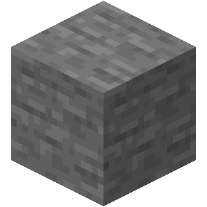

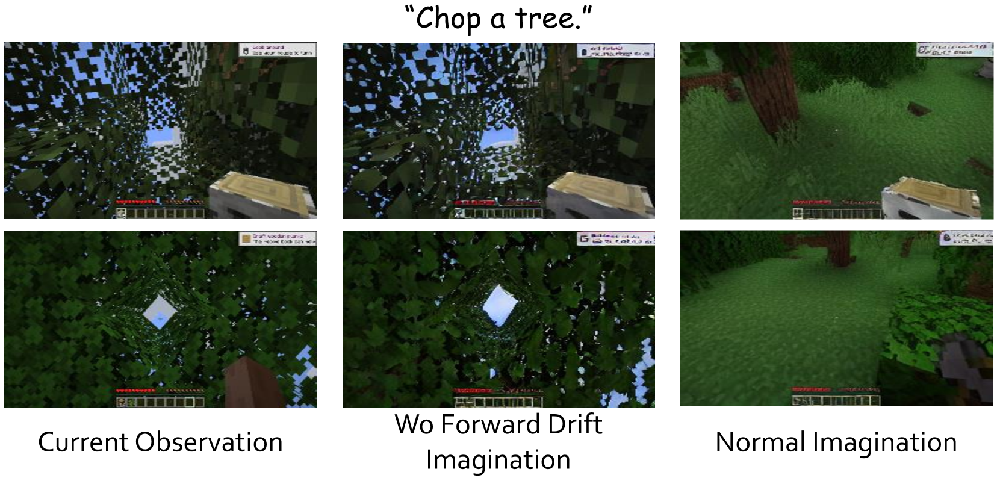

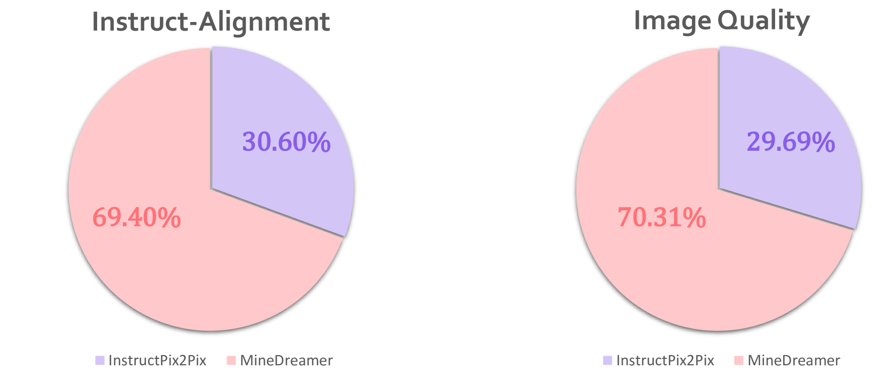

[Arxiv](https://arxiv.org/abs/2403.12037)