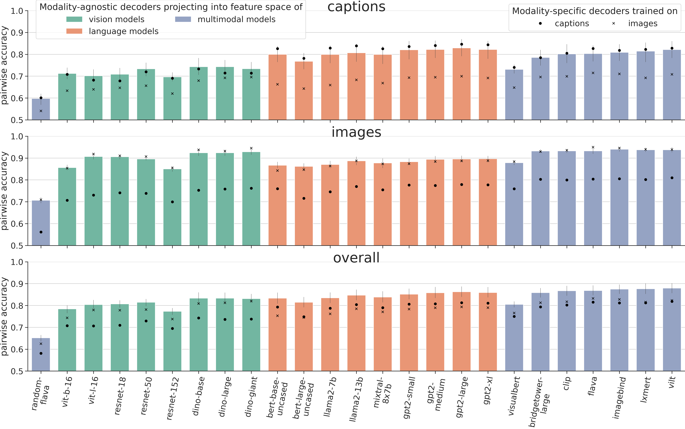
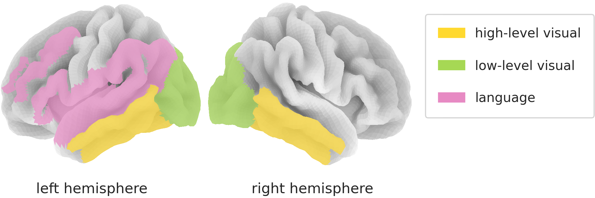
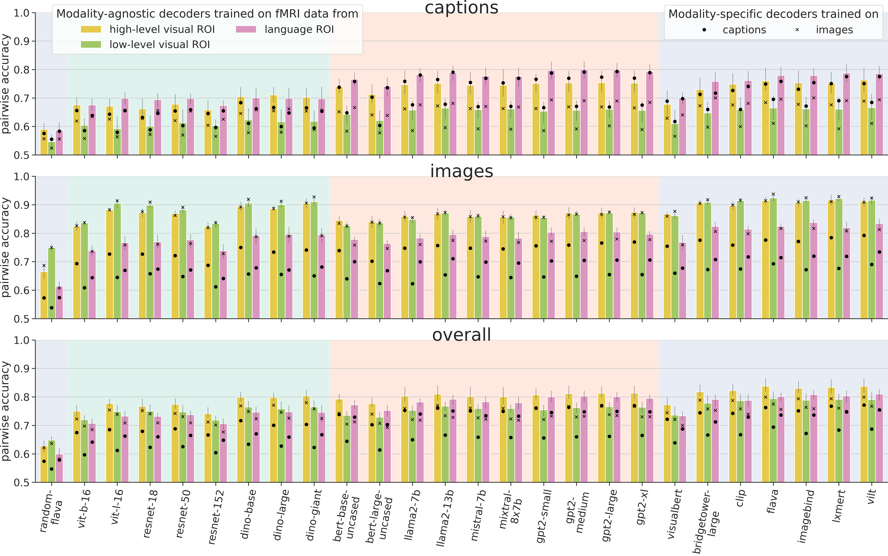
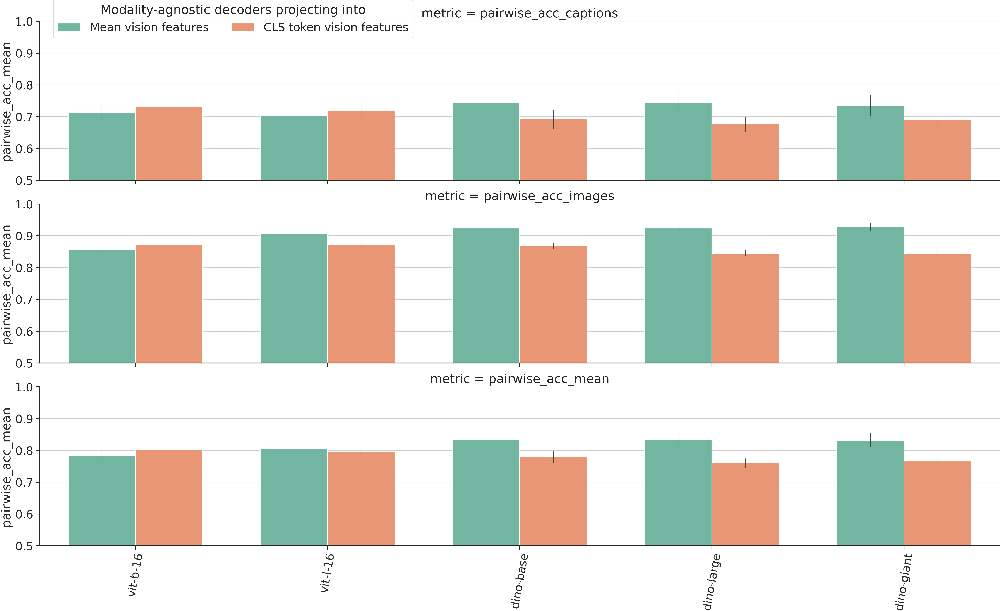
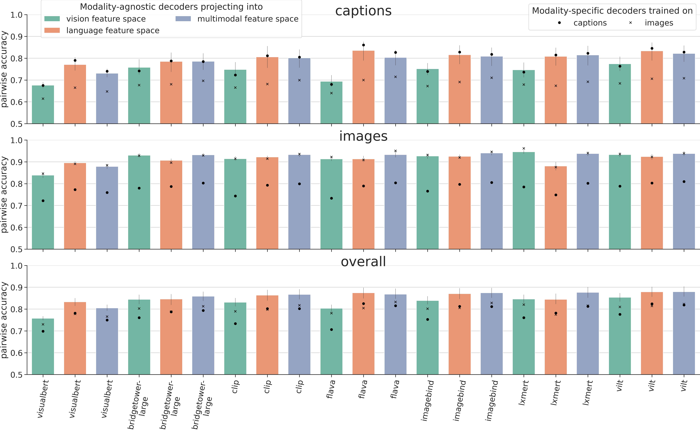
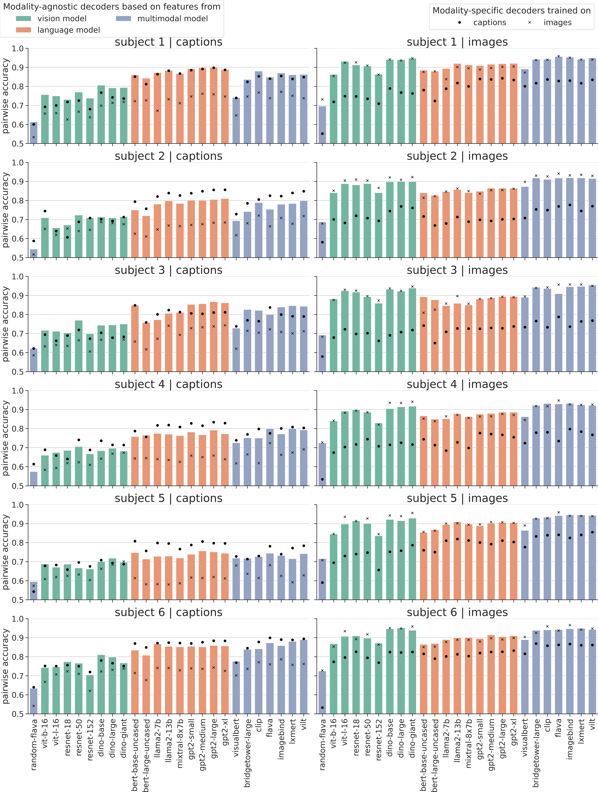

# 跨模态fMRI解码技术应用于视觉与语言研究，实现对不同感知模态信息的有效解码。

发布时间：2024年03月18日

`Agent` `神经科学` `人工智能`

> Modality-Agnostic fMRI Decoding of Vision and Language

# 摘要

> 以往研究表明，可以将观察图像时的大脑活动数据投射至各类模型（包括视觉模型的特定模态解码和语言模型的跨模态解码）的特征空间。在此研究中，我们采用并分析了一个全新的大规模fMRI数据集，其中包含每个参与者约8500次观看图像及相应文字描述的试验。这一创新性数据集为我们研发出了“模态无关解码器”——无论刺激以图像还是文本形式出现，它都能准确预测受试者所见内容。我们对这类解码器进行了训练和评估，将其应用于各种公开可用的视觉、语言以及多模态模型的刺激表达。研究结果显示：（1）模态无关解码器的表现可媲美甚至超越模态特定解码器；（2）针对单模态模型表达进行映射的模态无关解码器在性能上不逊于依赖于多模态表达的解码器；（3）尽管语言区域和处理低级视觉信息的枕叶脑区在解码文本和图像刺激上各有所长，但处理高级视觉信息的颞叶区域在应对这两种类型的刺激时均有卓越表现。

> Previous studies have shown that it is possible to map brain activation data of subjects viewing images onto the feature representation space of not only vision models (modality-specific decoding) but also language models (cross-modal decoding). In this work, we introduce and use a new large-scale fMRI dataset (~8,500 trials per subject) of people watching both images and text descriptions of such images. This novel dataset enables the development of modality-agnostic decoders: a single decoder that can predict which stimulus a subject is seeing, irrespective of the modality (image or text) in which the stimulus is presented. We train and evaluate such decoders to map brain signals onto stimulus representations from a large range of publicly available vision, language and multimodal (vision+language) models. Our findings reveal that (1) modality-agnostic decoders perform as well as (and sometimes even better than) modality-specific decoders (2) modality-agnostic decoders mapping brain data onto representations from unimodal models perform as well as decoders relying on multimodal representations (3) while language and low-level visual (occipital) brain regions are best at decoding text and image stimuli, respectively, high-level visual (temporal) regions perform well on both stimulus types.

[Arxiv](https://arxiv.org/abs/2403.11771)