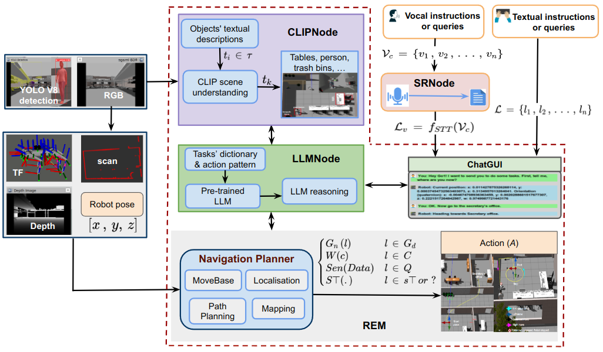
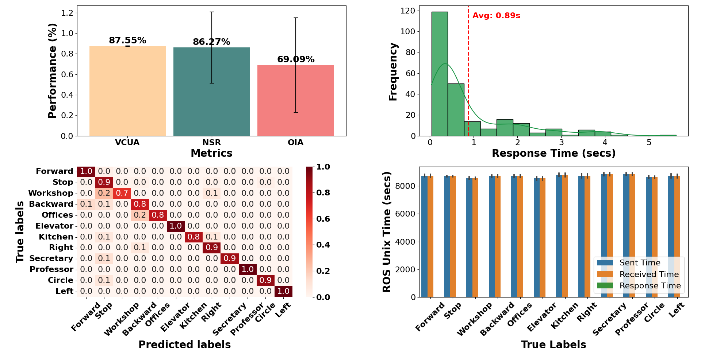

# 借助预训练的语言与视觉模型，探究多模态环境下人类与自主智能体的交互机制

发布时间：2024年03月18日

`Agent` `对话系统` `机器人技术`

> Multimodal Human-Autonomous Agents Interaction Using Pre-Trained Language and Visual Foundation Models

> 本文中，我们拓展了一种方法，让人们能通过口头和文字对话与自主智能体顺畅沟通。该方法巧妙运用预训练的大型语言模型、多模态视觉语言模型以及语音识别技术，解析并提炼出机器人任务环境中高级别的自然语言交流及其语义含义，转化为机器人可执行的操作指令或查询。为了检验此框架对于自然语音对话的理解能力，我们邀请了具有不同种族背景和英语口音特征的参与者进行了定量试验，他们以口头和文字指令的形式与机器人互动。基于收集的交互数据，我们发现这一框架在解码语音命令时的准确率达到87.55%，命令执行成功率为86.27%，并且从接收用户语音指令至机器人开始执行实际动作的平均响应时间为0.89秒。相关视频演示已发布在网址https://linusnep.github.io/MTCC-IRoNL/上。

> In this paper, we extended the method proposed in [17] to enable humans to interact naturally with autonomous agents through vocal and textual conversations. Our extended method exploits the inherent capabilities of pre-trained large language models (LLMs), multimodal visual language models (VLMs), and speech recognition (SR) models to decode the high-level natural language conversations and semantic understanding of the robot's task environment, and abstract them to the robot's actionable commands or queries. We performed a quantitative evaluation of our framework's natural vocal conversation understanding with participants from different racial backgrounds and English language accents. The participants interacted with the robot using both spoken and textual instructional commands. Based on the logged interaction data, our framework achieved 87.55% vocal commands decoding accuracy, 86.27% commands execution success, and an average latency of 0.89 seconds from receiving the participants' vocal chat commands to initiating the robot's actual physical action. The video demonstrations of this paper can be found at https://linusnep.github.io/MTCC-IRoNL/.

[Arxiv](https://arxiv.org/abs/2403.12273)