# NovelQA：针对长篇文本新颖问题回答的基准测试，旨在衡量模型在解答复杂、需要理解全文信息的问题上的表现。

发布时间：2024年03月18日

`LLM应用` `文本理解`

> NovelQA: A Benchmark for Long-Range Novel Question Answering

> 随着LLMs的飞速发展，自然语言处理领域开启了新篇章，尤其是在解读和处理长篇幅文本的信息理解上。然而，现有基准难以准确衡量此类模型的长篇阅读能力。因此，我们创新推出了NovelQA——一个专门针对LLMs长期阅读能力的评测基准，它基于英文小说构建，兼顾了文本的复杂性、长度及叙事连贯性，堪称评估LLMs深度文本理解力的理想之选。本文详述了NovelQA的设计制作过程，重点展示了其人工标注和丰富多元的问题类型。通过在NovelQA上对长篇LLMs的评估，我们深刻洞察了模型的实际表现，尤其凸显了它们在面对多级推理、精细事实查询以及包含超过10万token超长输入时所遇到的难题。这些发现进一步印证了深化LLMs长篇理解能力及推动计算文学研究持续进步的重要性。

> The rapid advancement of Large Language Models (LLMs) has introduced a new frontier in natural language processing, particularly in understanding and processing long-context information. However, the evaluation of these models' long-context abilities remains a challenge due to the limitations of current benchmarks. To address this gap, we introduce NovelQA, a benchmark specifically designed to test the capabilities of LLMs with extended texts. Constructed from English novels, NovelQA offers a unique blend of complexity, length, and narrative coherence, making it an ideal tool for assessing deep textual understanding in LLMs. This paper presents the design and construction of NovelQA, highlighting its manual annotation, and diverse question types. Our evaluation of Long-context LLMs on NovelQA reveals significant insights into the models' performance, particularly emphasizing the challenges they face with multi-hop reasoning, detail-oriented questions, and extremely long input with more than 100,000 tokens. The results underscore the necessity for further advancements in LLMs to improve their long-context comprehension and computational literary studies.

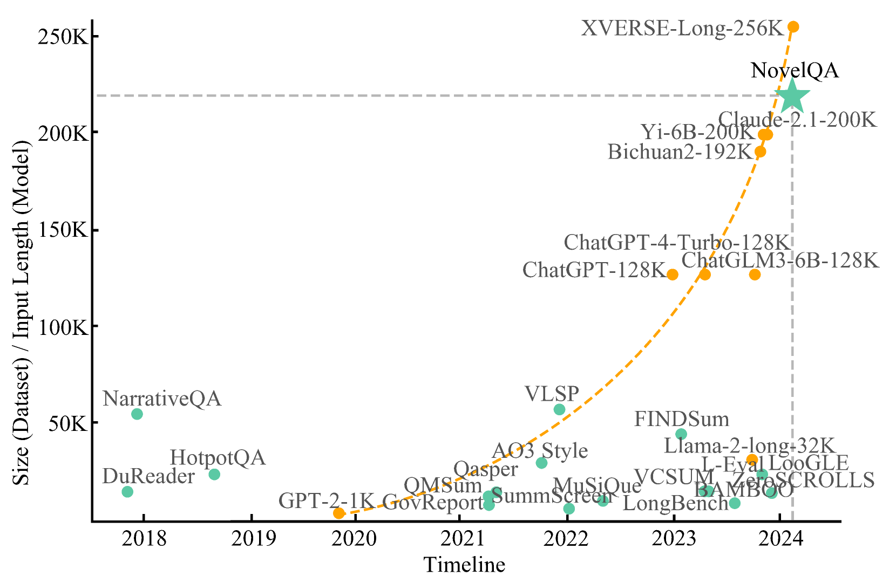

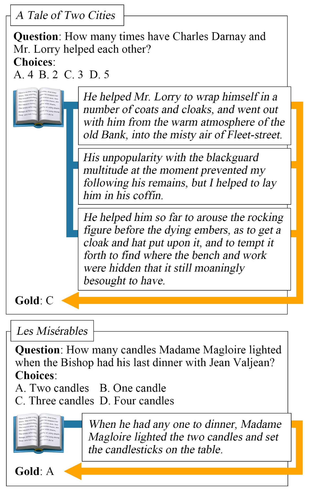

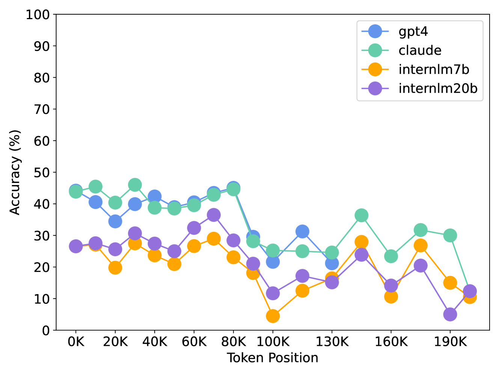

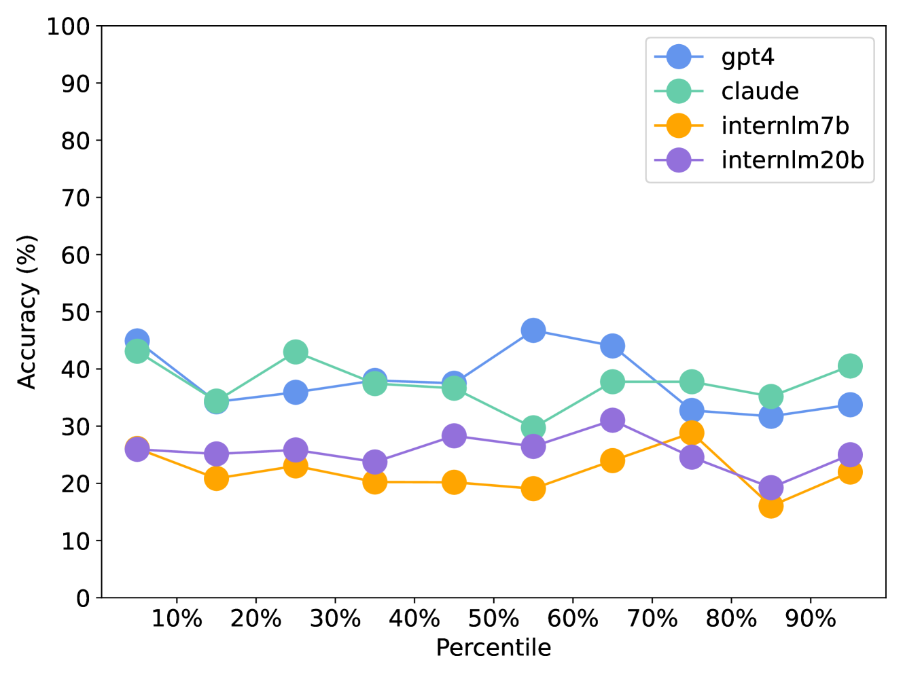

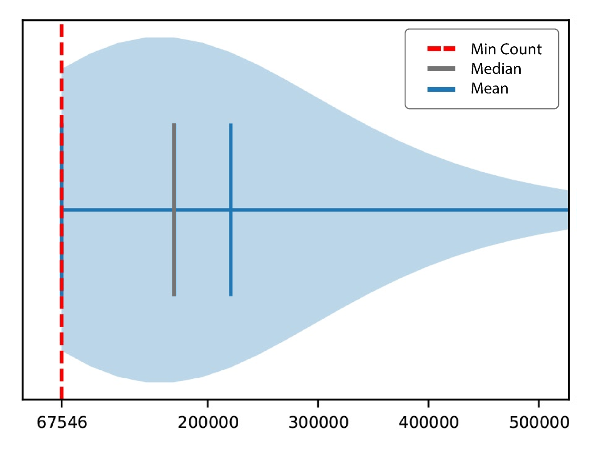

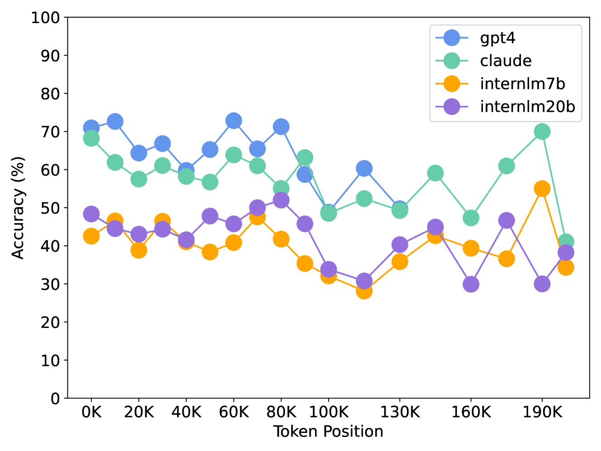

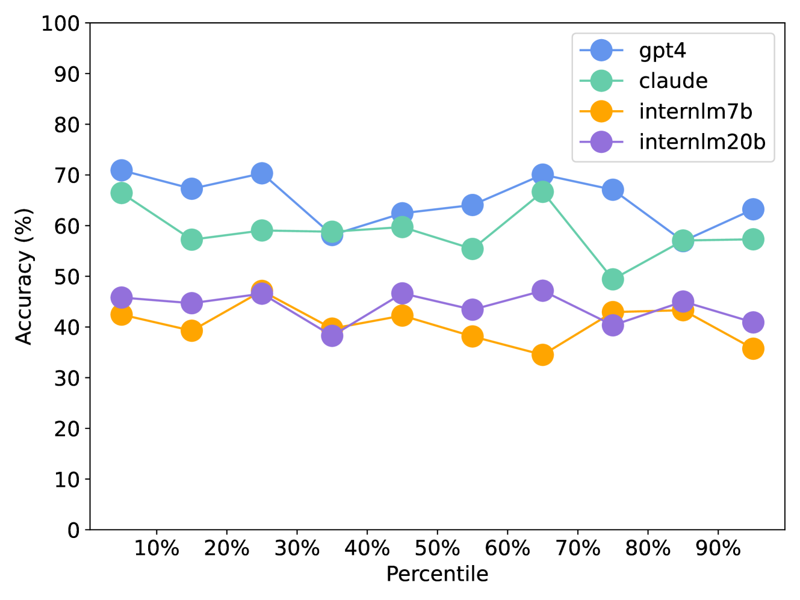

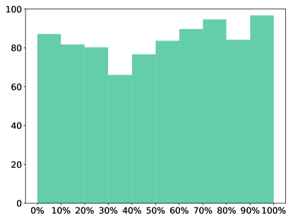

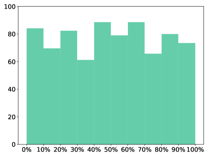

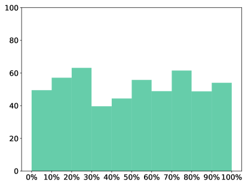

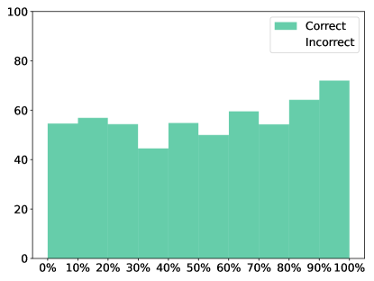

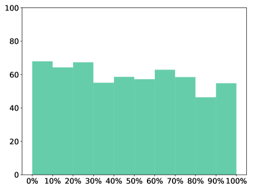

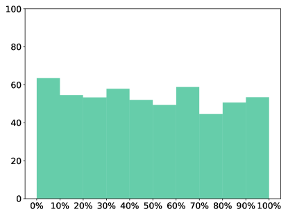

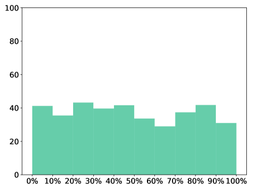

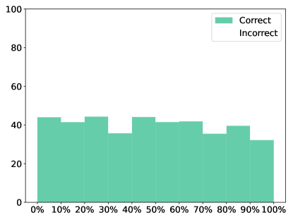

[Arxiv](https://arxiv.org/abs/2403.12766)