# OV9D 是一项针对开放词汇类别级的 9 维物体姿态与尺寸估算技术，旨在无需预先训练所有类别的样本，即可准确推断各类物体的位置、方向及大小信息。

发布时间：2024年03月18日

`Agent` `机器人` `计算机视觉`

> OV9D: Open-Vocabulary Category-Level 9D Object Pose and Size Estimation

> 本文探讨了一项新挑战——开放词汇级物体姿态及尺寸估计，即通过人类提供的任意新型物体类别文字描述，让机器人准确预测场景图像中目标物体的位置、方向和尺寸。为达成这一广泛适用的目标，我们创新推出了大型逼真数据集OO3D-9D，其源自OmniObject3D并成为同类任务中规模最大、内容最丰富的数据资源，特别标注了各类别物体的对称轴信息以消除对称不确定性。同时，我们发现在预训练的视觉-语言基础模型中挖掘强大的先验知识是实现此泛化能力的另一关键要素。因此，我们设计了一个搭建在预训练DinoV2和文本到图像稳定扩散模型之上的框架，用于推断目标实例的标准化对象坐标空间（NOCS）图。该框架巧妙运用了DinoV2蕴含的视觉语义特征以及文本到图像扩散模型整合的视觉与语言智能，从而使得面对不同新颖类别的多样化文本描述时具备良好的泛化性能。综合的定量与定性实验显示，我们的开放词汇法在经过大规模合成数据训练后，明显优于基准方法，并能在真实世界的未知类别图像中展现出有效的泛化效果。项目的官方网站为https://ov9d.github.io。

> This paper studies a new open-set problem, the open-vocabulary category-level object pose and size estimation. Given human text descriptions of arbitrary novel object categories, the robot agent seeks to predict the position, orientation, and size of the target object in the observed scene image. To enable such generalizability, we first introduce OO3D-9D, a large-scale photorealistic dataset for this task. Derived from OmniObject3D, OO3D-9D is the largest and most diverse dataset in the field of category-level object pose and size estimation. It includes additional annotations for the symmetry axis of each category, which help resolve symmetric ambiguity. Apart from the large-scale dataset, we find another key to enabling such generalizability is leveraging the strong prior knowledge in pre-trained visual-language foundation models. We then propose a framework built on pre-trained DinoV2 and text-to-image stable diffusion models to infer the normalized object coordinate space (NOCS) maps of the target instances. This framework fully leverages the visual semantic prior from DinoV2 and the aligned visual and language knowledge within the text-to-image diffusion model, which enables generalization to various text descriptions of novel categories. Comprehensive quantitative and qualitative experiments demonstrate that the proposed open-vocabulary method, trained on our large-scale synthesized data, significantly outperforms the baseline and can effectively generalize to real-world images of unseen categories. The project page is at https://ov9d.github.io.

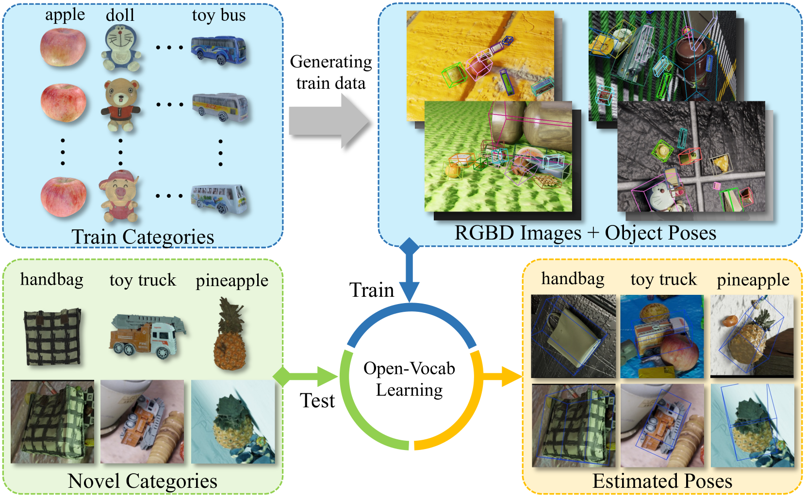

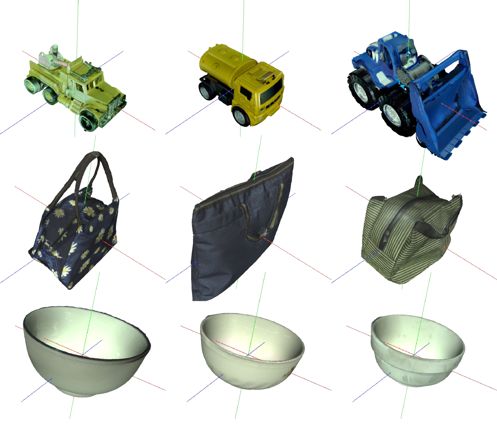

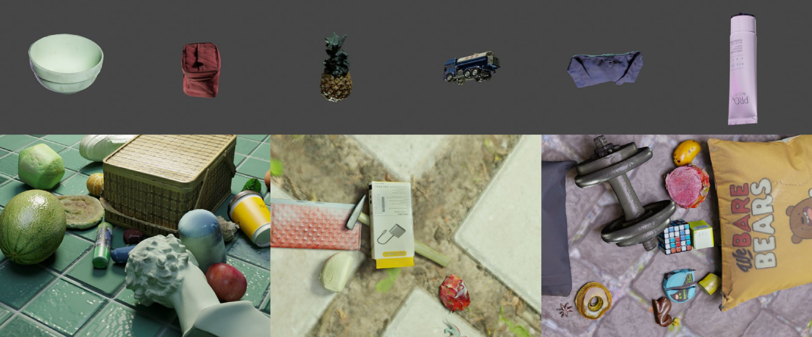

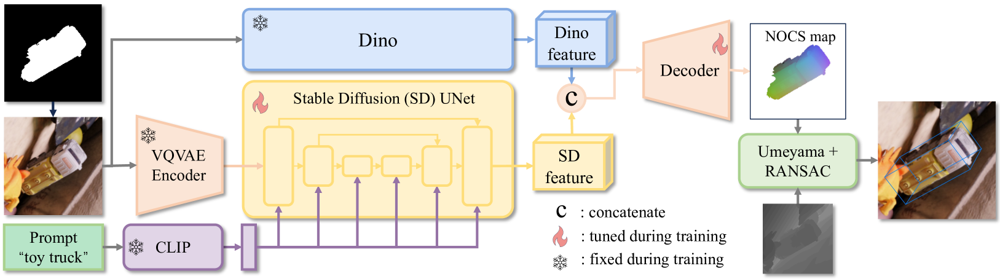

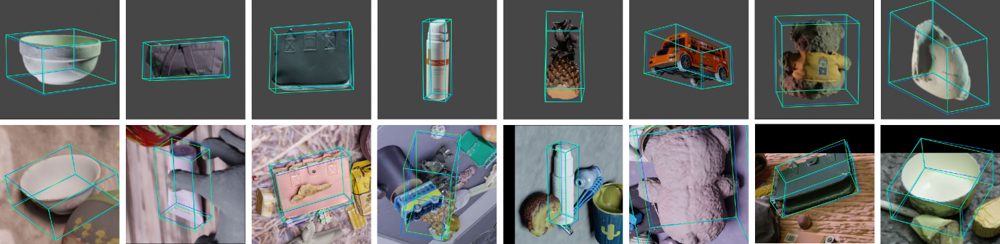

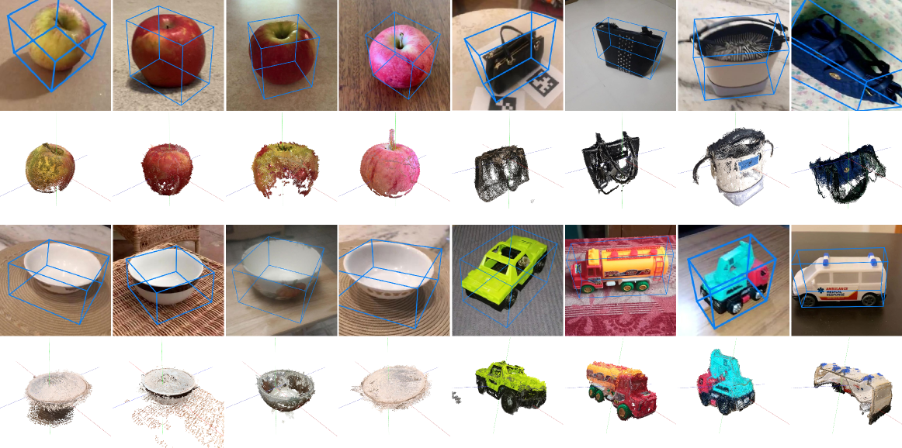

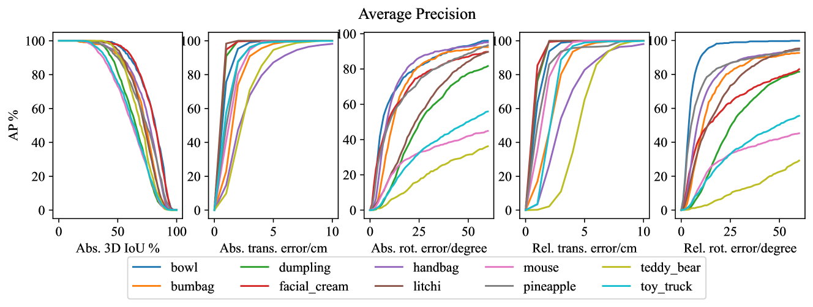

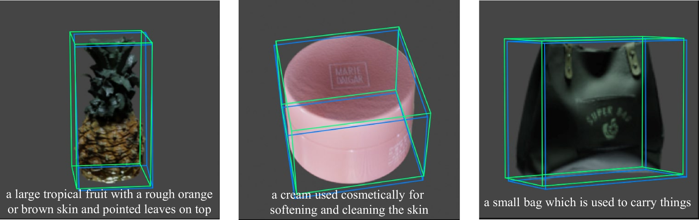

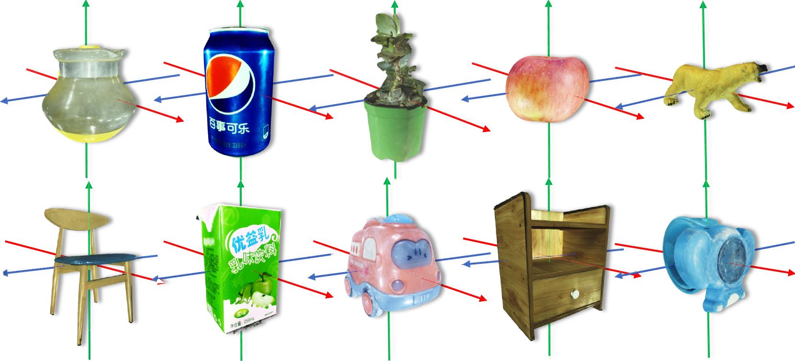

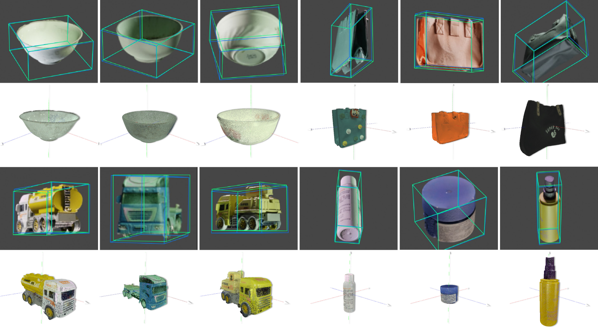

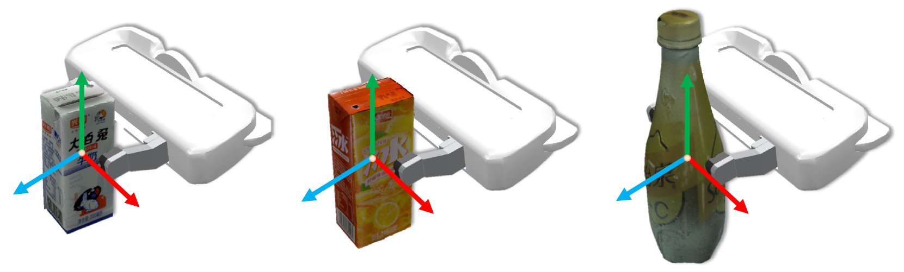

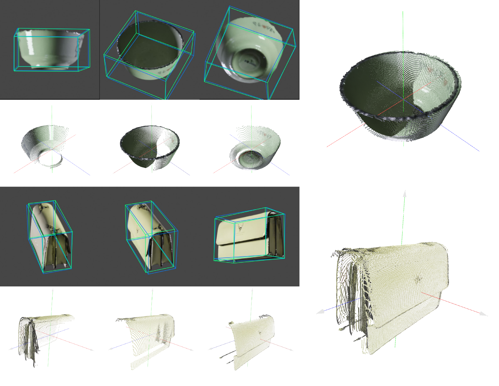

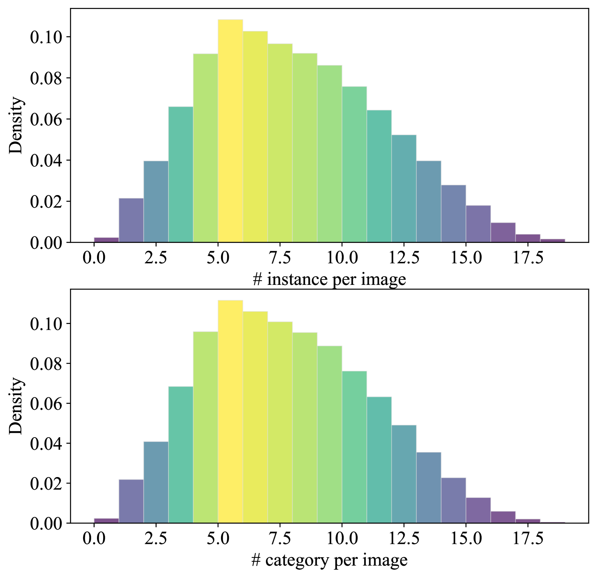

[Arxiv](https://arxiv.org/abs/2403.12396)