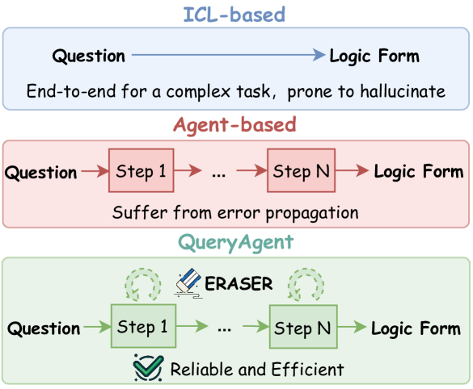
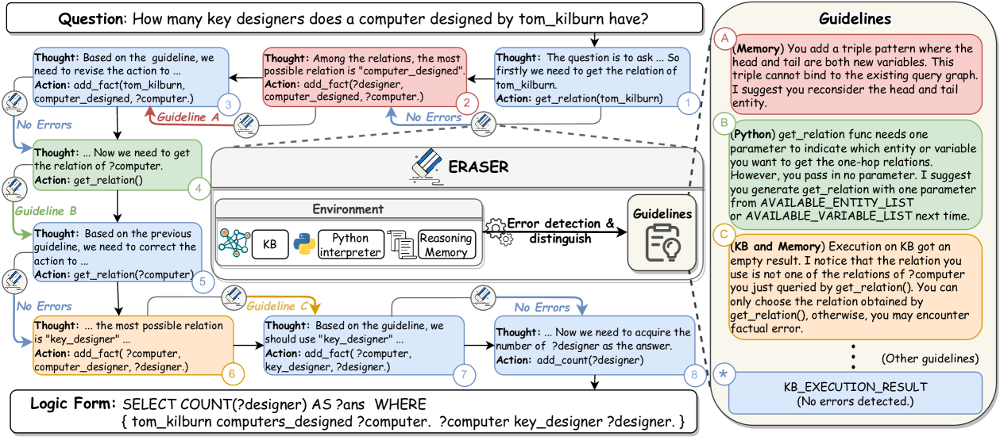
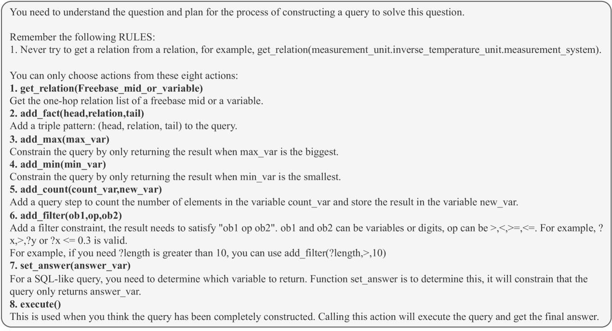
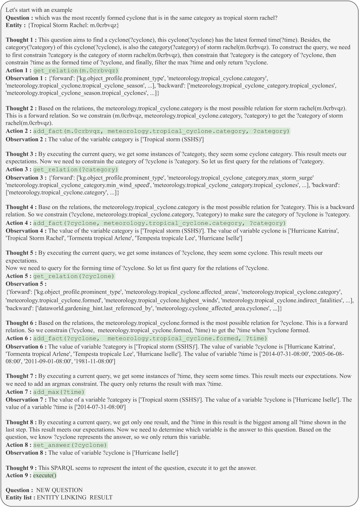
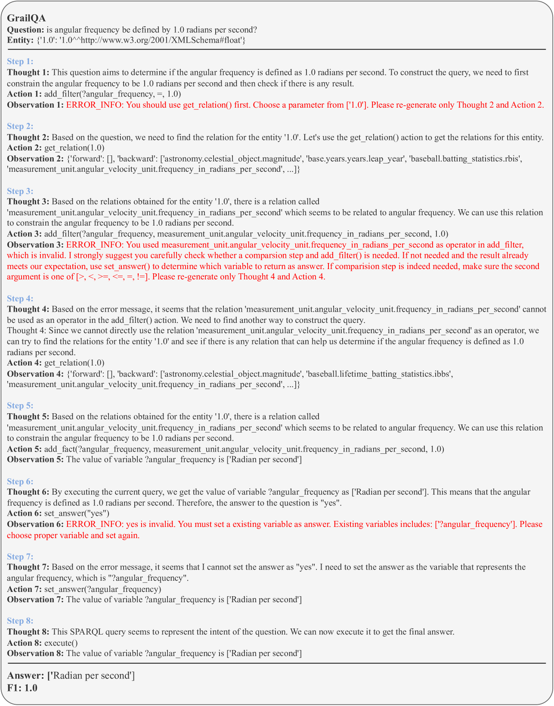

# QueryAgent 是一个创新的推理框架，它借助环境反馈实现自我校正，既保证了推理过程的可靠性，又提升了效率。步骤详解：

发布时间：2024年03月18日

`Agent` `语义解析`

> QueryAgent: A Reliable and Efficient Reasoning Framework with Environmental Feedback based Self-Correction

> LLMs在语义解析任务上大放异彩，但面对“幻觉”问题时，既有方法在稳定性和效率上略显乏力。本文提出的QueryAgent框架以步步为营、逐级自我校正的方式应对这一难题。我们创新性地引入了基于环境反馈的自我校正机制——ERASER，不同于常规做法，ERASER精明地在必要时借助中间步骤中的丰富反馈信息来进行有针对性且区分度高的自我修正。实验证明，在仅用一个示例的情况下，QueryAgent在GrailQA和GraphQ数据集上以高达7.0和15.0 F1分的提升碾压过往的少量样本方法。不仅如此，本方法在实际运行时间、查询负担及API调用成本等方面均展现出了卓越的效率优势。更进一步，通过应用ERASER技术，我们还提升了另一基准系统AgentBench约10个点的表现，有力证明了本方法的优秀迁移性能。

> Employing Large Language Models (LLMs) for semantic parsing has achieved remarkable success. However, we find existing methods fall short in terms of reliability and efficiency when hallucinations are encountered. In this paper, we address these challenges with a framework called QueryAgent, which solves a question step-by-step and performs step-wise self-correction. We introduce an environmental feedback-based self-correction method called ERASER. Unlike traditional approaches, ERASER leverages rich environmental feedback in the intermediate steps to perform selective and differentiated self-correction only when necessary. Experimental results demonstrate that QueryAgent notably outperforms all previous few-shot methods using only one example on GrailQA and GraphQ by 7.0 and 15.0 F1. Moreover, our approach exhibits superiority in terms of efficiency, including runtime, query overhead, and API invocation costs. By leveraging ERASER, we further improve another baseline (i.e., AgentBench) by approximately 10 points, revealing the strong transferability of our approach.

[Arxiv](https://arxiv.org/abs/2403.11886)