# ROUTERBENCH：专为多大型语言模型（Multi-LLM）路由系统设计的一套权威基准测试方案

发布时间：2024年03月18日

`LLM应用` `人工智能基础设施`

> ROUTERBENCH: A Benchmark for Multi-LLM Routing System

# 摘要

> 随着LLMs应用场景不断拓宽，寻求高效服务方案变得至关重要。尽管LLMs功能多样，但在权衡性能与成本时，尚无一款模型能完美应对所有任务与场景，因此催生了整合多种模型优势以突破单个LLM局限性的LLM路由系统。但遗憾的是，目前尚未有一个标准化基准来衡量此类路由系统的性能，这在一定程度上制约了该领域的发展。因此，我们推出了ROUTERBENCH这一创新评估框架，旨在系统评估LLM路由系统的效能，并搭配了一个包含405,000多个代表LLM推理结果的详尽数据集，以支持路由策略的研发。同时，我们还构建了一套关于LLM路由的理论框架，并借助ROUTERBENCH对比分析了多种路由方法，揭示了它们在我方评估框架下的优劣之处。此项工作既规范化了LLM路由系统的研究与发展，也为其评估设立标杆，为未来更便捷、更具经济效益的LLM部署开启新篇章。相关代码与数据已上传至https://github.com/withmartian/routerbench。

> As the range of applications for Large Language Models (LLMs) continues to grow, the demand for effective serving solutions becomes increasingly critical. Despite the versatility of LLMs, no single model can optimally address all tasks and applications, particularly when balancing performance with cost. This limitation has led to the development of LLM routing systems, which combine the strengths of various models to overcome the constraints of individual LLMs. Yet, the absence of a standardized benchmark for evaluating the performance of LLM routers hinders progress in this area. To bridge this gap, we present ROUTERBENCH, a novel evaluation framework designed to systematically assess the efficacy of LLM routing systems, along with a comprehensive dataset comprising over 405k inference outcomes from representative LLMs to support the development of routing strategies. We further propose a theoretical framework for LLM routing, and deliver a comparative analysis of various routing approaches through ROUTERBENCH, highlighting their potentials and limitations within our evaluation framework. This work not only formalizes and advances the development of LLM routing systems but also sets a standard for their assessment, paving the way for more accessible and economically viable LLM deployments. The code and data are available at https://github.com/withmartian/routerbench.

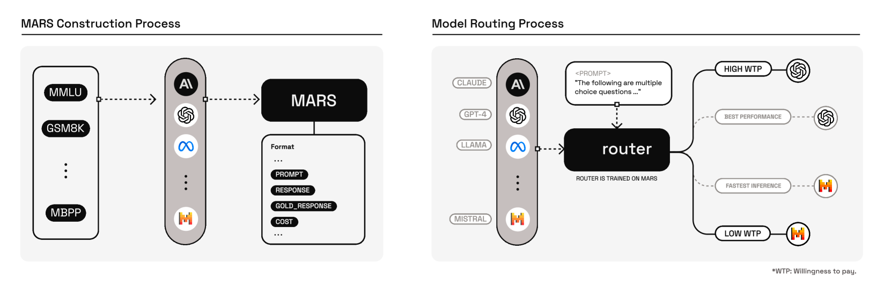

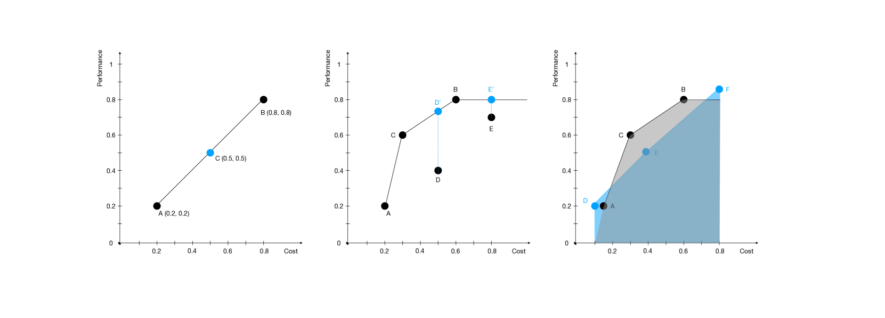

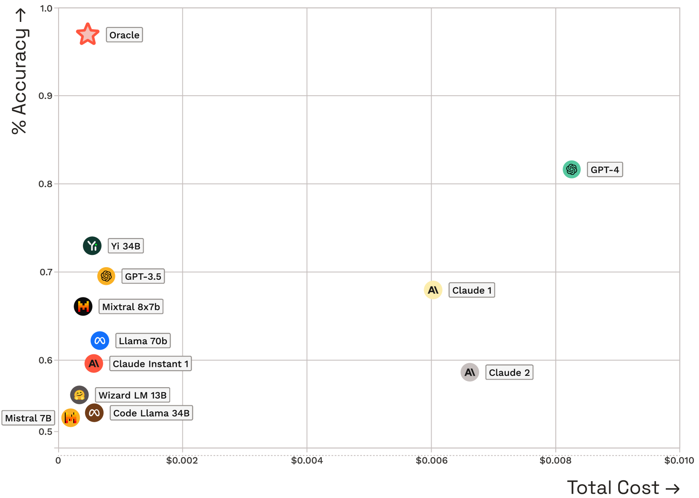

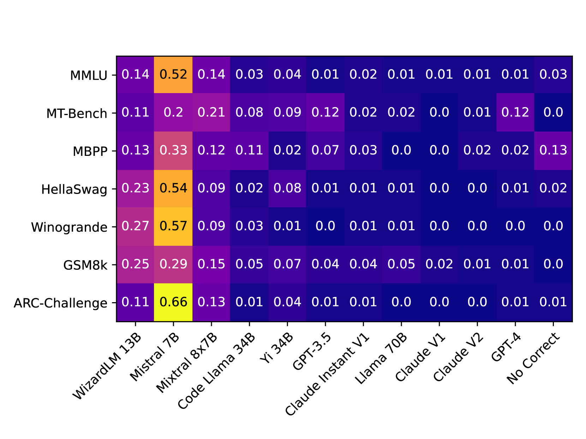

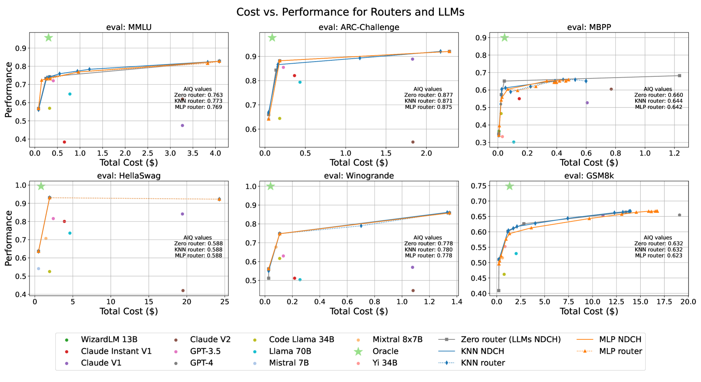

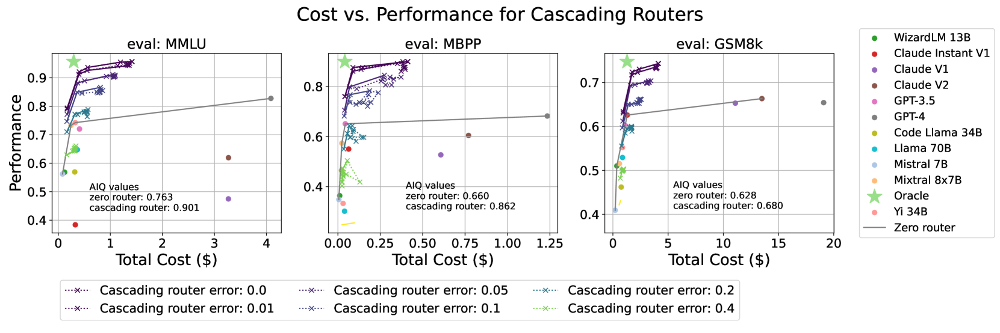

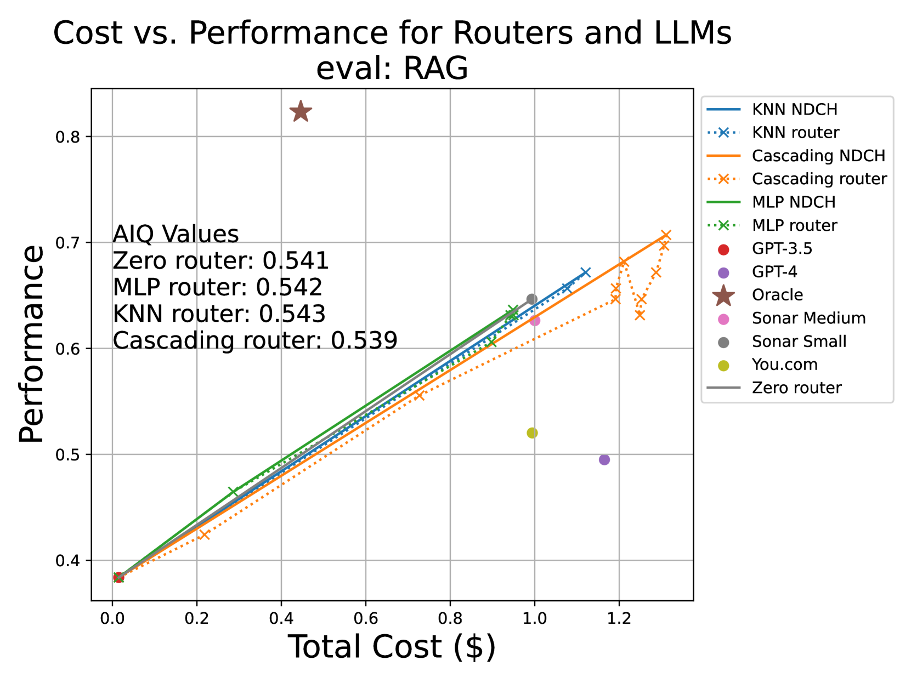

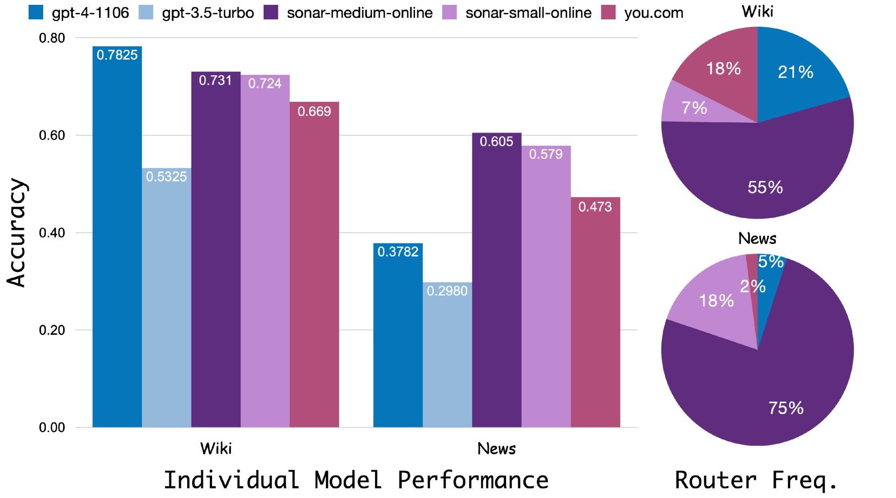

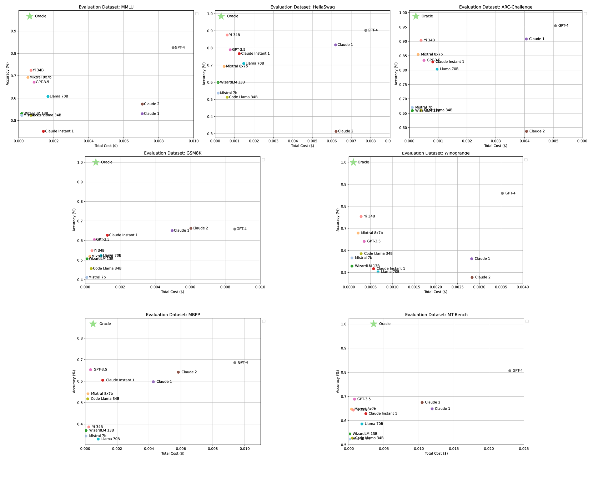

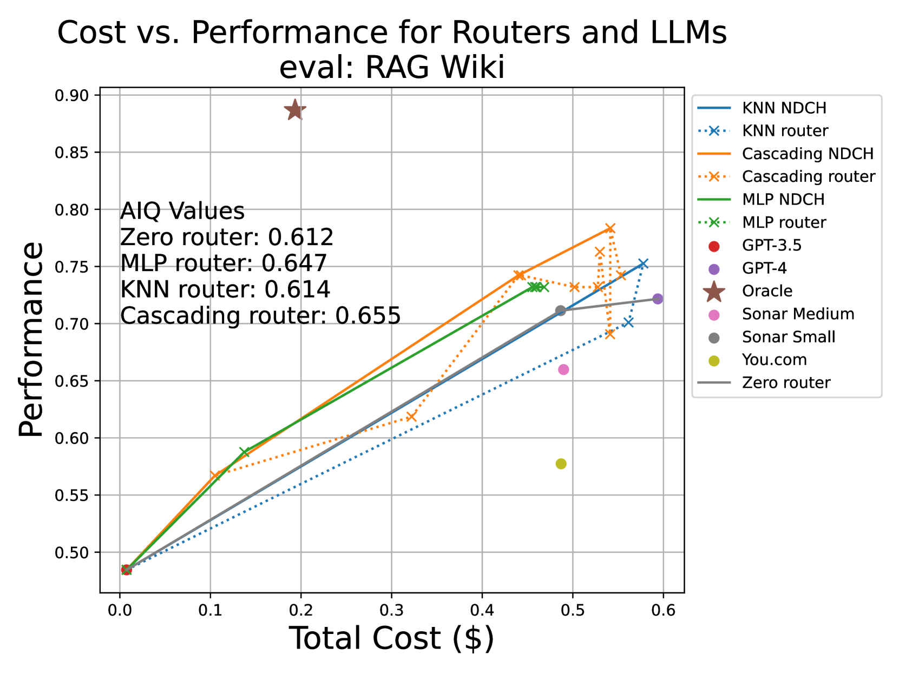

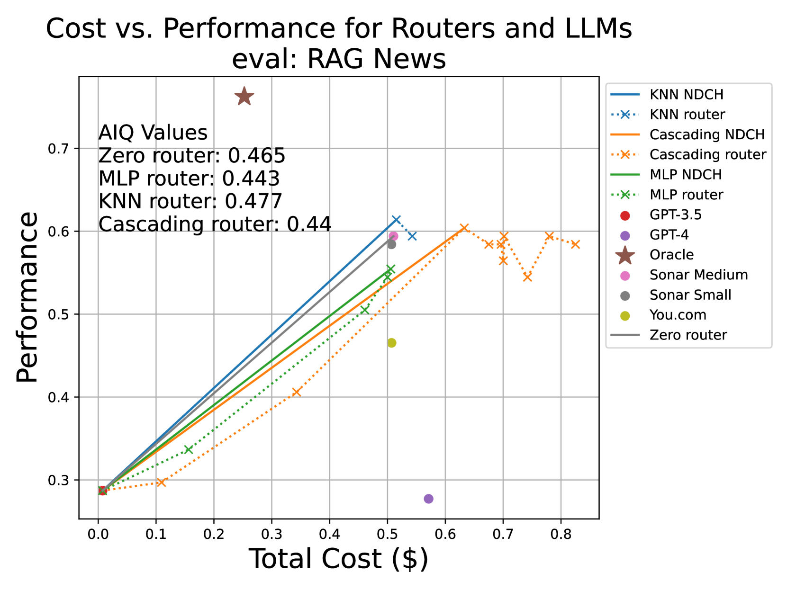

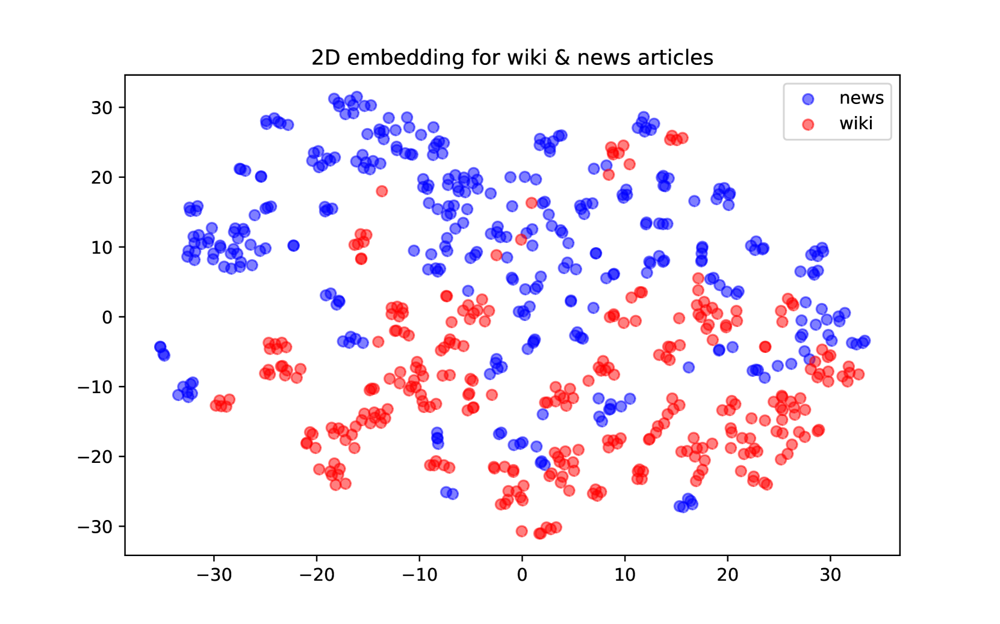

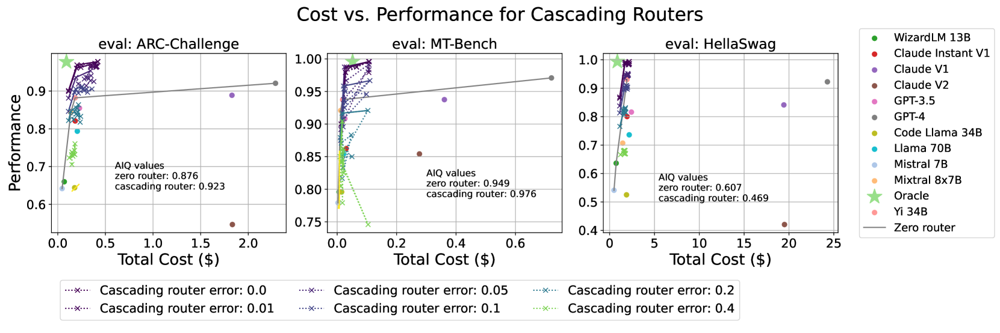

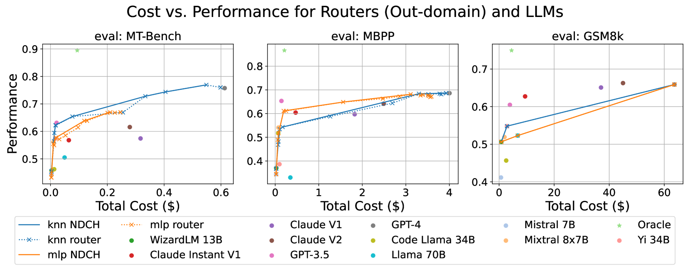

[Arxiv](https://arxiv.org/abs/2403.12031)